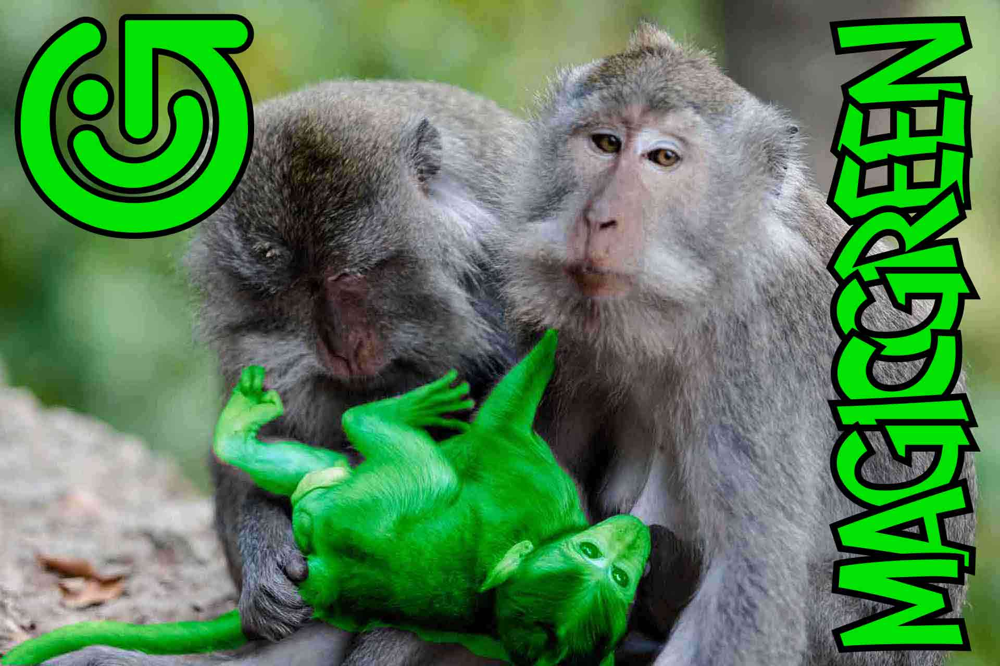

# MAGIC GREEN (Astro)

## DEV TECH STACK:

- plain [Astro SSG](https://docs.astro.build/en/getting-started/) | [Astro repo](https://github.com/withastro/astro)
- [Astro Experimental assets](https://docs.astro.build/en/guides/assets/)
- new built-in [Astro Image component](https://docs.astro.build/en/guides/assets/#convert-from-astrojsimage)
- [Astro Avif images](https://docs.astro.build/en/guides/assets/#properties)
- [Typescript](https://docs.astro.build/en/guides/typescript/)
- [Prettier](https://docs.astro.build/en/editor-setup/#prettier) | [prettier-plugin-astro](https://github.com/withastro/prettier-plugin-astro)
- [Partytown](https://docs.astro.build/en/guides/integrations-guide/partytown/) | [Partytown repo](https://github.com/withastro/astro/tree/main/packages/integrations/partytown)
- [Picoscss](https://picocss.com/)
- no frameworks...

**Lighthouse score**: 100, 100, 100, 100.

---

> "**Nothing is as powerful as an idea whose time has come.**" _Victor Hugo_

## Feeding the green baby.

The growing concern about the ecological impact is a fact worldwide. Scientists and Up-stream-ists are urging us to clean up our actions and change the way we live and operate. Lots of press has appeared in recent years here and there but somehow infos are spread all over the place.

Ecologically sustainable business needs to communicate about their low impact practices and policies. Green minded business must let customers know in order to beat the competition.

Green and sustainable businesses practices are both necessary and a growing reality today. Conscious consumers want to know who is doing the right thing and are ready to support them. The time is perfect to fill this gap.

## The Magic Green project

We see an urgent need for a communication platform which gather infos, good examples and connect. So we started this information tool to let the world know. We want to inspire, to push the best examples and show what can be done and who is doing it.

We are building a internet based platform to gather infos, examples and addresses of all stuff green in South East Asia and beyond.

We are open-source, copyright-free. We encourage you to print any article of our website and forward it to anyone that might be interested in your network of friends and colleagues. Print to a PDF file in order to save trees, of course.

We aim to inspire responsible tourism and consumption. Follow us to know what's up!

## Warning:

Please note that all assets here are realeased under Attribution 4.0 International [CC_BY license](https://creativecommons.org/licenses/by/4.0/).

Thanks, the [Junglestar](https://junglestar.org) team.
