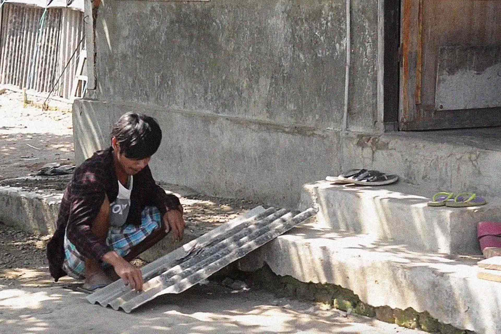
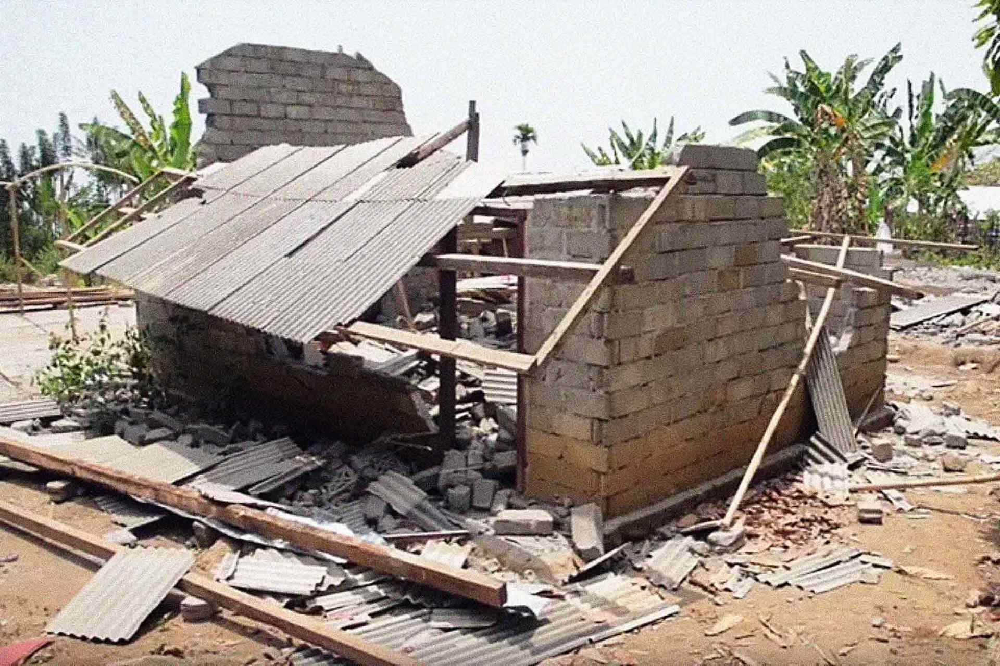
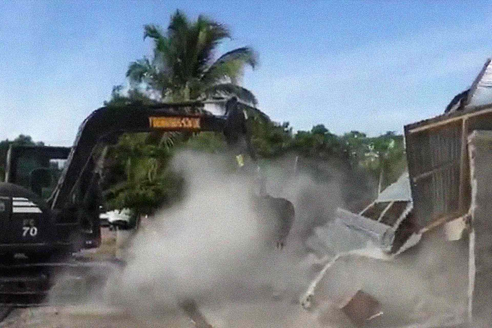

The danger of using asbestos roofs for people is big. Exposition to asbestos dust leads to mesothelioma cancer.

Made illegal in western countries more than 30 years ago, asbestos is still used everywhere in Indonesia.

There are many resources online to know about it and understand its health hazards.

[This video](https://www.youtube.com/watch?v=C4LczoPA1bs) explains how asbestos fiber dust affects human health and how to deal with it... hopefully useful!

Bahaya penggunaan atap asbes bagi masyarakat apabila terpapar debu asbes terus menerus, sebagai salah satu penyebab penyakit kangker mesothelioma.

Dalam [video ini](https://www.youtube.com/watch?v=C4LczoPA1bs) menjelaskan bagaimana debu serat asbes mempengaruhi kesehatan manusia dan bagaimana cara penanggulangannya... semoga bermanfaat!

## Know More Links

[Watch the IDEP video - Lihat video IDEP ](https://www.youtube.com/watch?v=C4LczoPA1bs)

[IDEP - english](http://www.idepfoundation.org/en/)

[IDEP - bahasa Indonesia](http://www.idepfoundation.org/id/)

[IDEP - Youtube channel](https://www.youtube.com/channel/UCT2rrklLyHcZVVW93JDt8kA)
