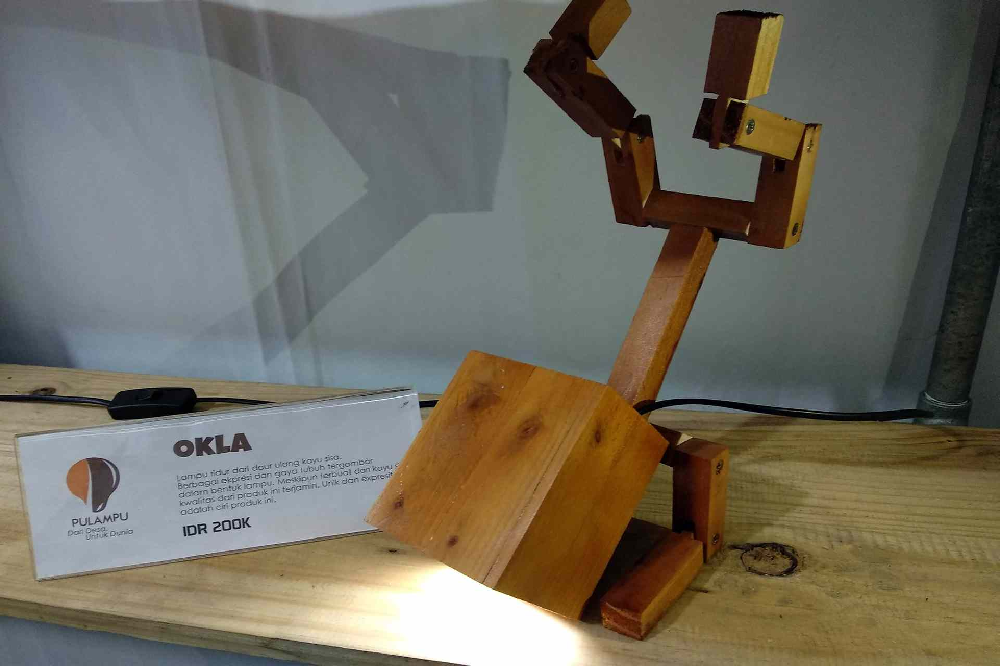
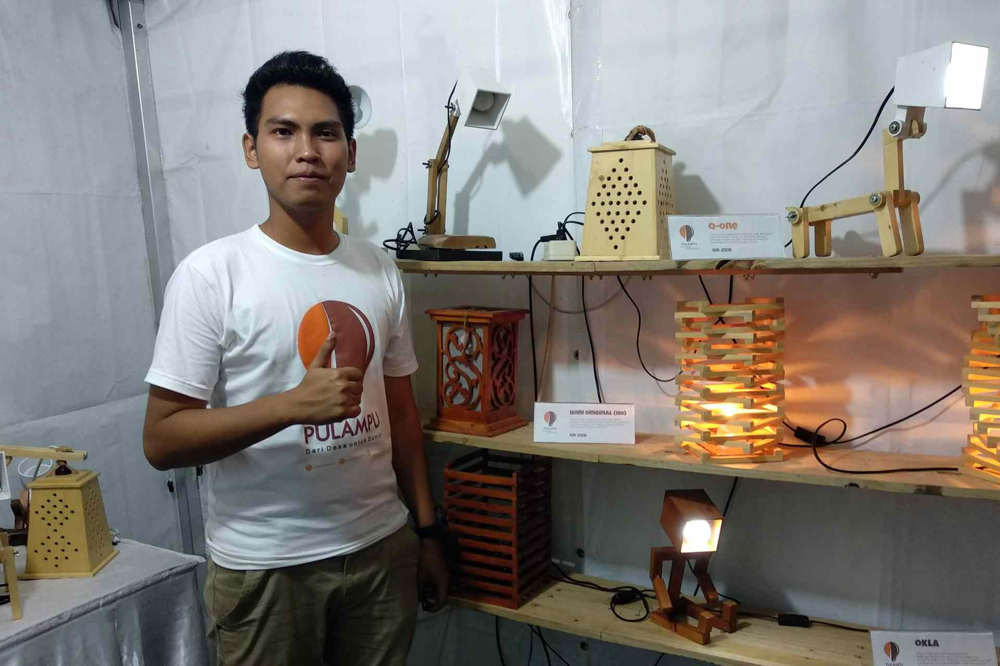

Yo, these guys from Surabaya, in East Java, make some really cool design lamps.

The human shape is totally moveable, and can be twisted into many funny shapes.

They claim it's from reclaimed wood, but neither the product nor the packaging carry any proof of this... and honestly the lamp itself does not look like it's made from re-used wood. They told us so probably just to appear smart and trendy... lame.

But, rest easy, feel good, turn on your wood lamp! Adjust it into a new position reflecting how you feel at the moment.

Now enjoy the always changing shape of your new lamp.

## Know More Links

[Pulampu online](https://pulampu.yukbisnis.com/)

[Pulampu on Twitter](https://twitter.com/pulampu)

[Pulampu on FB](https://www.facebook.com/pulampuindonesia/)

[Baca lain](http://pojokpitu.com/baca.php?idurut=42299)
