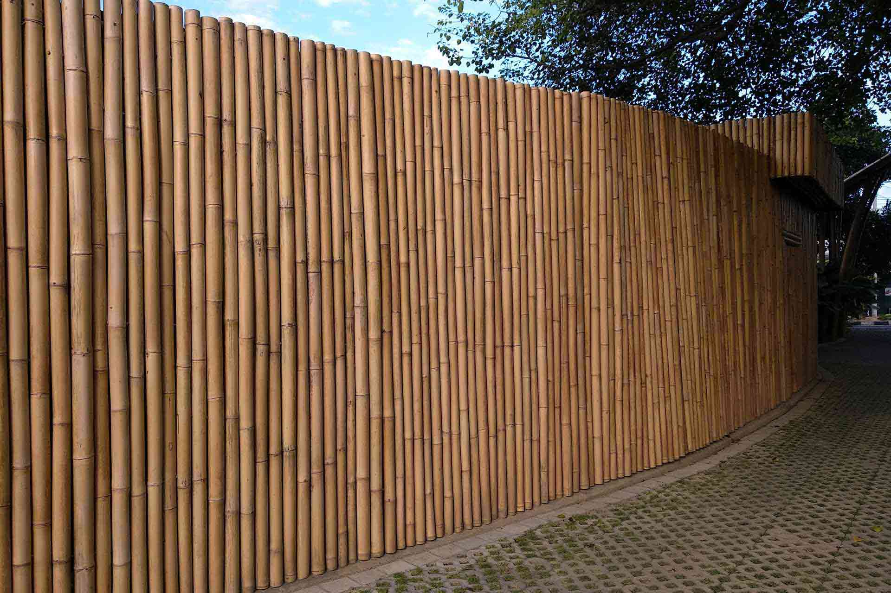

With a state of the art brand new bamboo construction, Artotel Beach Club in Sanur, Bali brings vibrancy and color to the island's south east.

They plan to satisfy the needs of travelers who are looking for a refreshingly arty Bali experience.

This boutique hotel want to be a canvas showcasing thought-provoking artworks by some of the most relevant Bali-based contemporary artists of today.

## Know More Links

[Artotel indonesia website](https://www.artotelindonesia.com)
