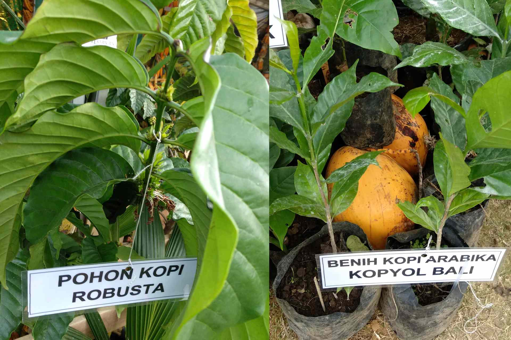
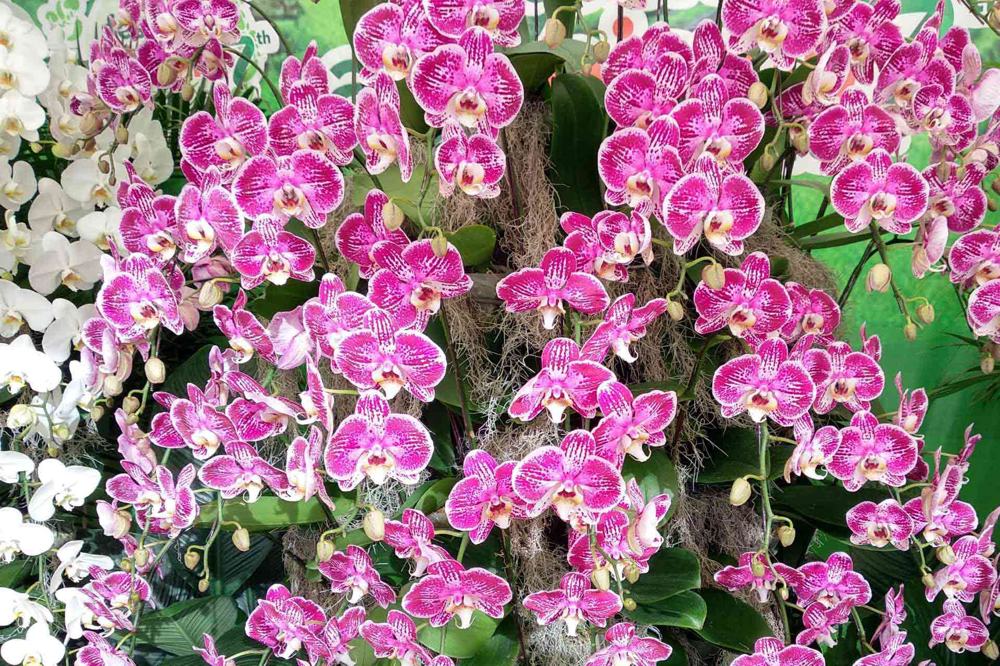
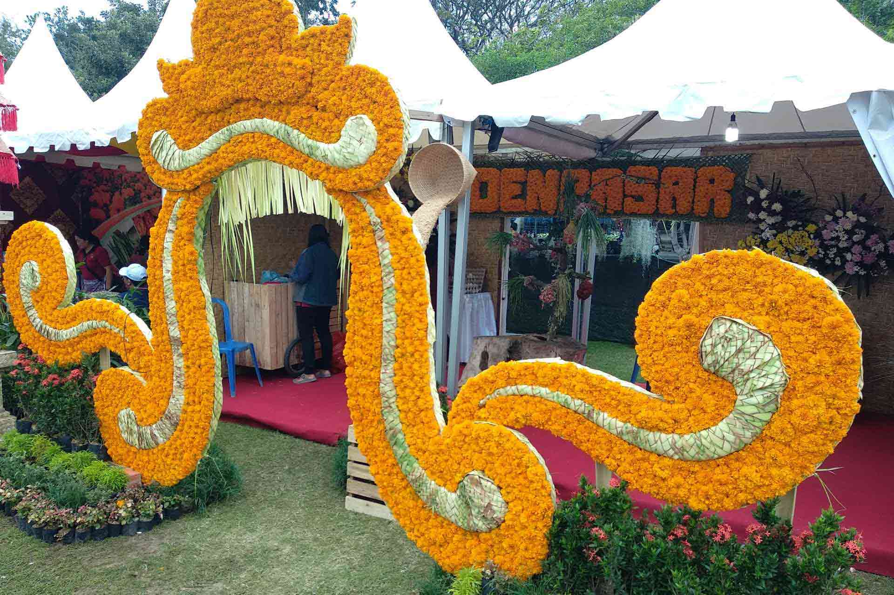
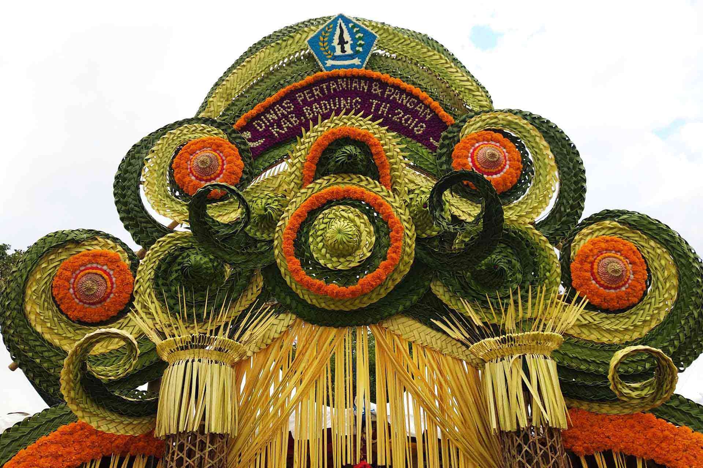

From 26 July to 29, 2018 at [Taman Bajra Sandhi Monument](https://goo.gl/maps/Am5UzTVAaHz) in Bali an agribusiness trade show is taking place.

Among beautiful green booths there are many useful infos and products to discover, like a coconut climber tool called **Ponkod**, "Alat bantui panjat kelapa" that has been reviewed on [Bisnis website](http://entrepreneur.bisnis.com/read/20180204/263/734055/peluang-usaha-berkat-inovasi-produk-ini-panjat-kelapa-selihai-tupai-), [check out this videos](https://youtu.be/K-RCTw9p6DU) or [this one](https://youtu.be/dcWB8dHKIak).

With free entrance, you will be able to see, meet and buy plants, trees and organic products.

You can buy coffee trees, salak trees, or [hydroponic systems](http://hidroponikbali.com).

> "By regular climbing, a day can climb 20-25 coconuts but with Ponkod can go up to 45 trees," say Gede Juliana Eka Putra, Ponkod Founder.

You can find beautiful orchids and organic food producers like **Dewata Organik** from [Bangli](https://goo.gl/maps/9sxcDHEaALw). His booth sells "Bibit Buah Unggul" - Superior Fruit Seeds, organic fertilizer and locally made honey.

## Know More Links

[Hidroponik Bali - Hydroponic systems](http://hidroponikbali.com).

[Taman Bajra Sandhi Monument](https://goo.gl/maps/Am5UzTVAaHz)

[Farmindo Pondok - climbers](http://www.farmintek.com)

Dewata Organik - Made Supadma Novi Wijaya - tel. +62 81 916710300 or +62 85 338274241
