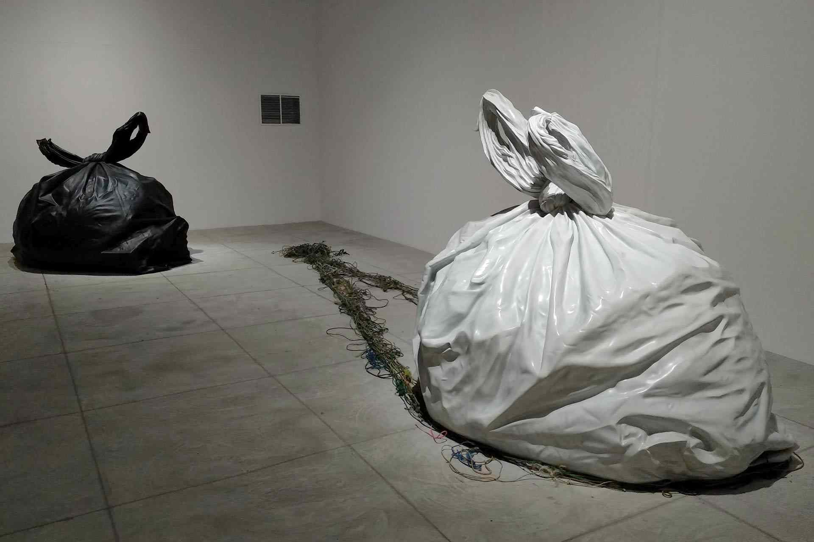
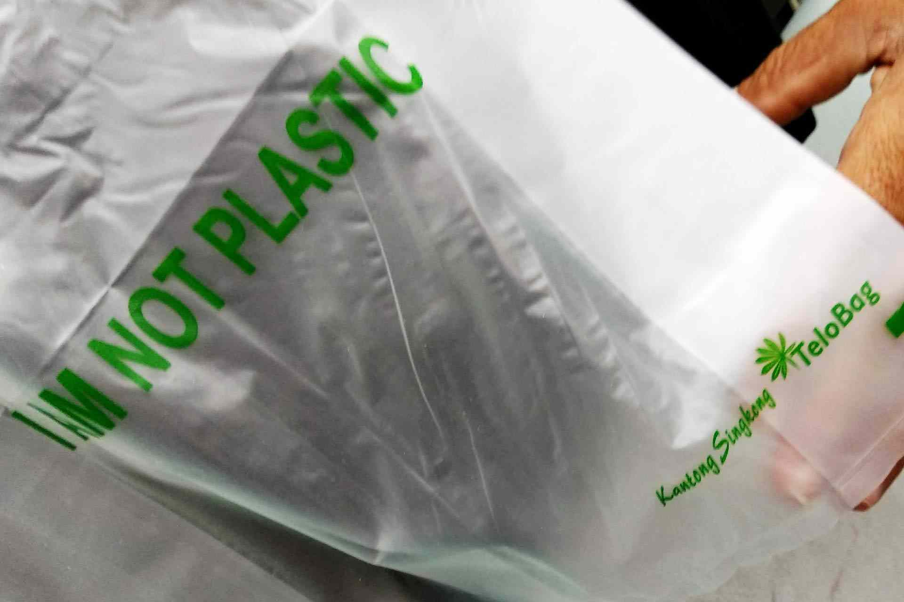
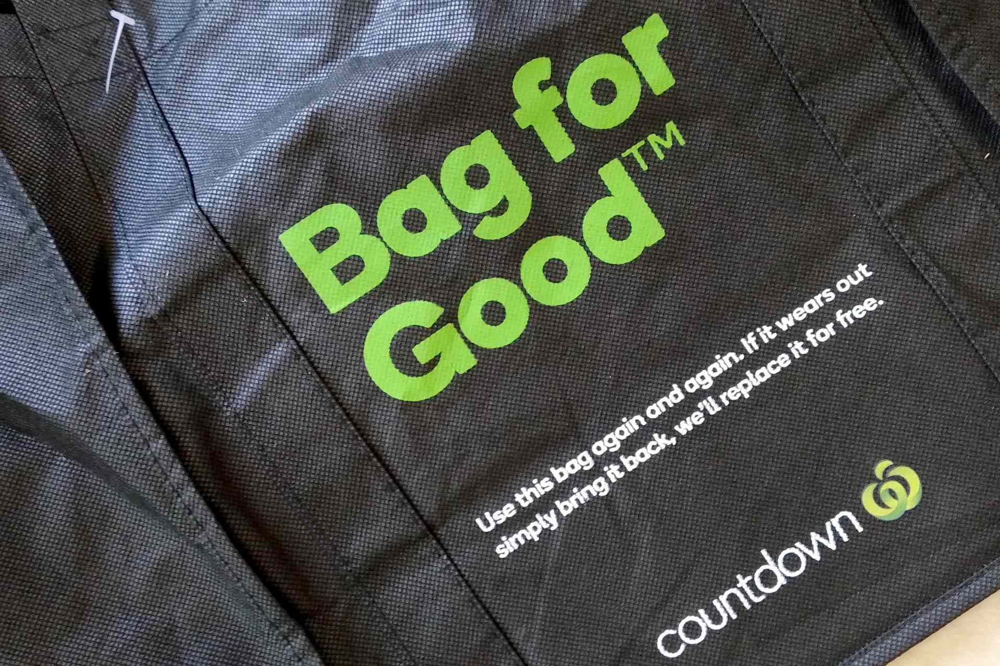
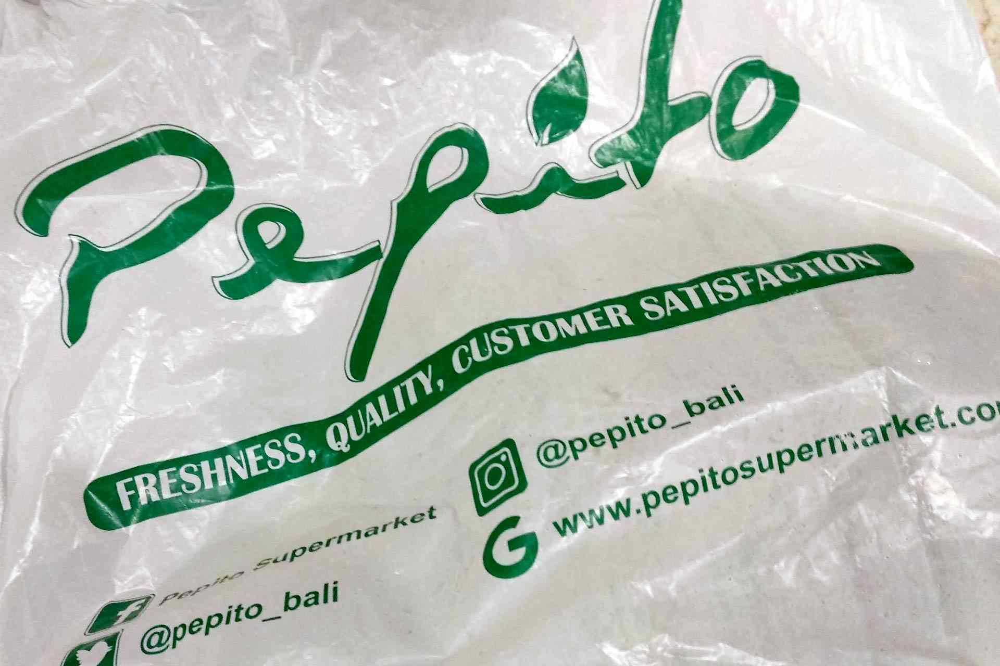
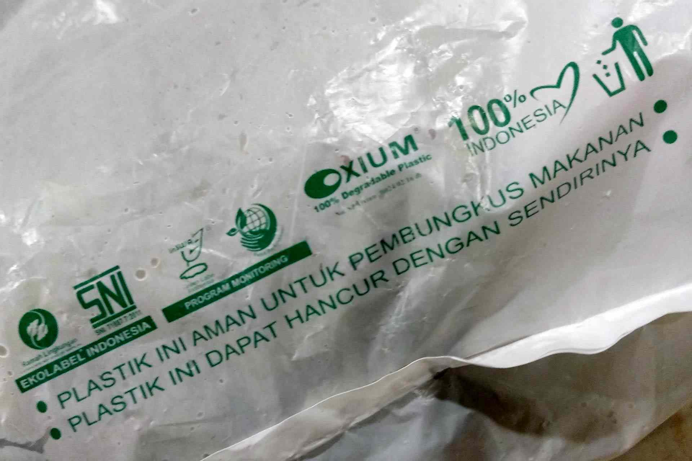
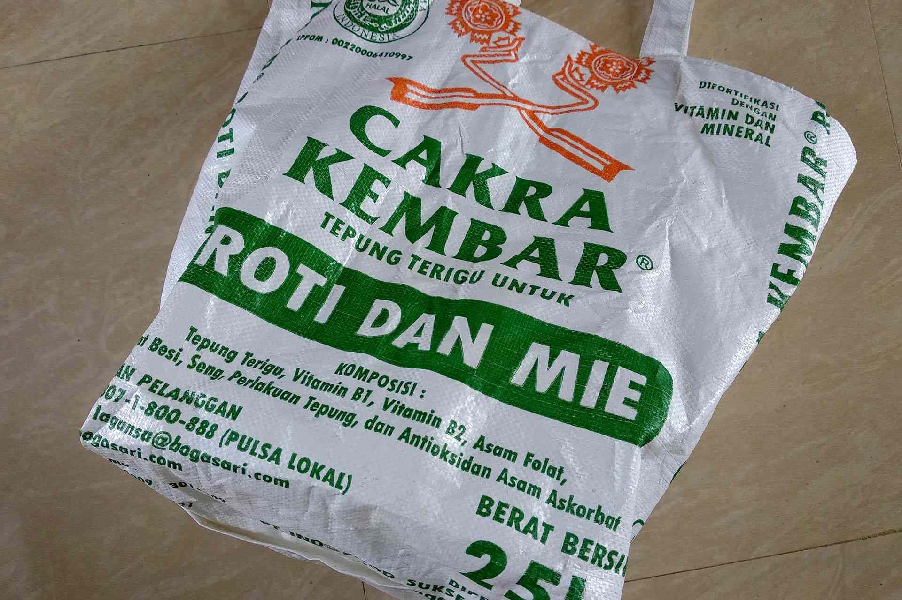

## TLDR

- The UN Environment Program estimates that 8 million tonnes of plastic is dumped in the oceans each year. Over 60% of this which generated by China, Indonesia, the Philippines, Vietnam and Thailand.

- Trying to fight plastic pollution Bali recently banned single use plastic bags.

- Other steps will need to include helping establishing the newly born biodegradable plastic industry and a better organized trash collection system.

Starting with the new year, Bali Denpasar area has banned the plastic bags. Tabanan regency now is set to follow up with similar initiative.

The ban is expected to cover the whole island coming into effect in June 2019.

The raising concern about **plastic pollution** has got a lot of press attention. In the last few years that South East Asia in general, and Bali in particular, is in the news for its ocean and land plastic pollution levels.

The **Bye-Bye Plastic Bag** campaign in Bali, created by Melati and Isabel Wijsen, in Bali, which has gained attention after former Governor Pastika signed a Memorandum of Understanding banning plastic bags in 2014, is now active in 18 countries.

The sisters were recently recognised by CNN as one of the world’s Young Wonders as part of the CNN Heroes event, giving the island and their movement enormous exposure.

> "Around 97% of our members no longer provide plastic bags for consumers," _Anak Agung Ngurah Agung Agraputra, Chairman of the Indonesian Retail Business Association or Aprindo Bali_

> "It is our hope that all levels of society will be able to provide smart ideas as a substitute for plastic bags... Aprindo Bali’s support was very much appreciated." --- IGN Jaya Negara, Deputy Mayor of Denpasar.

Coming up on March 6th the [Ogoh-Ogoh parades](https://fumes.junglestar.org/photo-journalism/ogoh-ogoh/), will the effigies, traditionally constructed from bamboo and paper, but in recent years build with foam, be plastic and Styrofoam free in 2019?

Head of Denpasar Disbud, the provincial cultural department, I Gusti Ngurah Bagus Mataram, has said this year's official Ogog-Ogoh parades will also respect the ban and avoid plastics and Styrofoam as a way to support the governor's initiative. Only bamboo, paper and natural products will be allowed, he told the press.

In Australia a similar ban has prevented an estimated 1.5 billion bags being dumped into the environment according to The Guardian UK in December 2018.

Coles and Woolworths’ decided to stop offering single-use disposable plastic bags midway through the year and three months on the change has translated to an 80% drop in the consumption of plastic bags nationwide, according to the National Retail Association.

A recent report in Reuters claims that between 500 billion and 1 trillion plastic bags are used annually around the world. Less than 10% of this is recycled and much of the rest ends up in the oceans.

The UN Environment Program estimates that 8 million tonnes of plastic is dumped in the oceans each year. Over 60% of this which generated by China, Indonesia, the Philippines, Vietnam and Thailand.

Bogor in West Java, introduced a similar ban on single use plastic bags on December 1 2018, and local News Wires are reporting the country's capital Jakarta could be next on the list.

We can't wait for this starting measure to spread, which could definitely be a game changer. Surely governments will need to followed up with more wide touching initiatives, covering supermarket product, currently still sold in plastic horizontal_spacings.

Other steps will need to include helping establishing the newly born biodegradable plastic industry and a better organized trash collection system. But hey, a good starting is surely a positive news.

## Know More Links

[Telobag](http://telobag.com/en/home/)

[Telobag instagram](https://www.instagram.com/telobagindo/)

[Evoware seaweed plastics](http://www.evoware.id/)

[Oxium Indonesian biodegradable plastic](http://www.oxium.net/page/)

[Avani website](https://www.avanieco.com/)

[Satvika Bhoga shop in Sanur](https://goo.gl/maps/uskEeZ96ALJ2)

[Eco Bali Recycling service](http://eco-bali.com)

[Avani biodegradable plastic life cycle](https://www.avanieco.com/life-cycle-3/)

[Evoware – Edible Sachet and Food Wraps Video](https://youtu.be/24T6ruz1GhU)

[Evoware – Youtube channel](https://www.youtube.com/channel/UCBN9aRJfC-bI-f3ll4abZaQ/videos)

[Reuters Evoware review](https://www.reuters.com/article/us-indonesia-evoware/indonesian-startup-wages-war-on-plastic-with-edible-seaweed-cups-idUSKBN1DN0XA)

[Bamboo straws](https://bamboo-straws.com/)

[World Watch Institute](http://www.worldwatch.org/)

[plastic oceans website](https://plasticoceans.org/)

[A Plastic Ocean - on Netflix](https://www.netflix.com/id/title/80164032)

[Byebye plastic bags website](http://www.byebyeplasticbags.org)

[Bali plastic bag free - video](https://youtu.be/SsF4xun1-u0)

[It's about time we start listening - TedX video](https://youtu.be/Y6Z5eOv6Nnk)

[Our campaign to ban plastic in Bali - Ted video](https://youtu.be/P8GCjrDWWUM)

[Bioplastics - An alternative for sustainable living](https://advancebioplast.com/)

[Biotechnology for Beginners](https://amzn.to/3wuzL8x)

[Soil Degradable Bioplastics for a Sustainable Modern Agriculture (Green Chemistry and Sustainable Technology)](https://amzn.to/3yy7akp)
