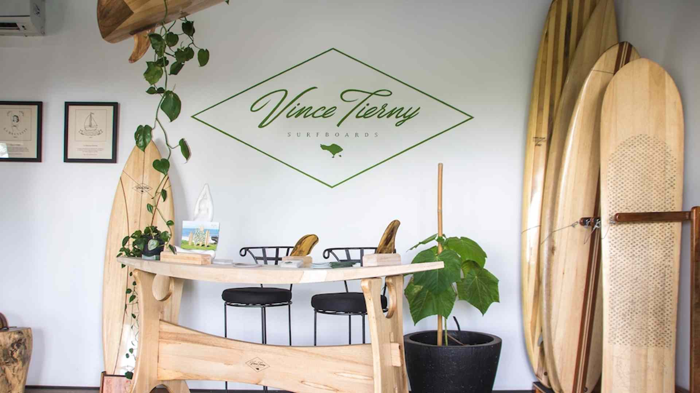
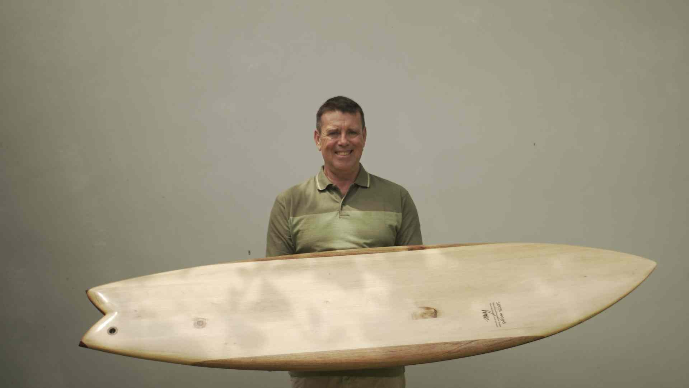
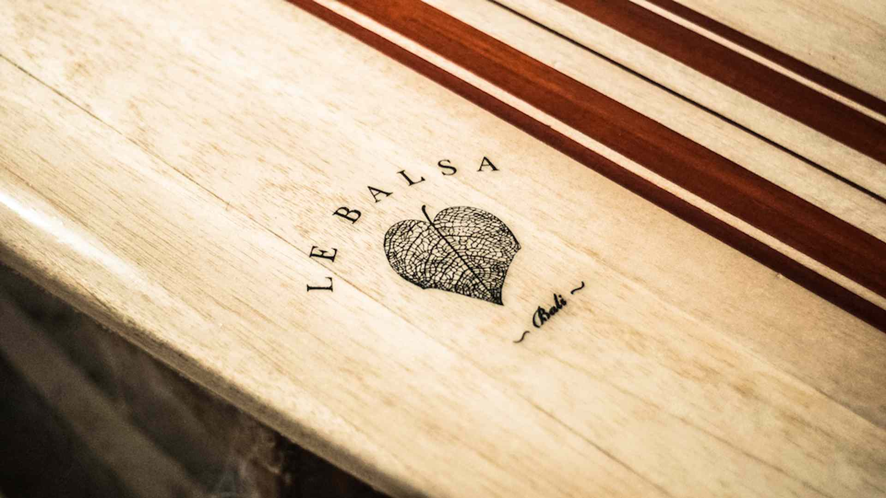
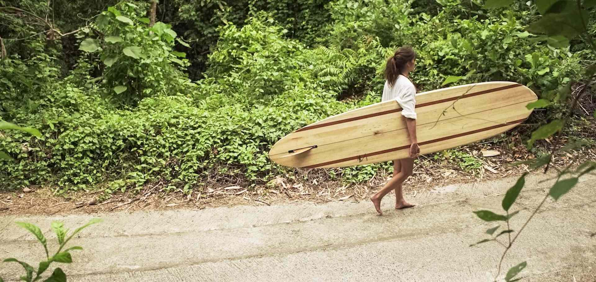

Surfing is one of the most environment-friendly sports , because of the love to the ocean every surfer keeps. But there is also a side of it thats not eco-friendly at all: the equipment. Everything is made out of plastic and the boards are mostly out of foam with epoxy, what is not very green.

Vince Tierny changed that. Since the early 80s he came from France to Indonesia and more or less stayed here. He grew up a manufactory of wooden Surfboards, with some struggling, but he kept on going until now, where they produce up to 150 boards annually.

The wood that is used for the boards is Balsa, also known as [Ocroma Pyramidale](https://en.wikipedia.org/wiki/Ochroma). It is like the perfect material for surfboards, because of its low density, that makes it very light, but its powerful strength.

They have local farmers, who grow the trees in East Java. They have to take care about one tree for 5-7 years to get the right size and shape. Then the trees were harvest and dry up to three month.

Finally the tree get in the manufactory cut and the shapers start to do their work. For one board a whole moth is needed until it is totally done for you to catch the waves. The board is of course glazed, so it is only 98% natural, but they were made to last your lifetime and they promise you also can give it to your children one day.

> We start by gifting Balsa plants to local famers in the region of the Bromo Volcano. As an infant tree, it is still vulnerable and needs tendering to allow the perfect growth into the next cycle. With the favorable conditions provided by the local farmers, the saplings will continue to develop into a full grown tree within a 5-7 year time period. When the trees reach their maturity stage, we return to the local farmers and purchase them trees to harvest._Vince Tierny_

They had a [showroom in Berawa, Canggu](https://goo.gl/maps/6kgsznMZLdK2) where they sell some standard boards, which are always available and you can also by cotton T-shirts, organic wax or bamboo fins.

The prices for a signature board starts at 315 USD up to 2200 USD, but for the customized boards the price always depends on the size and which kind of features you like to have.

Un fortunately Vince business is now permanently closed, here is [Vince Tierny Fb page](https://www.facebook.com/pg/vincetierny/) in case you want to still get in contact with him.

You can get a Balsa Surfboard form one of the links below, or even build one yourself, following [this video tutorial](https://youtu.be/00HYKyeiDe0) or [this other one](https://youtu.be/Df96N1WCBe8) or even make yourself a [5'10" bamboo shortboard](https://youtu.be/xhBOHScs2Ec).

## Know More Links

[Kayu surfboards - Bali](https://kayusurfboards.com/)

[Riley Balsawood Surfboards - Australia](https://balsawoodsurfboardsriley.com/)

[Gaspard Surfboards - France](http://gaspard-surfboards.fr/)

[Kuntiqi - Spain](https://www.kuntiqi.com/)

[Ecosurfshop - Europe](https://ecosurfshop.eu/)

[Yanasurf - Usa](https://yanasurf.com/balsa-wood-surfboards/)

[Grain Surfboards - Usa](https://www.grainsurfboards.com/)
