Bali is at the heart of the Indonesian archipelago stretching 150km wide and 80km from north to south. Its unique variant of Hinduism influences every aspect of island culture, from day-to-day village life to art, dance, food and music.

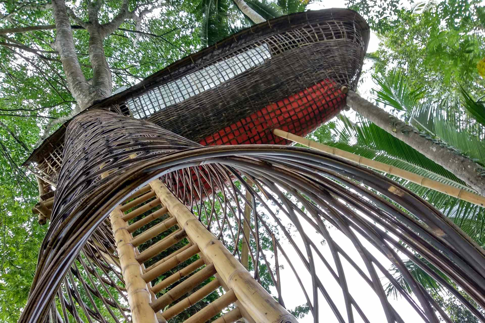
Located an hour’s drive to the north of Bali’s capital Denpasar, Ubud is already internationally acknowledged for its visual arts and performance, as well as exceptional arts and crafts, making it one of the most important cultural and artistic centres in Indonesia.

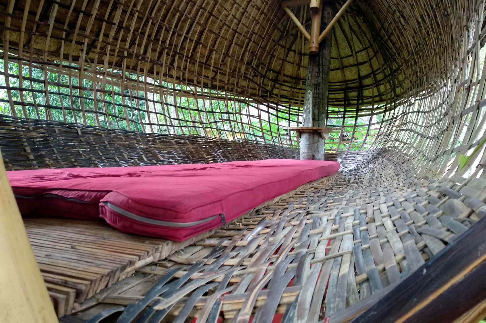

Unlike the beach areas, Ubud is laden with rice terraces and river crossings and forests. Coupled with a higher altitude, the overall climate is noticeably cooler than beachside locations in Bali.

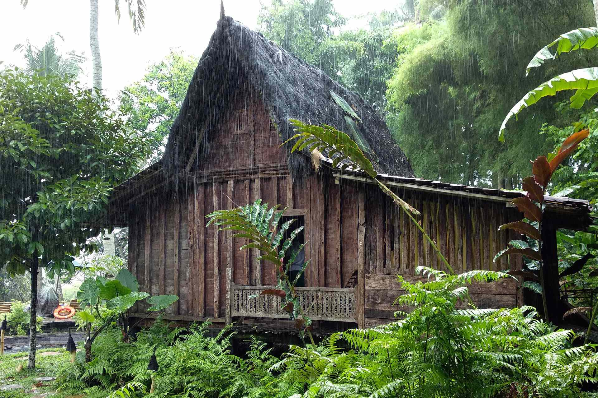

Bambu Indah is a radically distinctive boutique hotel in Sanyan, Ubud, carefully curated by designers and long term residents of Bali, John and Cynthia Hardy.

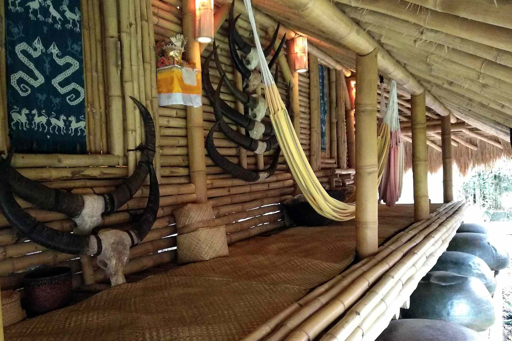

In 2005, eleven antique Javanese bridal homes were brought to Bali, restored, and decorated with fine details.

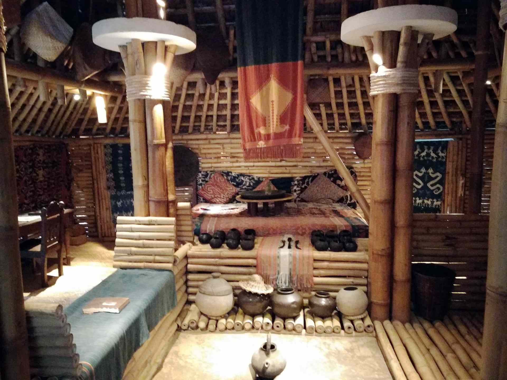

Now, Bambu Indah is available to travelers seeking unique experiences while being comforted by the luxury of a natural environment and service of an intimate hotel.

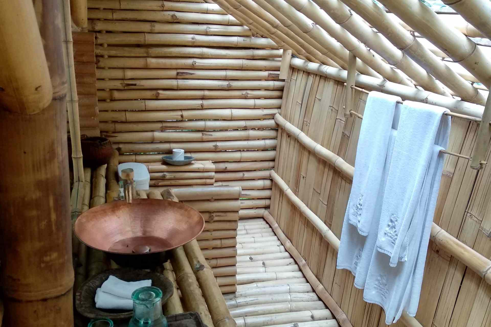

## River Warung Restaurant

The new river pools are magical. An hidden gem in Ubud, overlooking the Ayung River and dense tropical jungle.

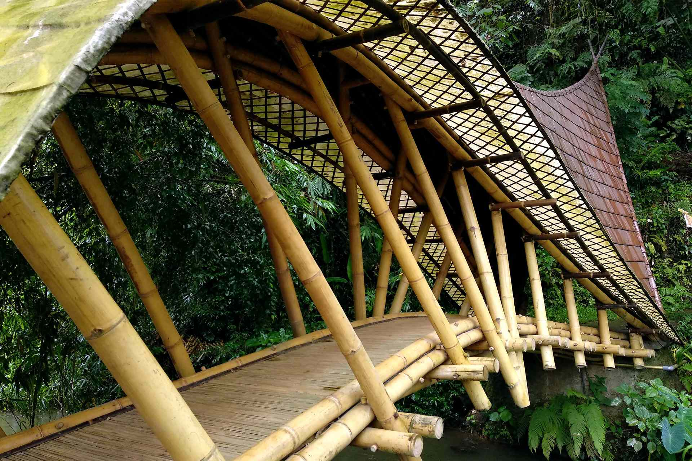

The River Warung Restaurant, open from 10am until 5pm, offers a feast of homegrown garden produce, freshly cooked over an open fire.

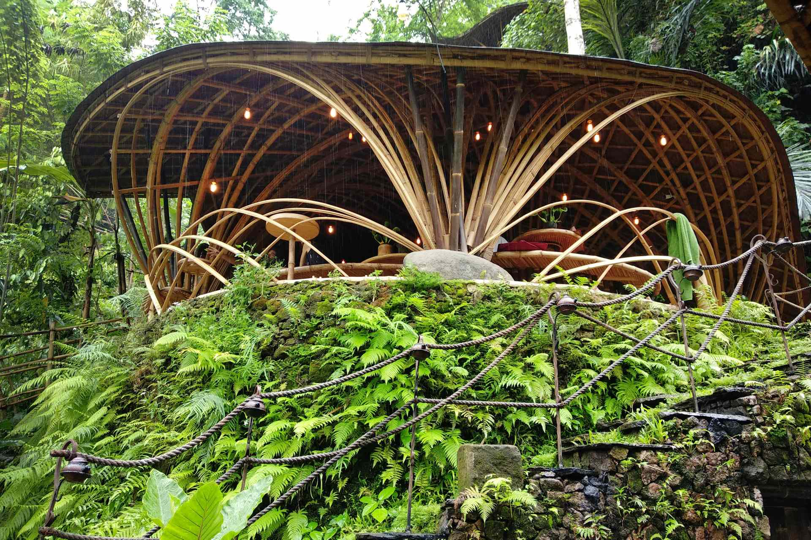

Every ingredient, ice cube and stick of firewood is lovingly carried down to the river on heads and backs.

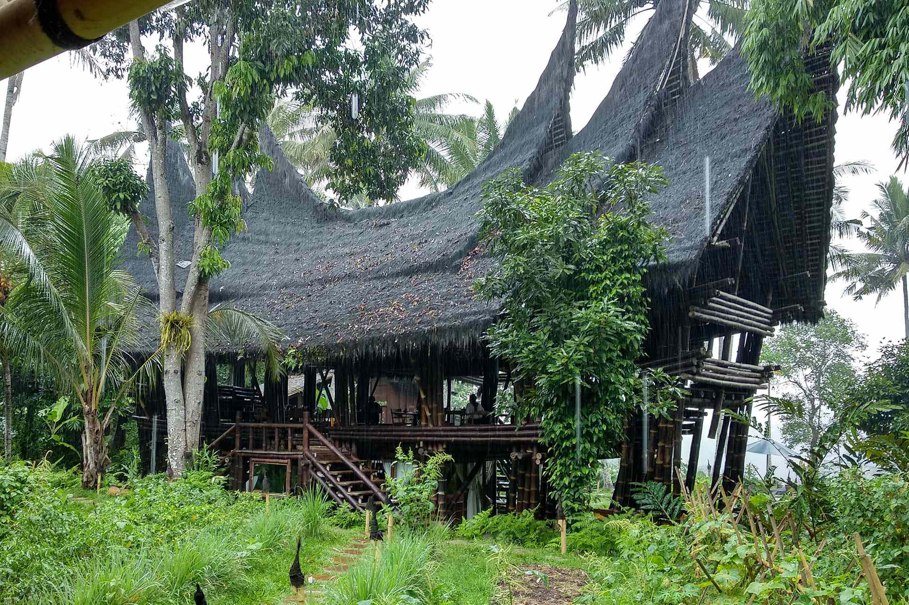

The Bambu Kitchen Restaurant is open daily from 6.30am to 10pm and feature local cuisine. It received _'2014 Snail of Approval'_ by complying with **Slow Food** Bali’s guidelines of using at least 75% Indonesia-produced ingredients, sustainably managing the waste and paying fare wages to staff.

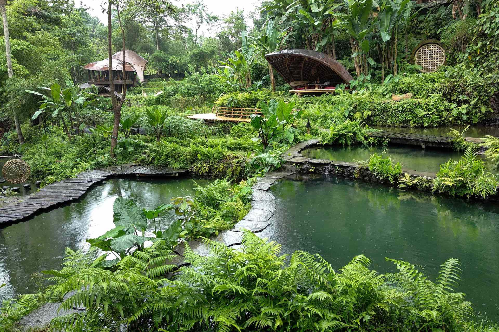

Organic Vegetable and Herb Garden run by a team of gardeners, led by permaculture experts, plant and harvest traditional Balinese rice, organic vegetables, herbs and flowers throughout the property on a daily basis.

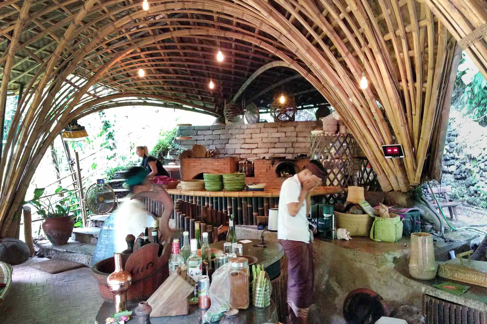

Veggies are allowed to ripen on the vine and are foraged every morning for use in the restaurants.

To ensure a healthy garden, only natural fertilizers is used, including compost made from their own organic waste.

Composting diverts waste from landfills, and helps eliminate the need for chemical fertilizers often used in commercial farms.

The Bambu Kitchen Restaurant is working towards being 100% self sufficient, growing all of our fruit, vegetables and herbs on site.

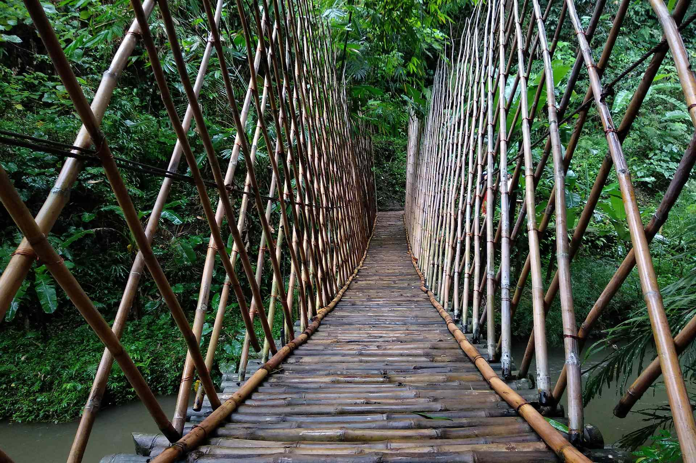

Still sometimes there is a need to buy locally produced items, such as vegetables, coffees, teas, beers and wines.

This ensures to support the local economy, and means that food spends less time in transit, is fresher, seasonal and more nutrient-rich.

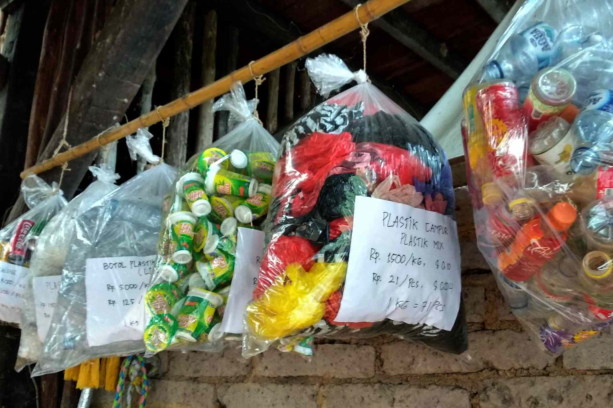

Guests are pampered with homemade dishes, breads, granola, jams, teas and deserts.

The restaurant offer also breakfast and afternoon tea with traditional Balinese sweets.

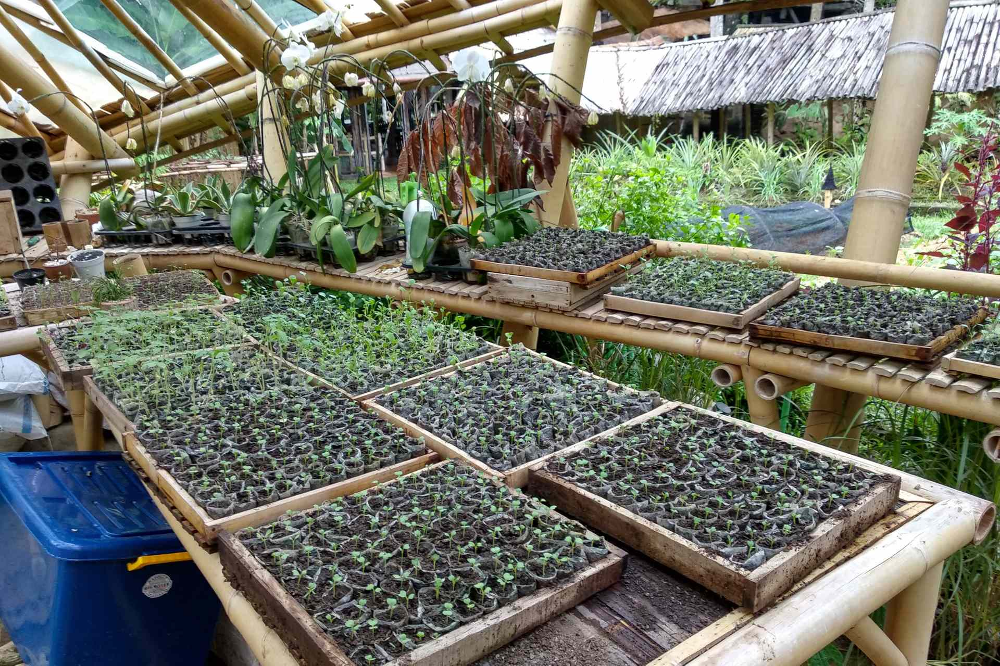

## Know More Links

[Bambu Indah - website](http://bambuindah.com/)

[Bambu Indah - has received lots of press](http://bambuindah.com/press/)
