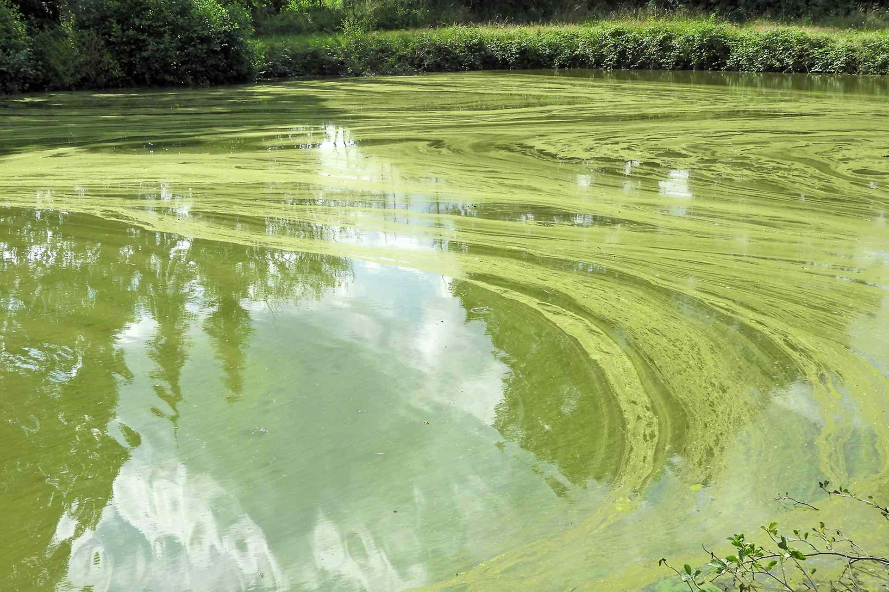
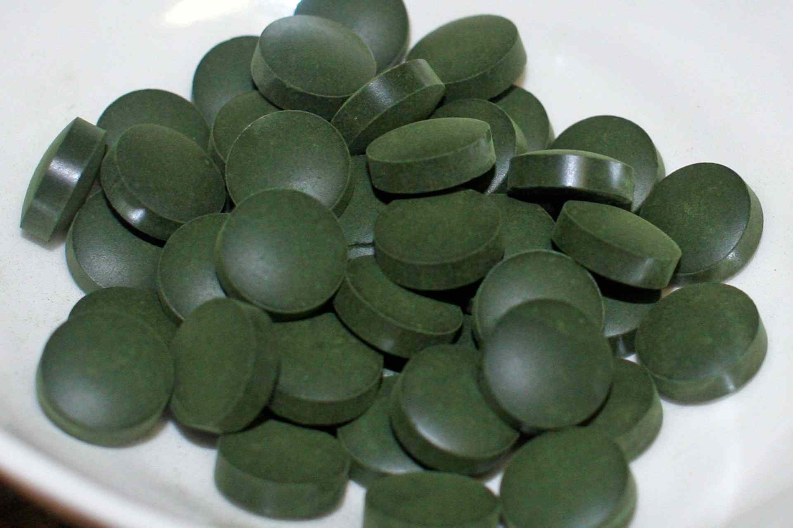

**Spirulina** is a type of bacteria called Cyanobacterium, a dark blue-green algae that has been touted as one of the most potent and protective **superfood** in existence.

Spirulina was consumed by the Aztecs back in the day, but became popular again when NASA proposed that it could be grown in space and [used by astronauts](http://ntrs.nasa.gov/archive/nasa/casi.ntrs.nasa.gov/19890016190.pdf).

Often used as a supplement to the diets due to the well-researched and diverse health benefits, Spirulina is a fantastic source of antioxidants, which can protect against oxidative damage.

It can lower total cholesterol, LDL cholesterol and triglycerides, while raising HDL, the "good" cholesterol. It protects LDL cholesterol from becoming oxidized.

Spirulina may have some anti-cancer properties, especially against a type of precancerous lesion called OSMF (Oral Submucous Fibrosis).

In one study, a higher dose of Spirulina has been shown to lead to lower blood pressure levels, a major risk factor for many diseases.

Spirulina supplements have been shown to be very effective against allergic rhinitis, helping to reduce various symptoms.

One study shows that it may be effective against anemia in the elderly. It can enhance endurance, and one study shows that it can increase muscle strength and significantly lower blood sugar levels.

Spirulina may also have other beneficial effects, such as helping to "detoxify" the heavy metal arsenic from the body.

A single tablespoon (7 grams) of dried Spirulina powder contains (2):

- Protein: 4 grams.
- Vitamin B1 (Thiamin): 11% of the RDA.
- Vitamin B2 (Riboflavin): 15% of the RDA.
- Vitamin B3 (Niacin): 4% of the RDA.
- Copper: 21% of the RDA.
- Iron: 11% of the RDA.

It also contains decent amounts of magnesium, potassium and manganese, and small amounts of almost every other nutrient that we need.

This is coming with only 20 calories, and 1.7 grams of digestible carbohydrate.

Spirulina may literally be the single most nutritious food on the planet.

## What Are the Dangers of Spirulina?

Because it takes in minerals from its environment, however, spirulina can absorb toxic amounts of some substances. If you use spirulina, buy it from a reputable source and use it in moderation.

Like other water-grown nutritional products, spirulina easily absorbs heavy metals, such as mercury and lead, from its environment. Spirulina grown in areas with large concentrations of these metals can contain dangerously high amounts of of them, passing them on to consumers.

Although a 1986 study revealed alarmingly high concentrations of lead and mercury in several brands of spirulina supplements, a 1989 study found the concentrations to be much lower, concluding that one would have to take in more than 77 grams of the most heavily contaminated spirulina daily to suffer from toxicity.

Spirulina contains Microcystins, groups of amino acids that can be toxic to your liver if you take in too much of them, according to Purdue University. Because scientists have not yet determined a specific intake amount that is toxic, many nutritional product manufacturers do not regulate them at all.

Many consumers have reported experiencing adverse health effects after using spirulina, a group of German researchers conducted a study, published in "Toxicology and Applied Pharmacology" in 2011, reviewing its safety.

They analysed 13 commercially distributed products and found Cytotoxins, substances that are harmful to cells, in each of them. The researchers concluded that such nutritional products are highly questionable.

Spirulina contains an abundance of nucleic acids, according to the Beth Israel Deaconess Medical Center. These substances, which are related to DNA, produce uric acid when they are metabolized. If too much uric acid accumulates in your body, gout or kidney stones can develop.

If you are susceptible to gout attacks or kidney stones, spirulina may be especially harmful to you. To avoid excessive uric acid, the hospital recommends limiting your intake of spirulina to less than 50 grams per day.

## Know More Links

[Spirulina - Wikipedia](<https://en.wikipedia.org/wiki/Spirulina_(dietary_supplement)>)

[10 Health Benefits of Spirulina](https://www.healthline.com/nutrition/10-proven-benefits-of-spirulina)

[Spirulina project at Auroville](https://www.auroville.com/spirulina)

[Dangers of Spirulina](https://healthyeating.sfgate.com/dangers-spirulina-7035.html)
