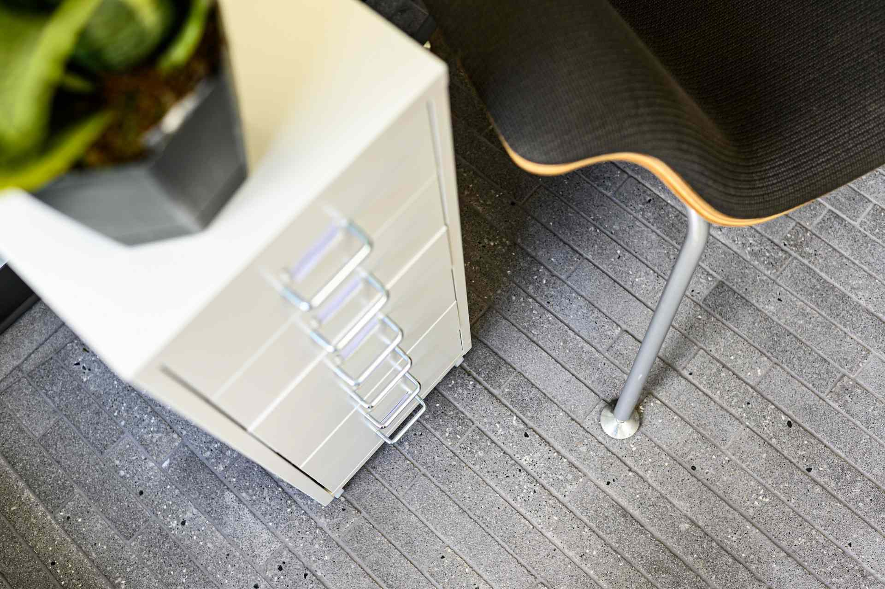
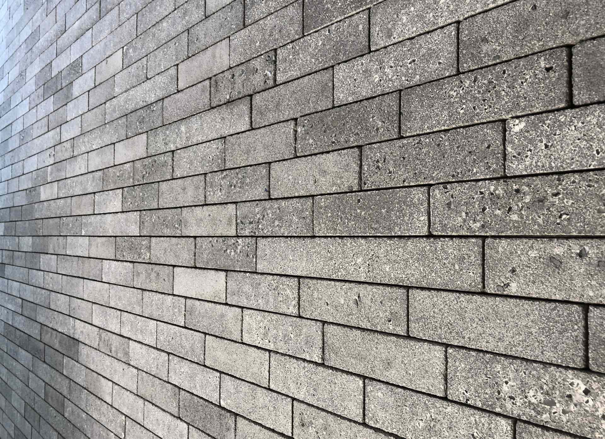
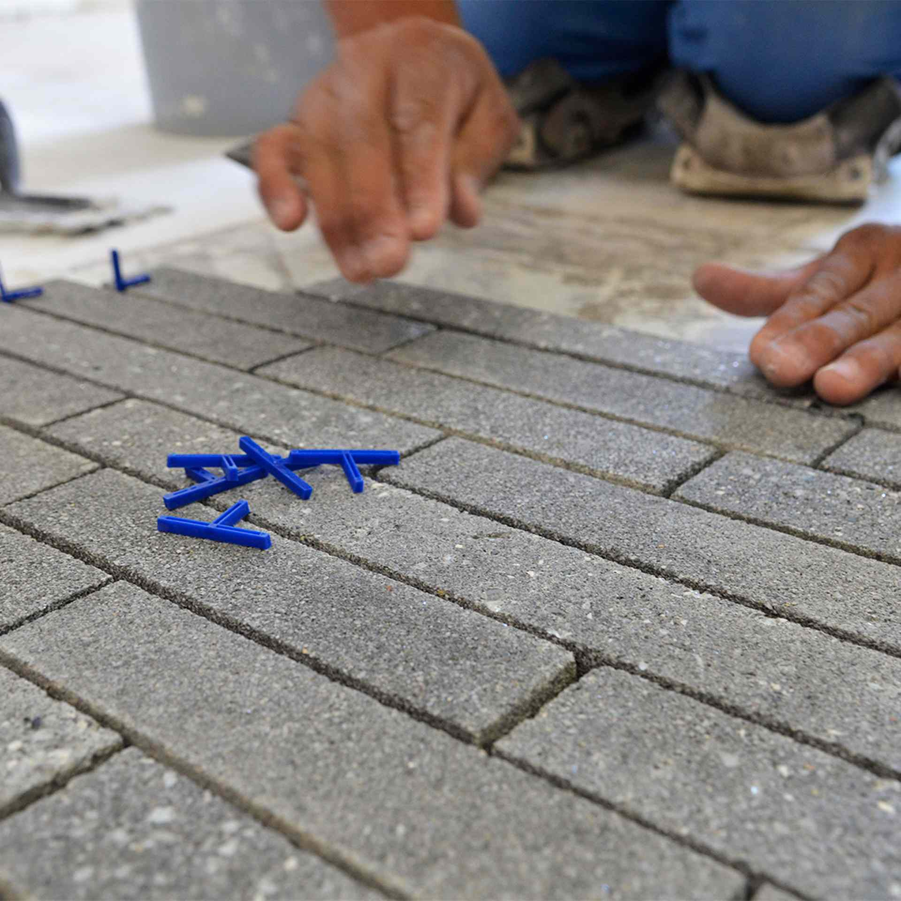
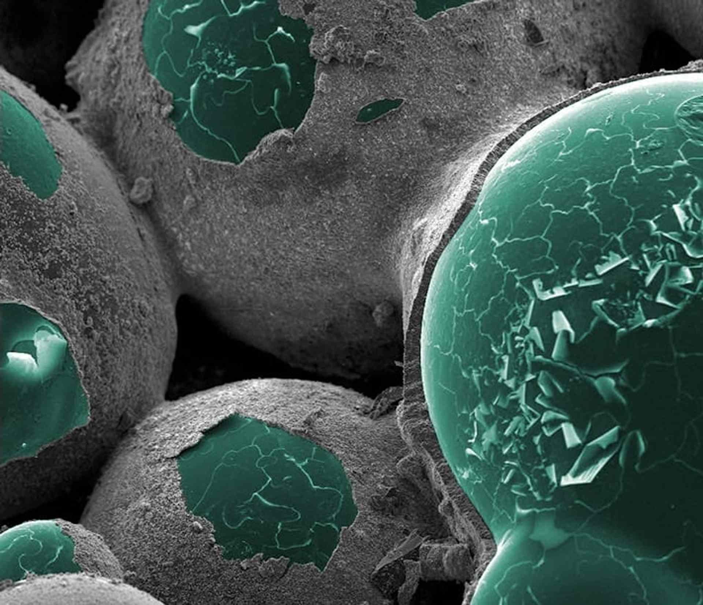
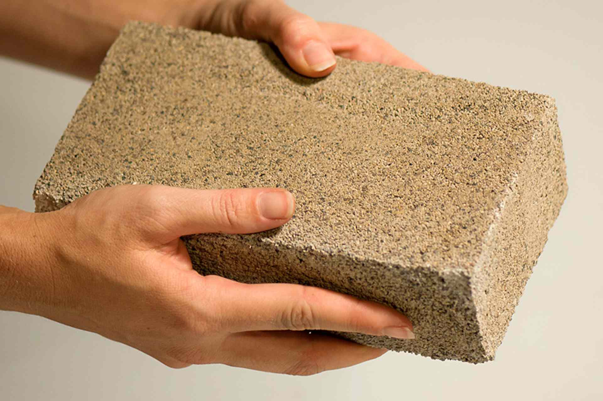
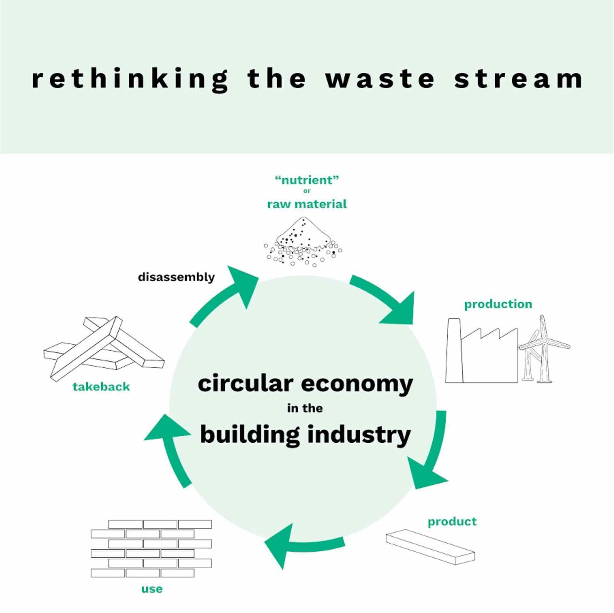
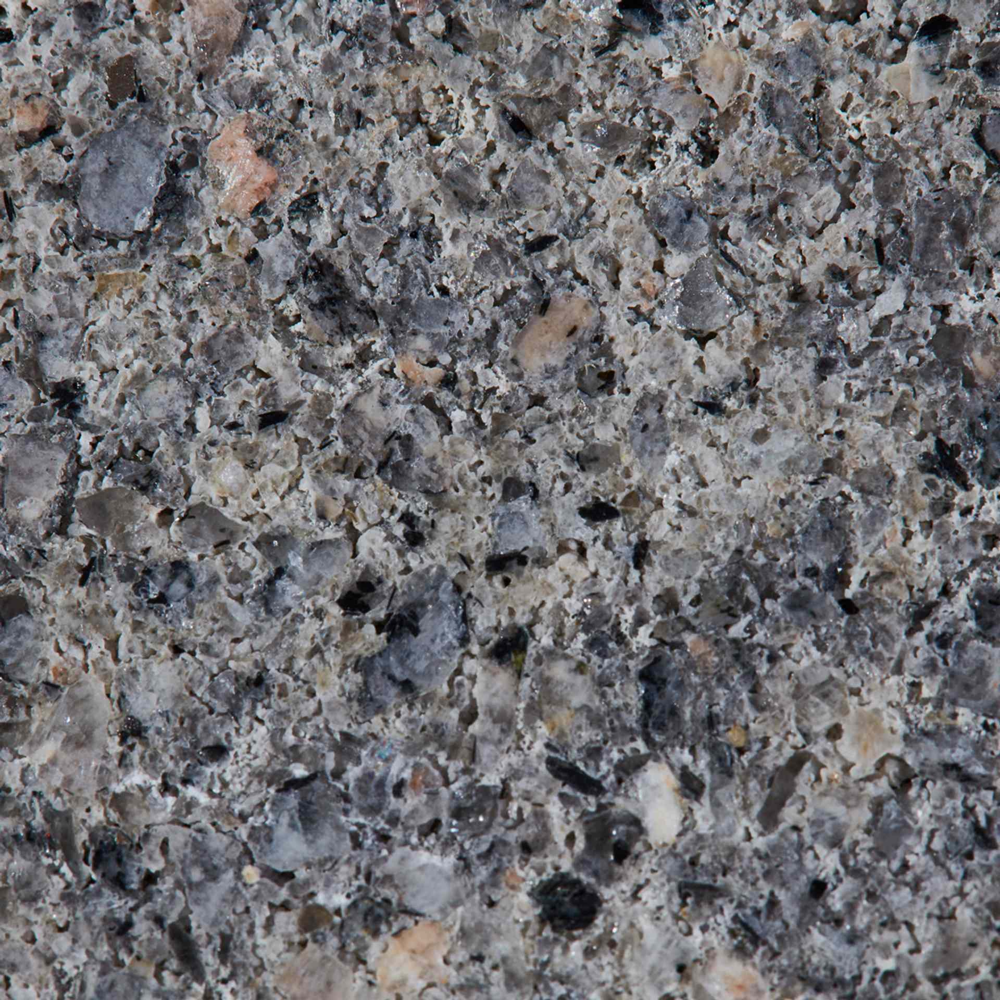
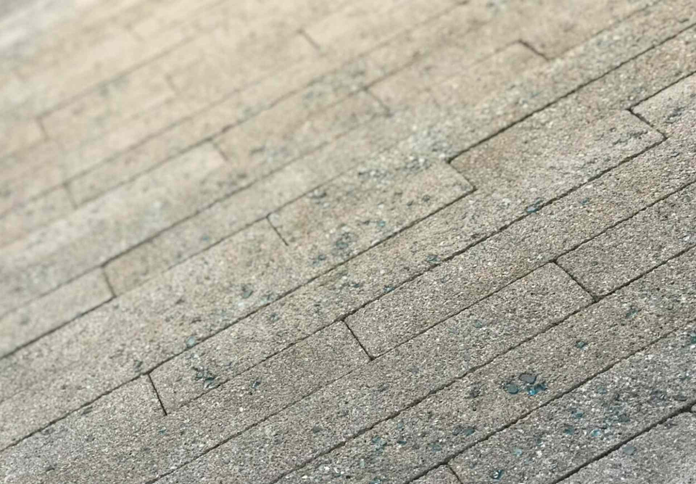

  IN THIS PAGE
- [TLDR](#tldr)
- [We grow biocement. No kiln firing, No CO2 emissions.](#we-grow-biocement-no-kiln-firing-no-co2-emissions)
- [Grown sustainable building material.](#grown-sustainable-building-material)
- [How it's made.](#how-its-made)
- [Dust control solution](#dust-control-solution)
- [The "Coral Reef" project.](#the-coral-reef-project)
- [Know More Links](#know-more-links)

## TLDR

- Growing biologically controlled calcium carbonate cement by employing microorganisms.

- 99% less carbon footprint compared to cement.

- Formed at ambient temperatures without dust release.

As an architect or designer, what is your role in the building industry? Are you making conscious decisions to support a sustainable economy? It all starts with the materials we use.

Bio cement, 99.4% carbon free cement, is the right choice for the health of our environment without sacrificing durability or lifespan of the material.

Can a fairly new material be used in the same way as the conventional ones we have been building with for centuries?

Would it be a viable option to replace, say, concrete, with an environmentally responsible alternative and still get the same results in terms of architectural performance?

And how can a structure be intrinsically linked to its locale?

London-based designer **Asif Khan** explored with his _Wallpaper Re-Made_ project, _"Coral Reef"_, created in partnership with American cement industry innovator **BioMason**.

## We grow biocement. No kiln firing, No CO2 emissions.

A leading innovator in the green building space, **bioMASON®** offers the lowest carbon footprint, greater than 99% less, cement product in the market.

They grow their pre-cast materials by employing microorganisms.

The scaled process of growing biocement materials is similar to hydroponics and traditional concrete block manufacturing.

Aggregate is mixed with our microorganisms, pressed into shape and fed an aqueous solution until hardened to specification.

Their process enables materials to be formed in ambient temperatures by replacing the curing process with the formation of biologically controlled structural cement.

Their patented biocement® **bioLITH®** tiles are available today to architects and green building leaders across the globe.

This North Carolina-based company, co-founded by CEO _Ginger Krieg Dosier_ and her partner _Michael Dosier_, is innovative.

It "grows" sustainable cement by employing microorganisms, just as coral reefs are formed in marine environments.

**BioMASON®** is supported by the National Science Foundation’s Small Business Innovation Research (SBIR) / Small Business Technology Transfer (STTR) program, a nearly $190 million program that awards research and development grants to small businesses and startups, transforming scientific discovery into products and services with commercial and societal impact.

## Grown sustainable building material.

**BioMason** was built on a single belief that there is a better way, a new way with cues from natural marine cement formation.

Instead of burning calcium carbonate to form cement, we are growing calcium carbonate cement biologically, precise, strong, durable, and real world tested, all formed in ambient conditions.

**BioMason** offers ground-breaking technology and a product line unlike any other available to the building and construction industry today.

## How it's made.

> "A regate is mixed with our microorganisms, pressed into shape and fed an aqueous solution until hardened to specification."

Explains _Krieg Dosier_.

> "BioMason’s process enables materials to be formed in ambient temperatures by replacing the curing process with the formation of biologically controlled structural cement."

The company is also researching marine biocement with the ability to self-repair.

BioMason biocement for dust control offers a best in class solution, that is cost effective, and convenient in application.

## Dust control solution

BioMason’s **biocement®** for dust control inhibits the creation of excess soil dust, which is a pollutant that contributes to an increase in particulate matter.

It's odorless, non-leaching, biodegradable, non-dissipating, non-flammable, water resistant, non-slippery & safe, results in a durable surface ecologically and environmentally safe, works on even the most difficult soil substrates.

Human, animal, marine life, and vegetation safe. It has a long term duration in between applications of about 6 months.

## The "Coral Reef" project.

The idea for _"Coral Reef"_ was born of one of Khan’s ongoing projects in the UAE, the new Museum of Manuscripts in Sharjah.

Currently under construction, the structure, due in 2021, present a surface made of many small stone elements, referencing traditional local coral-stone buildings and the geometry of _Arish_, the region’s palm-leaf architecture.

> "When we started working with BioMason, I wondered if we could recreate an element of our building from its biocement, and I wanted that product to use Sharjah’s sand as its a regate material, a resource that is plentiful..."

says Khan.

> "It’s an experiment, but the idea of making a structure from what we found on site is very simple and poetic. We decided to create a prototype section of external wall as our Re-Made project to test this possibility."

Creating the structure with Sharjah sand is not straightforward, even with BioMason’s strong, existing ties with this part of the world.

> "We first used the sands and indigenous a regates in Sharjah in 2009 when we created the technology,"

says Krieg Dosier.

> "We will seek to bring this technology full circle by using Sharjah a regates to produce our BioLith tile product, the company’s main product for commercial and residential applications, as a building façade material."

The collaborator team agrees that more research and strength tests will be needed to ensure the end product’s workability.

> "BioMason’s process enables materials to be formed in ambient temperatures by replacing the curing process with the formation of biologically controlled structural cement."

For Re-Made, the team is trying to reimagine an element from the museum’s structure as a shelving unit built of biocement.

> "Fish use coral reefs as places to graze and explore. I think a shelving system can have a similar feeling for people."

The piece may even become part of the museum, when it opens.

But the point of this project goes beyond its practical applications.

There’s a deep, conceptual and symbolic value to the experiment.

> "BioMason was founded by two architects who worked in the UAE from 2007 to 2014."

Illustrates Krieg Dosier.

> "The Re-Made project continues that narrative, expressing regionalism and reverence to other building materials used in the UAE. This project, design and collaboration are a proud and compassionate statement to working with materials found on site and our responsibility to place and environment."

Khan feels _"Coral Reef"_ is an exciting challenge:

> "I like that this project gave me the opportunity of remaking something that was precious to us the museum’s original design]. Perhaps we should all challenge our design assumptions more often."

## Know More Links

[Biomason - website](https://www.biomason.com)

[Handbook of Bioplastics and Biocomposites Engineering Applications](https://amzn.to/3hN44mG)

[Growing bricks, not another brick in the wall - TEDxWWF](https://youtu.be/OcZl2rRoccU)

[Growing bricks with bacteria - bioMASON- Youtube](https://youtu.be/6BqoM4am8kw)

[Biomason - IG](https://www.instagram.com/biomason)

[Biomason - Twitter](https://twitter.com/biomason)

[Bricks grown from bacteria - archdaily](https://www.archdaily.com/472905/bricks-grown-from-bacteria)

[Bioplastics - An alternative for sustainable living](https://advancebioplast.com/)

[Production of Biodegradable Plastics and Bioplastics Technology](https://amzn.to/2RyvVwx)

[Sustainable Economic Development (World Sustainability Series)](https://amzn.to/3hPYsbA)

[Advances in Carbon Capture: Methods, Technologies and Applications](https://amzn.to/2SpoJCD)
