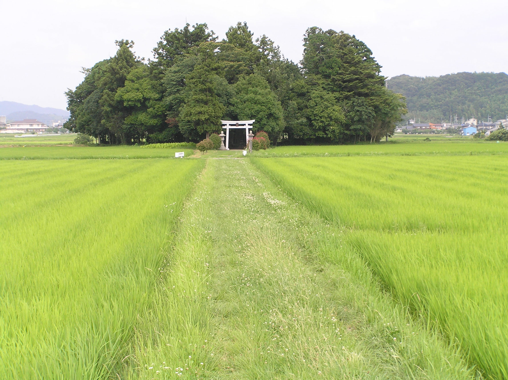
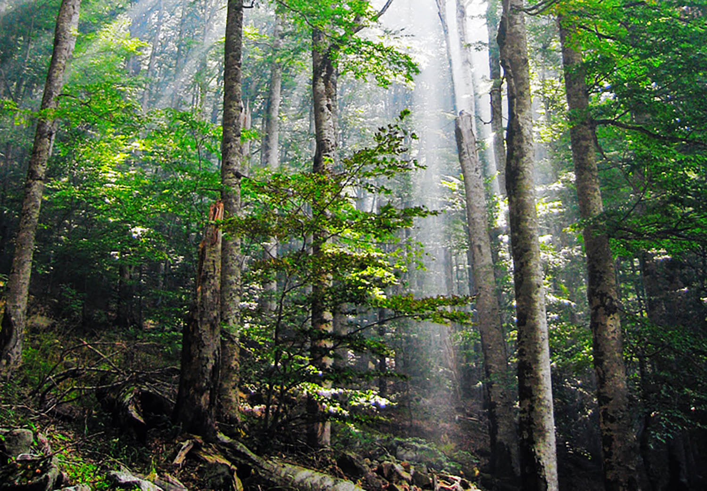

  IN THIS PAGE

- [Akira MIYAWAKI](#akira-miyawaki)
- [MIYAWAKI method](#miyawaki-method)
- [Method and conditions for success](#method-and-conditions-for-success)
- [Biocoenosis](#biocoenosis)

## TLDR

- MIYAWAKI advocated for the restoration of natural forests

- His method was deemed exemplary in a preparatory report for the 1992 Earth Summit, and in 1994 in the biodiversity congress of the UNESCO in Paris.

- Focusing on potential natural vegetation, MIYAWAKI developed, tested, and refined a method of ecological engineering, the MIYAWAKI method, to restore native forests from seeds of native trees on very degraded soils that were deforested and without humus.

## Akira MIYAWAKI

Beginning in the 1970s, MIYAWAKI advocated for the restoration of natural forests.

In 1992, he said he believed that the Earth Summit in Rio de Janeiro failed to emphasize the protection of native forests, most of which continued to decline. [Read more](https://en.wikipedia.org/wiki/Akira_MIYAWAKI)

Using the concept of potential natural vegetation, MIYAWAKI developed, tested, and refined a method of ecological engineering today known as the MIYAWAKI method to restore native forests from seeds of native trees on very degraded soils that were deforested and without humus.

With the results of his experiments, he restored protective forests in over 1,300 sites in Japan and various tropical countries, in particular in the Pacific region in the form of SHELTERBELTS, woodlands, and WOODLOTS, including urban, port, and industrial areas.

MIYAWAKI demonstrated that rapid restoration of forest cover and soil was possible by using a selection of pioneer and secondary indigenous species that were densely planted and provided with mycorrhiza.

MIYAWAKI observed trees that traditionally grew around temples, shrines, and cemeteries in Japan, such as the Japanese blue oak, CASTANOPSIS CUSPIDATA, bamboo-leaf oak, Japanese chestnut trees, and MACHILUS THUNBERGII. He believed that they were relicts of the primary forest.

Meanwhile, he noted that trees such as Japanese cedar, cypress and larch pine, supposedly native to Japan, had been introduced into Japan over centuries by foresters to produce timber.

MIYAWAKI reflected on the consequences of the change in composition and structure of most Japanese forests, most of which do not contain solely their original natural vegetation.

He calculated that only 0.06% of contemporary Japanese forests were indigenous forests.

Read [Plant ecology](https://en.wikipedia.org/wiki/Plant_ecology)

## MIYAWAKI method

His method was deemed exemplary in a preparatory report for the 1992 Earth Summit, and in 1994 in the biodiversity congress of the UNESCO in Paris.

The method was also presented in 1991 at the Symposium of the University of Bonn, and at the congresses of the International Association for Ecology, the International Society for Vegetation Science, and the International Botanical Congress, which included new aspects such as the links between growth, natural habitat, and estimated carbon fixation.

## Method and conditions for success

_The method's reconstitution of "indigenous forests by indigenous trees" produces rich, dense and efficient protective pioneer forests in 20 to 30 years, where natural succession would need 200 years in temperate Japan and 300 to 500 years in the tropics. Success phases_:

- RIGOROUS INITIAL SITE SURVEY

  Survey and research of potential natural vegetation.

  Identification and collection of a large number of various native seeds, locally or nearby and in a comparable geo-climatic context.

- GERMINATION IN A NURSERY

  Which requires additional maintenance for some species; for example, those that germinate only after passing through the digestive tract of a certain animal, need a particular symbiotic fungus, or a cold induced dorming phase.

- PREPARATION OF THE SUBSTRATE

  If it is very degraded, such as the addition of organic matter or mulch, and, in areas with heavy or torrential rainfall, planting mounds for taproot species that require a well-drained soil surface.

  Hill slopes can be planted with more ubiquitous surface roots species, such as cedar, Japanese cypress, and pine.

- PLANTATIONS RESPECTING BIODIVERSITY

  Inspired by the model of the natural forest. A dense plantation of very young seedlings (but with an already mature root system: with symbiotic bacteria and fungi present) is recommended.

  Density aims at stirring competition between species and the onset of phytosociological relations close to what would happen in nature (three to five plants per square metre in the temperate zone, up to five or ten seedlings per square metre in Borneo).

- PLANTATIONS RANDOMLY DISTRIBUTED IN SPACE

  In the way plants are distributed in a clearing or at the edge of the natural forest, not in rows or staggered

## Biocoenosis

A biocenosis, coined by Karl Möbius in 1877, describes the interacting organisms living together in a habitat (biotope).[Read more](https://en.wikipedia.org/wiki/Karl_M%C3%B6bius)

The use of this term has declined in the 21st сentury.

In the palaeontological literature, the term distinguishes "LIFE ASSEMBLAGES", which reflect the original living community, living together at one place and time.

In other words, it is an assemblage of fossils or a community of specific time, which is different from "DEATH ASSEMBLAGES" (thanatocoenoses).

No palaeontological assemblage will ever completely represent the original biological community (i.e. the biocoenosis, in the sense used by an ecologist); the term thus has somewhat different meanings in a palaeontological and an ecological context.

**Based on the concept of biocenosis, ecological communities can take various forms:**

- Zoocenosis for the faunal community,
- Phytocenosis for the flora community,
- Microbiocenosis for the microbial community.
-
The geographical extent of a biocenose is limited by the requirement of a more or less uniform species composition.

READ MORE:

[Biocoenosis](https://en.wikipedia.org/wiki/Biocoenosis)