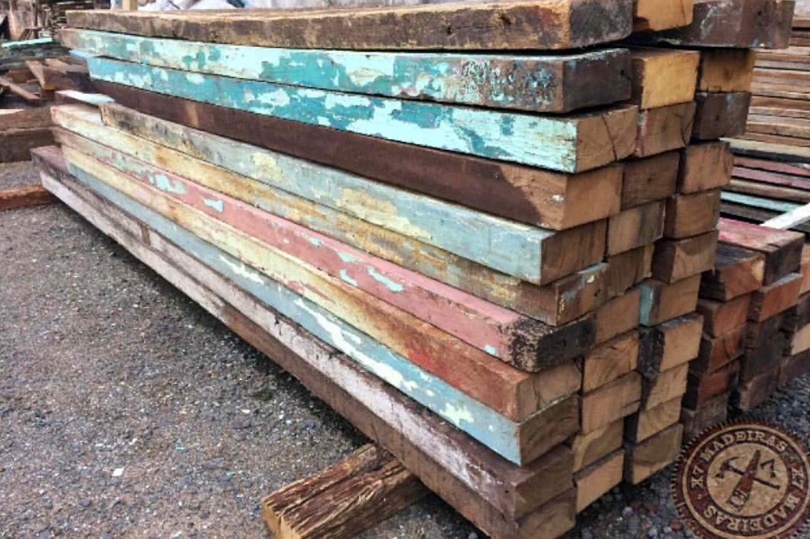

Peroba is a common tree in Brazil, local craftsmen use its wood for everything. From the strong, straight-grained stock that resembles oak, they build entire houses using it for framing, paneling, millwork, moldings, flooring, and furniture.

It is also called [Aspidosperma polyneuron](https://en.wikipedia.org/wiki/Aspidosperma_polyneuron) is a timber tree native to Brazil, Colombia, Peru, Argentina, and Paraguay. It is common in Atlantic Forest vegetation. It is useful also for beekeeping.

X7 Madeiras is Brazilian company who works with Peroba Rosa demolitions. They supplies all over Brazil and now they are starting to export too.

They provide rough unpainted Peroba boards and boards with inks and Peroba beams and boards for table production.

In addition to the Peroba, X7 Madeiras also works with Guarantã wood that can be used to base tables, chandeliers, benches, or whatever your imagination suggests.

They can send samples. Their strong point is that they are located exactly where the demolition of the old wooden houses is done, in the south of the Brasil and we have great quantity.

You can contact X7 Madeiras directly by calling Joyce +55 11 97085 2003 or writing an email to them: joydepaula@hotmail.com.

## Know More Links

[Peroba Tree - wikipedia](https://en.wikipedia.org/wiki/Aspidosperma_polyneuron)

[Brasil wood database](https://www.wood-database.com/brazilwood/)

[Peroba rosa](https://www.wood-database.com/peroba-rosa/)
