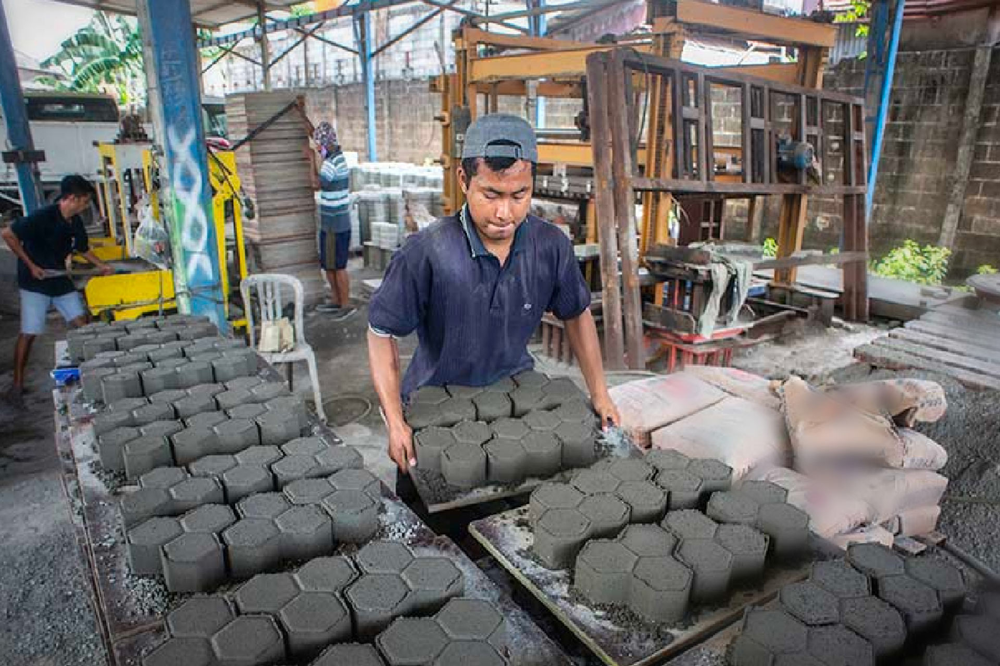
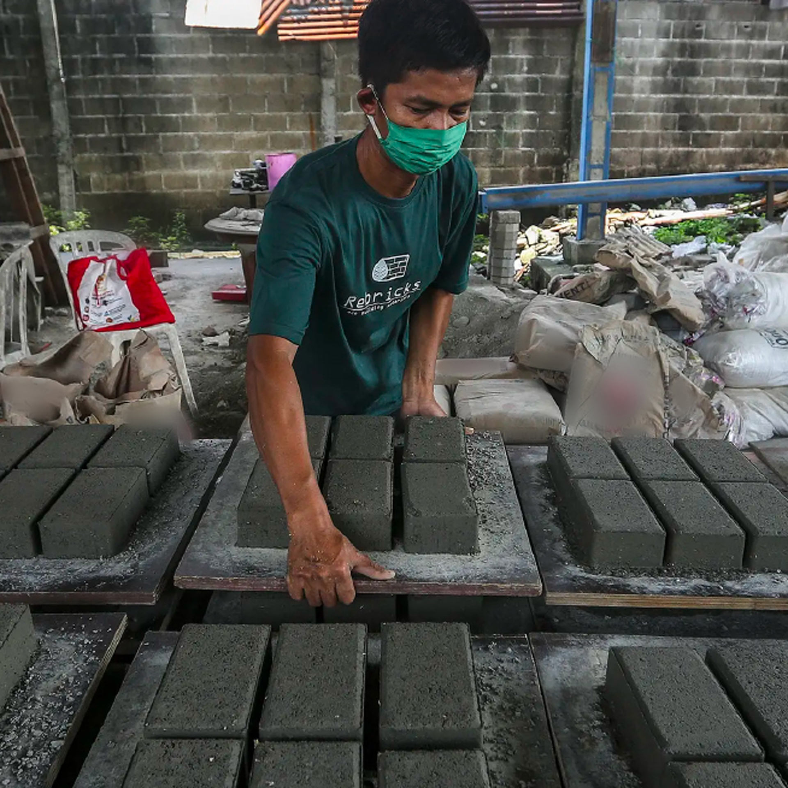
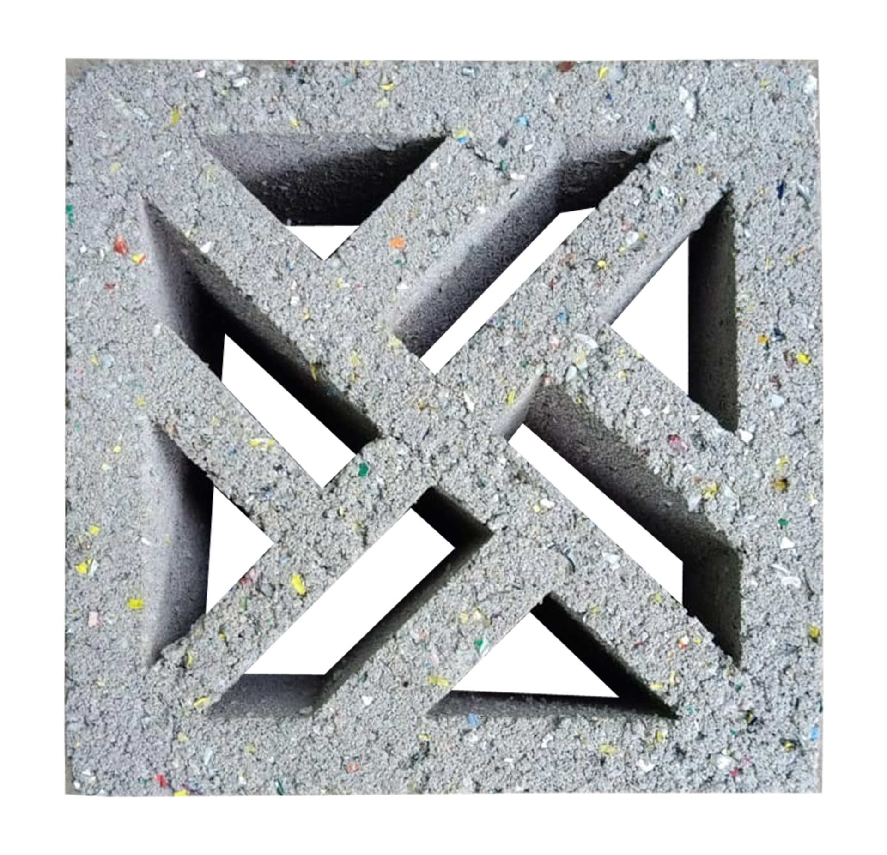
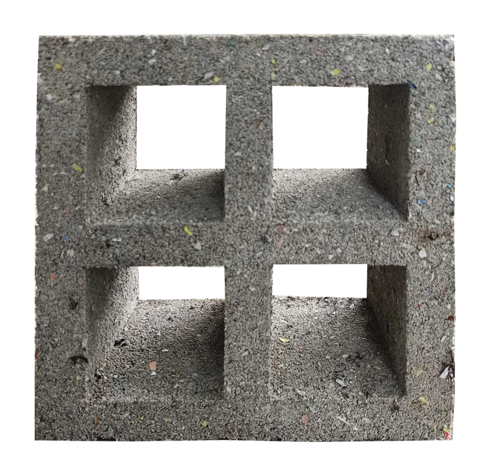

<!-- TOC -->

- [TLDR](#tldr)
- [REBRICKS MISSION](#rebricks-mission)
- [PAVING BLOCK](#paving-block)
- [HOLLOW BLOCKS AND ROOF TILES](#hollow-blocks-and-roof-tiles)
- [THE ACTUAL MAKING AVOIDS POLLUTION](#the-actual-making-avoids-pollution)
- [MOTIVATION: DO SOMETHING GOOD FOR THE PLANET](#motivation-do-something-good-for-the-planet)
- [SPREADING AWARENESS](#spreading-awareness)
- [CLIMATE SMART HOUSING](#climate-smart-housing)
- [Know More Links](#know-more-links)

<!-- /TOC -->

## TLDR

Indonesia firm REBRICKS turns waste plastic into bricks. Shredded and molded, without any burning.

They claim their bricks are designed and sealed to prevent microplastic leaking. They calculated a possible lifetime of more than 20 years.

Their brick are reusable, recyclable and can be remanufactured, so generating a production close to a circular economy loop.

Transforming plastic waste into recycled building materials they provide a solution to Indonesia’s plastic waste problem.

## REBRICKS MISSION

Ovy Sabrina and Novita Tan, Rebricks founders, where very concerned for the environment. Indonesia is one of the most polluted country in the world.

With little to no pullution management education, no istitutional rubbish collection, widespread trash burning across the archipelago, no sewage system and big poplutaion density, the resulting damage to the ecosystem has reached unsustainable levels here.

There are some bottle reclycling facilities, called 'Bank Sampah' litteraly 'rubbish bank', where poor people sell bottles collected by walking their neighborhood, but many types of plastic waste cannot be recycled.

This unrecyclable plastic, sachets, plastic bags, bubble wrap and other packaging, has no price and is ignored by collectors. So it ends in the sea and landfill.

Rebricks estensively tested possible techniques, leveragin Ovy's experience in the field of building materials and developed a formula and methods to produce long lasting building material that can be used in everyday building contructions.

## PAVING BLOCK

Paving blocks, the first Rebricks product, have been tested at [B4T](https://www.b4t.go.id/)(Great Hall of Material and Technical Goods) where they meet the SNI class B criteria, suitable for use as parking lots for pedestrians and parks.

From each Rebricks paving block, almost 20% is rejected plastic waste.

## HOLLOW BLOCKS AND ROOF TILES

Rebrick now offers a variety of products, including hollow blocks and rosters where the absorption of plastic waste is even greater.

Their products are able to compete in price and strength with other conventional building materials.

## THE ACTUAL MAKING AVOIDS POLLUTION

The actual making avoids pollution and does not generate new waste in the production process.

Rebricks' production capacity is currently 100 m2/day, recycling 88,000 sachets of plastic waste, about 25 kilograms of waste plastic. They are active in Jakarta, an other places in Java, Sulawesi, Bali and Sumatra.

## MOTIVATION: DO SOMETHING GOOD FOR THE PLANET

Rebricks intend to do good for the Planet. Reduce the high level of plastic waste Indonesian society produces.

When the Rebricks business started had no clear idea on how to go about collecting this rejected plastic waste supply.

So they started a campaign to mobilize the community and the response that was obtained was extraordinary.

There are many stories of changing behavior in sorting waste because of the Rebricks movement, people are becoming more aware of the impact of disposing of this type of plastic waste.

Even though few people are today aware and willing to do the simplest thing to help, their succes is growing.

More people are bringing a shopping bag or carrying a stainless straw from home.

These small actions are the easiest to do so they represent a good starting point in caring about the environment and can have a big impact.

## SPREADING AWARENESS

Of paramount importance tackling the enviroments pollutions is education and spreading awareness. So Rebricks is focused also in building collaborations. As you can [read on their website](https://rebricks.id/what-we-do/habitat-for-humanity-collaboration-with-rebricks-to-launch-climate-smart-housing-2023) their work with several institutions.

Other collaborative projects have been started withg WWF Indonesia, Nutrifood, Hush Puppies, Novo Nordisk and several national institutions.

HokBen, a fast food restaurant chain serving Japanese-style food based in Jakarta is working with Rebricks to process its food packaging waste made from polystyrene into something useful and valuable, namely roster.

Roster is a wall component that functions as a vent that helps air circulation. Usually roster is made of clay, adobe and concrete.

HokBen and Rebricks made a roster using HokBen food packaging.

Rebricks and Novo Nordisk started the Circular for Zero program in 2021, a webinar on how to choose waste, explaining what rejected waste is and where to send it to Novo Nordisk employees.

Participants managed to collect 125 kg or 125,000 disposable plastic packaging waste needed for the construction of 2 bathrooms and 2 toilets in Kampung Pemulung.

## CLIMATE SMART HOUSING

Habitat for Humanity in collaboration with Rebricks launched in 2023 'Climate Smart Housing'.

The amount of waste that currently produced by household if not treated properly brings a lot of disaster, as is evident to anyone who ahs visted Indonesia, and noticed that all kinds of trash is everywhere, not only in city streets but also in jungles and beaches.

Habitat for Humanity Indonesia is working with Rebricks Indonesia to build Climate Smart Housing, in order to create a greener circular economy.

Rebricks buys rejected waste from the Habitat fostered community in Mauk, Tangerang, Banten.

This waste is then recycled into raw materials for constructions. Then, Habitat will use the recycled product making houses for the community in Mauk.

Also through this program, 1 house built is able to avoid 270 kg of rubbish ending up in landfill or sea.

## Know More Links

[Rebricks website](https://rebricks.id/)

[Rebricks YouTube](https://www.youtube.com/@rebricksindonesia7608)

[Habitat for humanity](https://www.habitat.org/)

[Habitat for humanity - Indonesia](https://www.habitat.org/where-we-build/indonesia)

[Novonordisk](https://www.novonordisk.com/sustainable-business/zero-environmental-impact.html)