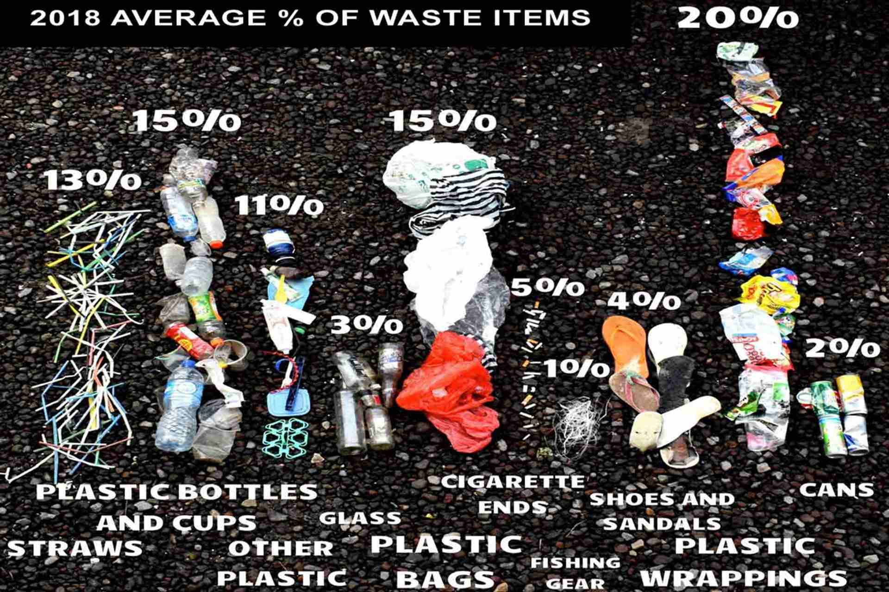

**Byebye plastic bags** is an initiative from children to force all the people to say no to plastic bags, because of the enormous environmental pollution they cause.

It was invented of two young women, Melati and Isabel Wijtsen.

They have a vision of a plastic bag free world where the young generation takes care and take action. They want to ban the use, sale and production of plastic bags.

They have some sponsors and partners, but mostly they are living from donations. You too can be part of the movement, if you join or build your own BBPB team.

Start by signing in at their [website](http://www.byebyeplasticbags.org). Or go straight to [donate to their non-profit Yayasan Bumi Indah](https://www.paypal.com/cgi-bin/webscr?cmd=_s-xclick&hosted_button_id=FDNL9X89B8EPC).

To get Bali free of plastic bags is such a great idea, but maybe harder to reach than they first thought.

They promised to get Bali free in 2018, what is definitely not the case. Most of the people do not look around that much and only see the very easy handling of plastic bags.

Hopefully the girls find some good new solutions to get there vision come true.

The first important step they reckon is to educate people about the damage plastic bags brings to our environment and also how you can be part of the solution.

They launched a lot of projects.

### Pererenan Pilot Village

Every month we distribute alternative bags to the local shops and warungs in this pilot village, which is home to 800 families.

Melati and Isabel are committed to making this village plastic bag free!

### One Island One Voice

A collective of NGOs, shops, hotels, restaurants, orgs and individuals who are committed to reducing waste on the island and solve the plastic problem with us.

We are stronger together! To promote plastic bag free zones, check [One Island One Voice website](https://www.oneislandonevoice.org/).

### River booms

River booms collect trash that would otherwise flow into the ocean or get stuck on the coastline.

BBPB works with students from Green School to build booms from recycled material and use in rivers across Bali.

### A SOCIAL ENTERPRISE

Women from a mountain village in Bali are making alternative bags, using collected and donated cloth materials.

The bags will be sold across Bali retailers.

For every one bag sold, one bag will be donated to a local community member.

### Education Booklet

In 2014, BBPB completed version 1 of their educational booklet for primary aged students to learn about the harms of plastic.

It was distributed throughout schools in Indonesia. An updated Version 2 of the booklet is to be published and distributed in 2018. [Educational booklet - PDF](https://drive.google.com/file/d/0Bxg4eo4M4UbeYmhxREI1cXJIY3c/view)

## Know More Links

[Byebye Plastic Bags - website](http://www.byebyeplasticbags.org)

[Bali plastic bag free - video](https://youtu.be/SsF4xun1-u0)

[It's about time we start listening - TedX video](https://youtu.be/Y6Z5eOv6Nnk)

[Our campaign to ban plastic in Bali - Ted video](https://youtu.be/P8GCjrDWWUM)
