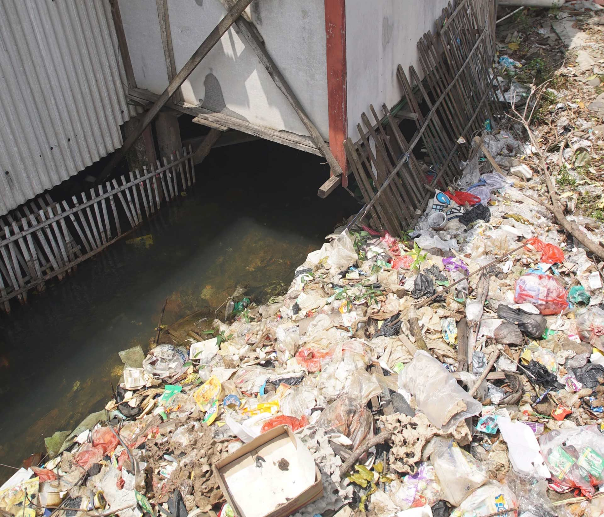
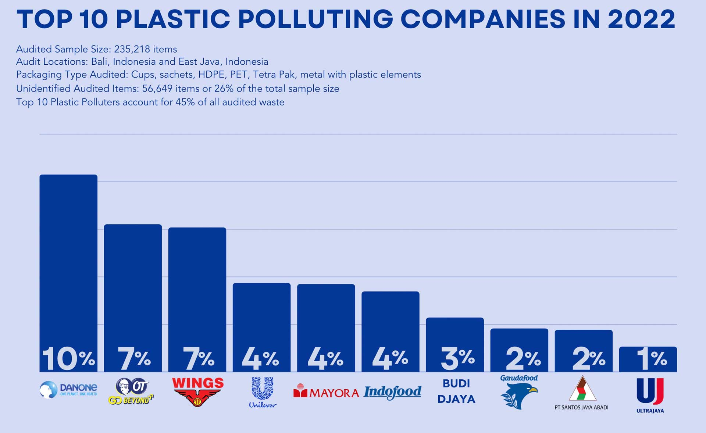
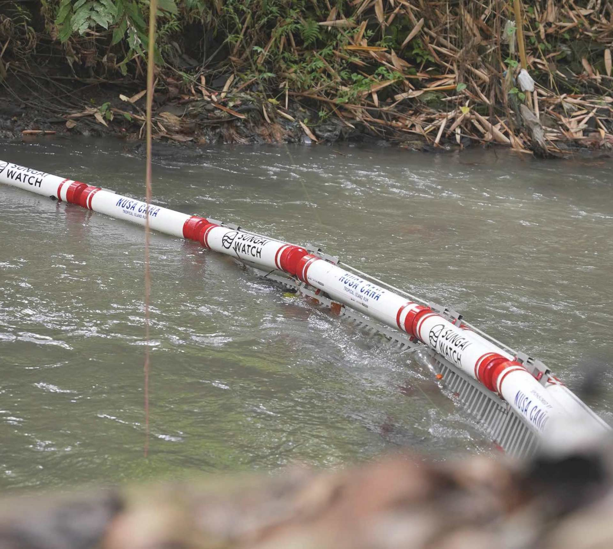

<!-- TOC -->

- [TLDR](#tldr)
- [SUNGAI WATCH MISSION](#sungai-watch-mission)
- [BARRIERS AND CLEANUPS](#barriers-and-cleanups)
- [WASTE AUDIT](#waste-audit)
- [VILLAGE MODEL NEW APPROACH](#village-model-new-approach)
- [CLEANUPS](#cleanups)
- [THANK YOU TO VOLUNTEERS!](#thank-you-to-volunteers)
- [Know More Links](#know-more-links)

<!-- /TOC -->

## TLDR

Indonesia ranks as the 2nd largest plastic polluter to the oceans after China.

1,311,859 kg of plastics collected

9 Village Models

180 Barriers installed

650 + Community cleanups

Rivers are the perfect connection point between life on land and our ocean.

SUNGAI WATCH organizes emergency cleanups at illegal dumps and along riverbanks to prevent plastic from entering rivers

##  SUNGAI WATCH MISSION

SUNGAI WATCH believes trash barriers are the quickest and most cost effective way to eradicate plastic pollution by activating communities on land.

Rivers are the perfect connection point between life on land and our ocean.

SUNGAI WATCH organizes emergency cleanups at illegal dumps and along riverbanks to prevent plastic from entering rivers as well as work on enforcing proper waste management at the local level.

In mapping SUNGAI WATCH work, tehy seek to track river pollution and better prevent these sources.

## BARRIERS AND CLEANUPS

SUNGAI WATCH barriers and cleanups are the perfect tool to get communities and governments involved in cleaning rivers, collecting data, and improving waste management practices.

## WASTE AUDIT

Sungai Watch main objective is to stop plastic from going into the ocean and find solutions to mitigate plastic pollution from entering our rivers in the first place.

So they collect data on plastic pollution to gain an understanding of where the waste is coming from and what practices and industries are responsible for it.

Through this data, they hope to assist governments and communities to establish better waste management practices and to put policies in place to avoid our rivers from being polluted.

They divide waste into 30 material categories. To understand the source of plastic pollution in our rivers, they then take a sample from each material category every month to identify the manufacturing brand.

By doing this, they can identify the companies that are most responsible.

>"In 2021, we audited 214,732 single waste items. In 2022, our brand audit analyzed a total of 235,218 single waste items.

This revealed the top 10 parent companies responsible for plastic pollution in Indonesia, with 26% of the waste items being unidentified..."

By sorting through the 535,246 kg of non-organic waste collected, they were able to identify the type of materials that are polluting our rivers, which has enabled us to further process each waste stream for recycling or up-cycling.

From the 11 categories listed here, they are able to recycle 51% of what they collected in 2022.

This includes colored plastic bags, transparent film, glass, PET bottles, hard plastics, and cups.

They are actively working towards finding solutions for the other waste streams such as sachets, sandals, fabrics, and styrofoam.

The most common type of waste they found in 2022 was residual waste (29%), which is anything that has been damaged beyond repair and can no longer be recycled after being in open environments for years.

The categories that fall under residual waste include burnt plastic, diapers, sanitary waste, cables and tanglers, face masks, banners made from poly, very dirty or deteriorated HDPE/PET, mesh, vinyl, pillows and synthetic fabrics, fishing nets, fishing lines and large pieces of styrofoam that are too dirty to be recycled.

they collect most of these residual items from our illegal landfill cleanups and our mangrove cleanups.

Although they are working towards finding a better solution to properly disposing of this category, the only current viable solution in Indonesia is to send this category to government managed landfills.

Through this waste audit, they are reminded that there is still a lot of work left to be done to avoid this waste from leaking into the environment.

They hope that this data can further emphasize the need for proper waste management practices, increased recycling initiatives, and most importantly a reduction in the use of single-use plastic.

## VILLAGE MODEL NEW APPROACH

At Sungai Watch, they believe the easiest way to solve plastic pollution from going into the ocean is by starting in our rivers, where they can directly stop the flow of plastics.

The solution: to install simple trash barriers in rivers and work upstream in preventing this plastic from entering the rivers.

Over the course of 2022, they continued installing more barriers and adapting our barrier designs to fit new river environments.

No two rivers are the same and they therefore take every barrier installation with a new approach. Our barriers are effective, however, no matter how many barriers they install, plastic is still entering our rivers at devastating speeds with illegal dumping happening along riverbanks.

They therefore mapped as many illegal landfills and dumps as they could to track the movement  of plastic pollution and understand where and how it enters our rivers.

Once they identify a trash hot spot, they launch a cleanup and awareness campaign to stop dumping within that community.

In 2022, they organized 429 cleanups in illegal landfills along riverbanks and worked with local communities to find better waste management practices to ensure dumping no longer occurs along rivers.

They therefore switched approach to not only focus 100% of efforts on installing barriers, but instead working upstream on cleaning illegal landfills, educating local communities, and finding a more wholesome system to tackle the roots of plastic pollution ending up in our rivers.

## CLEANUPS

On the island of Bali, it is predicted that only 4% of plastics are recycled.

A lot of this is due to the lack of waste management and recycling infrastructure.

Although Indonesia has pledged to reduce 70% of plastic pollution it emits into the ocean by 2025, Sungai watch are continuing to see an increase in illegal landfills that are piling up alongside rivers.

[Get involved](https://sungai.watch/pages/cleanups)

## THANK YOU TO VOLUNTEERS!

Since revamping our weekly cleanups in April 2022, Sungai Watch have accomplished over 25,524 volunteer hours and removed over 432,162kg of non-organic trash!

Through Sungai Watch weekly volunteer cleanups, they are able to empower local communities to stop illegal dumping.

## Know More Links

[Sungai watch](https://sungai.watch/)

[Sungai watch 2022 report](https://www.canva.com/design/DAFaHIwBG80/2xd9fWx65Myt3K2EooEcRw/view?utm_content=DAFaHIwBG80&utm_campaign=designshare&utm_medium=link&utm_source=viewer)

[Cleanups](https://sungai.watch/pages/cleanups)