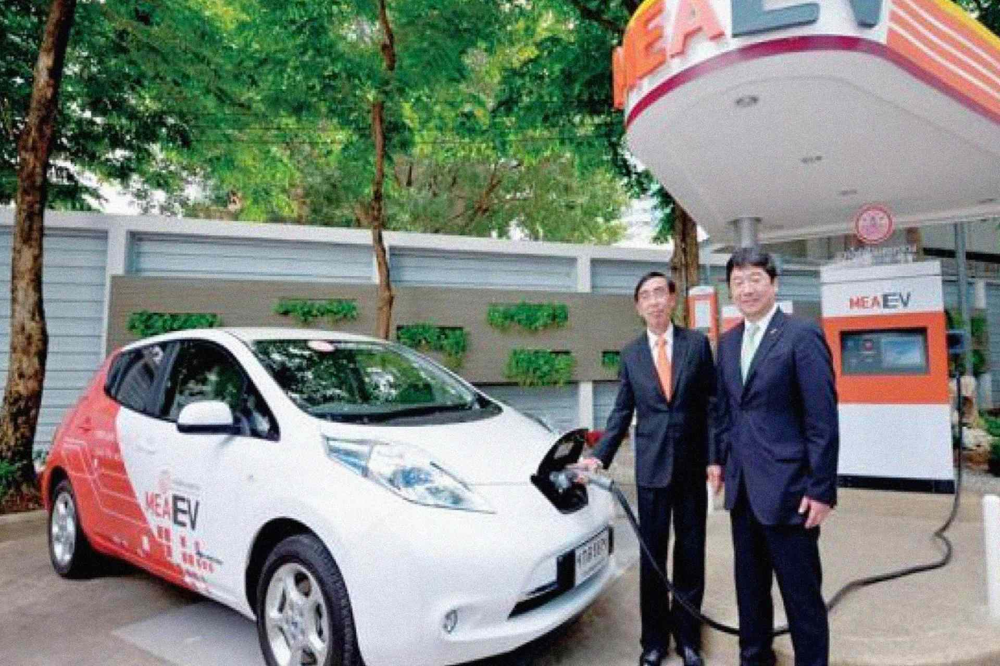
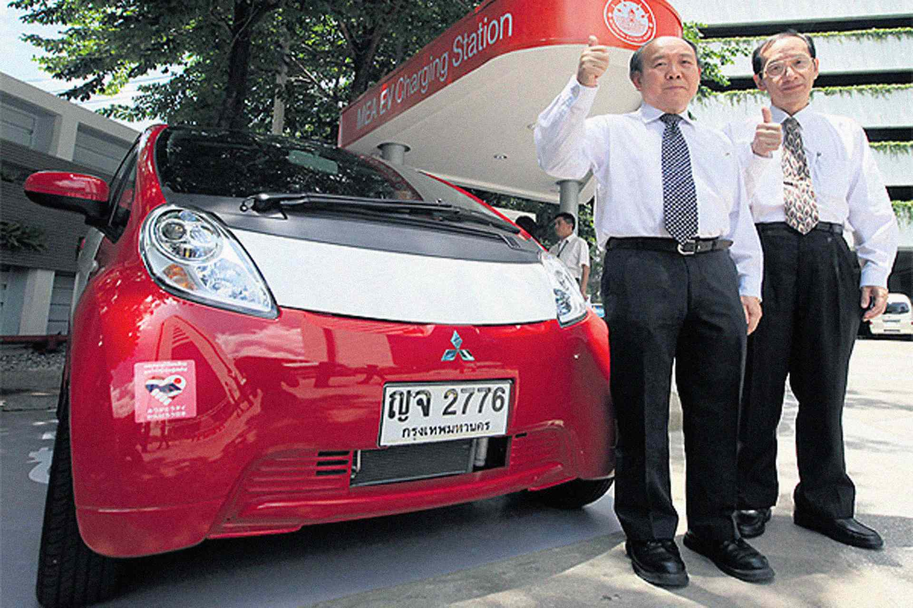

The Thai Government has a goal of getting 1.2 m electric vehicles on the road by 2036.

> "the rising number of registered electric vehicles, locally made EVs, continuous growth of infrastructure of charging stations, as well as research and development of some EV parts are indications that electric vehicles could have a major role in Thai society" _Amonrat Kaewpradap, a committee member of the Electric Vehicle Association of Thailand (EVAT)_

She pointed out that the accumulated number of EV registrations in Thailand for Battery Electric Vehicles [BEV] and Plug-in Hybrid Electric Vehicles (PHEV) sharply increased from 2016 to 2017.

In 2016, there were 80,194 registrations but the number surged to 102,700 in 2017, or an increase of 20,000 units.

> “More stations will boost the confidence for consumers in using EVs. So far, there are 500 charging stations in the country" _Amonrat Kaewpradap, a committee member of the Electric Vehicle Association of Thailand (EVAT)_

The current business environment in Thailand is not favourable for the production and sale of electric vehicles (EVs), due to their higher prices compared to conventional cars and insufficient EV related infrastructure.

The government and private sector are therefore working together to push forward policies and business activities that would foster growth and support EV production in Thailand.

EV manufacturers are hiking production amid increasing demand from buyers and the price of EVs could come down in the future as the government will support its usage with incentives.

> “In Thailand, BMW is expanding the market for plug-in hybrid electric vehicles (PHEVs) over the past three years. Sales have increased 44 per cent per year,” _Christian Wiedmann, president of BMW Thailand_

The Metropolitan Electricity Authority would provide sufficient electricity to serve the targeted number of EVs. They recently launched an online application on the locations of EV charging stations for the convenience of drivers.

## Know More Links

[Thailand sees bright future electric vehicles](https://www.wardsauto.com/engines/thailand-sees-bright-future-electric-vehicles)

[Paving the pathway to future of the Thai electric vehicles](https://www.scbeic.com/en/detail/product/2441)

[Thailand preparing incentives for electric vehicles](http://thaiembdc.org/2017/03/27/thailand-preparing-incentives-for-electric-vehicles/)
