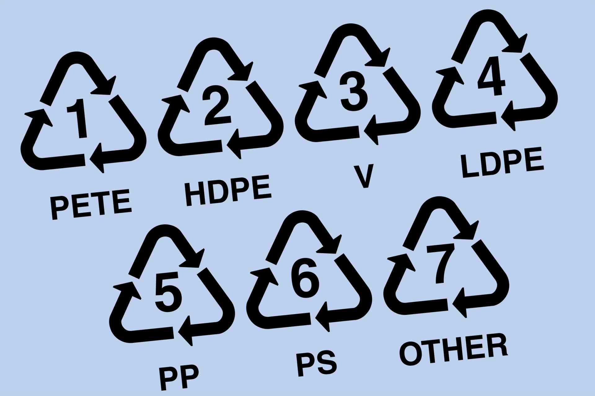

The obvious solution to avoiding plastic toxicity is to avoid plastics, which, in a world awash in plastic, is pretty difficult.

In the absence of this, it makes sense to limit your close encounters with plastic as best as you can.

> “BPA should be considered a hazard to human development and reproduction with clear evidence of adverse effects.” _Sarah Janssen of the Natural Resources Defense Council_

Look for the symbol. It indicated what type of plastic it is. Avoid buying the heavily toxic ones. This way you send a signal to producers, or at least your are not financing the dirty brands.

## The ABCs of Avoiding Plastics

- Never heat or microwave your food in plastic containers, which increases the leaching of chemicals.

- Avoid contact with BPA by avoiding **plastic wrap** (use wax or parchment paper, or aluminum foil), plastic food containers (use metal or glass containers), and disposable water bottles (use **reusable non-plastic or BPA-free bottles**).

- Look for **BPA-free** on the label of products (while this is not a guarantee of safety, it at least limits BPA exposure). Use metal and wooden eating and cooking utensils instead of plastic utensils.

- Find food and water containers that are BPA-free. Avoid **phthalates** by primarily avoiding PVC products (labeled as #3 plastic).

- Look for phthalates-free labels.

- When possible, air new plastic products like blowup mattresses, synthetic-fiber rugs, tablecloths, and toys outside for a few hours to let the VOCs disperse.

- Avoid plastics numbered #6 and #7 whenever possible.

## The plastic types

## **1. PET: Poly Ethylene Terephthalate.**

PET or PETE is commonly used in commercially sold drink bottles, and condiment bottles (like ketchup). Generally considered a “safe” plastic, as **does not contain BPA**, in the presence of heat **it can leach antimony, a toxic metalloid**, into food and beverages, which can cause vomiting, diarrhea and stomach ulcers.

Some studies have shown up to **100 times the amount of antimony in bottled water** than in clean groundwater. The longer the bottle is on the shelf or exposed to heat or sunshine, the more antimony is likely to have leached into the product.

## **2. HDPE: High Density Poly Ethylene.**

HDPE is commonly used in milk and juice bottles, detergent bottles, shampoo bottles, grocery bags, and cereal box liners. Like PET, it is also considered “safe,” but has been shown to **leach estrogenic chemicals dangerous to fetuses and juveniles**.

## **3. PVC: Poly Vinyl Chloride.**

PVC can be flexible or rigid, and is used for plumbing pipes, clear food packaging, shrink wrap, plastic children’s toys, tablecloths, vinyl flooring, children’s play mats, and blister packs (such as for medicines).

PVC contains a phthalate called DEHP, which **can cause male traits to become more feminized** (DEHP-containing products have been banned in many countries, but not the U.S.). In some products, DEHP has been replaced with another chemical called DiNP, which has similarly been shown to have **hormone disruption properties**.

## **4. LDPE: Low Density Poly Ethylene.**

LDPE is used for dry cleaning bags, bread bags, newspaper bags, produce bags, and garbage bags, as well as “paper” milk cartons and hot/cold beverage cups. LDPE does not contain BPA, but as with most plastics, **it can leach estrogenic chemicals**.

## **5. PP: Poly Propylene.**

PP is used to make yogurt containers, deli food containers and winter clothing insulation. PP actually has a high heat tolerance and as such, **does not seem to leach many of the chemicals other plastics do**.

## **6. PS: Poly Styrene**

PS, also popularly known as Styrofoam, is used for cups, plates, take-out containers, supermarket meat trays, and packing peanuts. **Polystyrene can leach styrene, a suspected carcinogen, especially in the presence of heat** (which makes hot coffee in a Styrofoam container an unwise choice).

## **7. Everything else.**

Any plastic item not made from the above six plastics is lumped together as a #7 plastic. Any plastic designated #7 is likely to **leach BPA and/or BPS**, both [**potent endocrine disruptors**](https://pubmed.ncbi.nlm.nih.gov/32112812/) linked to interfering with proper mood, growth, development, sexual function, reproductive function, and puberty, among other essential human developmental processes. They are also suspected of **increasing the risk of adult reproductive cancers, obesity, heart disease, and type 2 diabetes**.

## Know More Links

[Toxic traps 7 types dangerous plastic](https://www.alternet.org/personal-health/toxic-traps-when-these-7-types-plastic-are-dangerous)

[BPA leached 55 times more rapidly when exposure to heat](https://www.sciencedaily.com/releases/2008/01/080130092108.htm)

[BPA replacement also alters hormones](https://www.scientificamerican.com/article/bpa-replacement-also-alters-hormones/)

[95% of urine samples contained some BPA - Centers for Disease Control](https://www.niehs.nih.gov/health/topics/agents/sya-bpa/)

[Bisphenol A (BPA) an endocrine disruptor](https://www.ncbi.nlm.nih.gov/pubmed/21605673)

[Phthalates in plastic products containing PVC](https://www.cdc.gov/biomonitoring/Phthalates_FactSheet.html)

[Manufacturing of plastic - toxic chemicals released - carcinogenic or neurotoxic](https://ecologycenter.org/plastics/ptf/report3/)

[Bioplastics - An alternative for sustainable living](https://advancebioplast.com/)

[Endocrine Disruptors](https://www.niehs.nih.gov/health/topics/agents/endocrine/index.cfm)

[Consensus on the key characteristics of endocrine-disrupting chemicals](https://www.nature.com/articles/s41574-019-0273-8)
