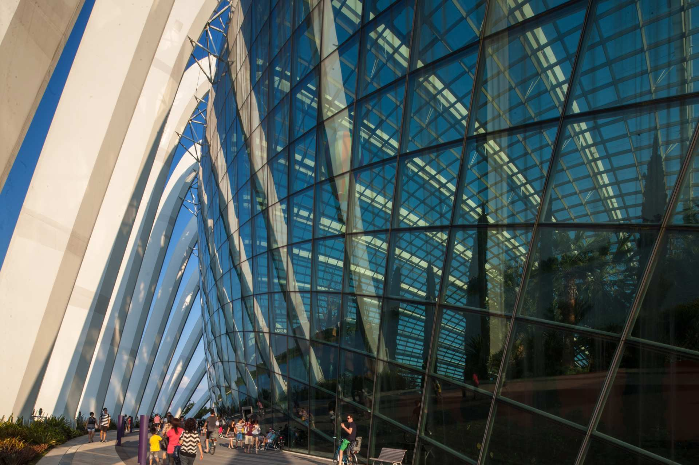
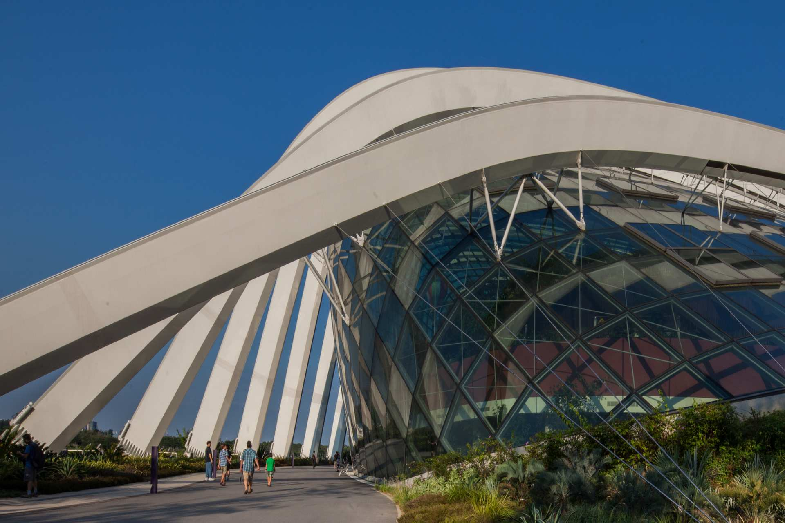
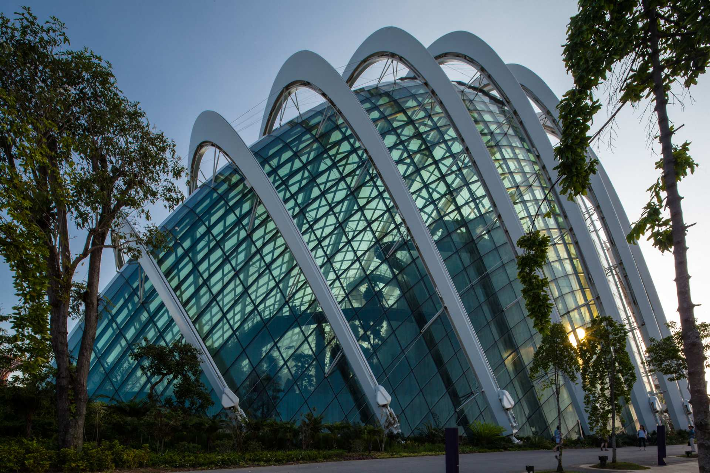

## TLDR

- Reached more than 40 million visitors to date.

- Contains more than 1,000,000 plants.

- Architecture wonder: The Cooled Conservatories at Gardens by the Bay are the world’s largest column-less greenhouses.

- Rated no.3 on things to do in Singapore Tripadvisor.

- World's top 20 most checked-in places on Facebook.

## GARDENS BY THE BAY MISSION

We make our Gardens the leisure destination of choice for all.

We delight our guests with an enthralling experience, excellent service and enriching programmes.

We inspire pride of ownership in every Singaporean for our Gardens.

We aim to be a model for sustainable development and conservation.

## SUSTAINABILITY IN THE GARDENS

**A creation of sustainability between social, economic and environmental**

Underlying the concept of Gardens by the Bay are the principles of environmental sustainability.

Much effort was made to plan and design for sustainable cycles in energy and water throughout Bay South Garden.

**ENERGETICS OF THE CONSERVATORIES**

Comprising two glass biomes, the Conservatories replicate the cool-dry climate of the Mediterranean and semi-arid sub-tropical regions and the cool-moist climate of the Tropical Montane region.

They house a diverse collection of plants that are not commonly seen in this part of the world and are of high conservation value.

The conservatories are a statement in sustainable engineering and apply a suite of cutting-edge technologies for energy-efficient solutions in cooling.

This suite of technologies can help to achieve at least 30% savings in energy consumption, compared to conventional cooling technologies.

**1 MINIMISING SOLAR HEAT GAIN**

The two conservatories are fitted with specially selected glass that allows optimal light in for plants, but reduces a substantial amount of heat.

The roof is fitted with a sensor-operated retractable sails that opens automatically to provide shade to the plants when it gets too hot.

**2 COOLING ONLY THE OCCUPIED ZONES**

The Conservatories apply the strategy of cooling only the lower levels, thus reducing the volume of air to be cooled.

This is achieved through thermal stratification – ground cooling by chilled water pipes cast within the floor slabs enabling cool air to settle at the lower occupied zone while the warm air rises and is vented out at high levels.

**3 DE-HUMIDIFYING THE AIR BEFORE COOLING**

To reduce the amount of energy required in the cooling process, the air in Flower Dome is de-humidified by liquid desiccant (drying agent) before it is cooled.

This desiccant is recycled using the waste heat from the burning of the biomass.

**4 GENERATING ENERGY AND HARNESSING WASTE HEAT**

Electricity is generated on-site to run the chillers that cool the Conservatories. At the same time, waste heat is captured in the process to regenerate the liquid desiccant.

This co-generation of energy is achieved by the use of a Combined Heat Power (CHP) steam turbine that is fed by horticultural waste from the Gardens and other parks around Singapore. This reduces dependency on the electrical grid.

## COOL-DRY CONSERVATORY - FLOWER DOME

Enter a world of perpetual spring! Replicating the cool and dry Mediterranean climate, [Flower Dome](http://www.gardensbythebay.com.sg/en/attractions/flower-dome/visitor-information.html) showcases exotic plants from five continents which are displayed in nine different Gardens.

Wander amongst thousand-year-old olive trees and unusual Baobabs as you take in sights of the Flower Field Display. Find out more about the

## CLOUD FOREST

A mysterious world veiled in mist. Take in breath-taking mountain views surrounded by diverse vegetation and hidden floral gems. And learn about rare plants and their fast-disappearing environment.

Explore the tropical highlands amidst orchids, pitcher plants and ferns from the cool-moist Tropical Montane region.

Be amazed as you encounter the world's tallest indoor waterfall at 35 meters and descend through the surreal mist-filled Cloud Walk and Treetop Walk. More about the [Cloud Forest](http://www.gardensbythebay.com.sg/en/attractions/cloud-forest/visitor-information.html)

## SUPERTREE GROVE

Of the 18 Supertrees in Gardens by the Bay, 12 of them can be found here at Supertree Grove, with the tallest one measuring up to 16 storeys in height.

Make a trip to the top of one of these iconic [Supertrees](http://www.gardensbythebay.com.sg/en/attractions/supertree-grove/visitor-information.html) and be awed by splendid views of the Gardens and the surrounding Marina Bay area.

Or, stroll along the 22-metre-high OCBC Skyway, a 128-metre aerial walkway that connects two of the Supertrees, and see the Gardens from a different point of view.

**ENVIRONMENTALLY SUSTAINABLE FUNCTIONS OF THE SUPERTREES**

Eleven of the Supertrees are embedded with environmentally sustainable functions.

Some have photovoltaic cells on their canopies to harvest solar energy for lighting up the Supertrees, while others are integrated with the Conservatories and serve as air exhaust receptacles.

## OCBC SKYWAY

There’s nothing quite like a stroll along the [Ocbc skyway](http://www.gardensbythebay.com.sg/en/attractions/ocbc-skyway.html).

At a height of 22 metres and surrounded by panoramic vistas of the Gardens and Marina Bay skyline, this 128-metre-long aerial walkway is an experience not to be missed.

## DRAGONFLY & KINGFISHER LAKES

Immerse in the fascinating world that exists below the surface of [Dragonfly & Kingfisher Lakes](http://www.gardensbythebay.com.sg/en/attractions/dragonfly-and-kingfisher-lakes.html).

More than a scenic treat, the lakes are a rich source of aquatic life from fish to plants. These plants play a vital role in maintaining the right amount of nutrients in the lake by absorbing excess nitrogen and phosphorus.

They help ensure better water quality by acting as a natural eco-filter and strategically located aquatic reeds also act as filter beds.

## WORLD OF PLANTS

In this realm of lush greenery you can learn all about the spectacular myriad of tropical plants and the systems these plants support.

Find out how plants disperse their seeds, how mushrooms benefit rainforest communities and how plants adapt to adverse environments.

Enjoy the sights of flowers and fruits in bloom, learn how to identify different tree species and even see some of the most primitive plants in the world! More on [World of plants](http://www.gardensbythebay.com.sg/en/attractions/world-of-plants/visitor-information.html)

## THE CANYON

The Gardens’ newest attraction featuring the largest collection of sculptural rocks along a 400-metre-long dragon-shaped trail. More about [The canyon](http://www.gardensbythebay.com.sg/en/attractions/the-canyon/visitor-information.html)

## HERITAGE GARDENS

A collection of four themed gardens, the [Heritage Gardens](http://www.gardensbythebay.com.sg/en/attractions/heritage-gardens/visitor-information.html) will take you through the history and culture of Singapore’s three main ethnic groups and colonial past, through the fascinating story of plants.

Explore the Chinese, Malay, Indian, and Colonial Gardens and learn how plants are intricately linked to the culture of each group.

## SUN PAVILION

Take a walk through the Sun Pavilion and marvel at the amazing desert-like landscapes. With over 1,000 desert plants comprising some 100 different species and varieties, the [Sun Pavilion](http://www.gardensbythebay.com.sg/en/attractions/sun-pavilion.html) is nothing short of extraordinary.

## KNOW MORE LINKS

[Gardens by the bay](http://www.gardensbythebay.com.sg/)

[Heritage Gardens](http://www.gardensbythebay.com.sg/en/attractions/heritage-gardens/visitor-information.html)

[World of plants](http://www.gardensbythebay.com.sg/en/attractions/world-of-plants/visitor-information.html)
