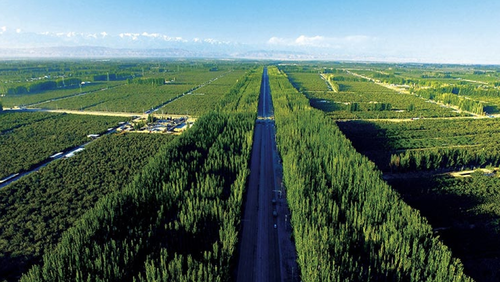
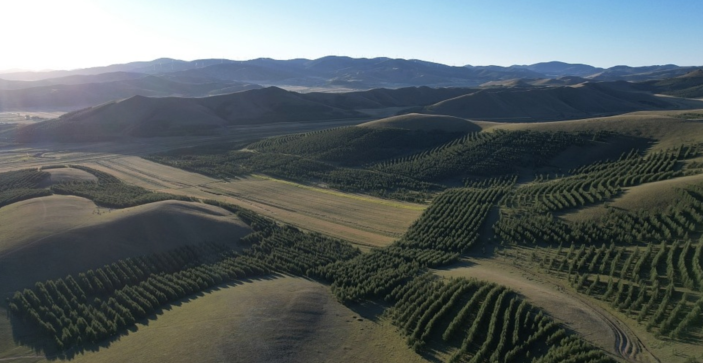
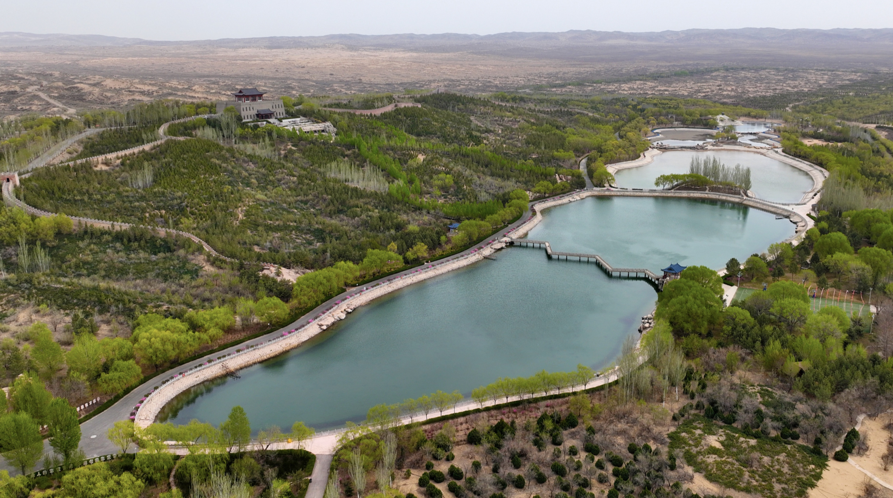

Since 1978, China has been running one of the most sustained environmental engineering efforts in human history. 

Officially called the *Three-North Shelter Forest Program*, but known to the world as the "*Great Green Wall*," the project has planted an estimated **66 billion trees** along the margins of the Gobi and Taklamakan deserts. 

Another **34 billion** are planned by 2050.

The goal was never subtle: hold back the deserts, protect farmland and grasslands, and stop the dust storms that once swept off the Gobi and choked cities as far away as Beijing and the east coast. 

Nearly fifty years in, the numbers tell a striking story of what sustained, state-driven reforestation can look like at national scale — and new satellite research offers a fresh look at how well it's actually working. 

A study led by landscape ecologist Yuhang Luo of Peking University, published in *Geophysical Research Letters* in 2026, confirms these forests are thriving: their canopy cover has grown steadily denser year after year, evidence the trees are establishing successfully across a huge and difficult landscape.

## The Scale, in Context

Regional forest cover in the project zone has climbed from roughly **5% in 1978 to 14% in 2023**, and the effort has measurably reduced dust storms and improved local air quality. 

To grasp how big that is, it helps to line it up against the world's other major reforestation efforts:

- **Africa's Great Green Wall** (launched 2007): Aims to restore 100 million hectares across an 8,000 km band south of the Sahara, spanning 11 countries. It's a far more ambitious footprint on paper, but progress has lagged — as of recent assessments, only a fraction of the target area has actually been restored, and a 2025 study of Senegalese plots found ecological gains were minimal in most of them.

- **The Bonn Challenge** (launched 2011, Germany/IUCN): A global pledge system aiming to restore 350 million hectares of degraded land worldwide by 2030, with over 70 million hectares pledged by participating countries so far.

- **1t.org / Trillion Trees Initiative**: A loose global coalition — not a single planting program — that unites corporate, government, and NGO tree-planting pledges under one umbrella, aiming (as the name suggests) for a trillion trees worldwide.

- **India's afforestation pledges**: Around 21 million hectares committed under Bonn Challenge–style agreements, including record-setting single-day planting drives.

What sets China's program apart isn't just the tree count — it's execution over an unusually long, uninterrupted timeline. Where many international initiatives are pledge-based coalitions of NGOs, governments, and companies with uneven follow-through, China's effort has run as one continuous, state-funded program for nearly five decades. 

China's broader reforestation efforts, of which the Great Green Wall is the most iconic piece, now account for roughly a quarter of all newly added green area on the planet over the last decade.

## Not Without Trade-offs

Scale isn't the whole story. The new satellite research also found that these planted stands are, on average, much younger than the natural forests around them (34 years versus 57), and that many rely on a narrower mix of fast-growing species chosen for their ability to establish quickly in harsh, arid conditions — a trade-off that favors rapid ground cover over the richer biodiversity of old-growth woodland. 

As study author Yuhang Luo put it, plantations are a powerful tool for fast results, but "for long-term carbon storage and resilience, natural forests remain irreplaceable."

That's a pattern echoed globally: Africa's Great Green Wall has struggled with sapling survival rates in the driest zones, and even well-funded Bonn Challenge pledges often convert to monoculture plantations rather than mixed natural regrowth. 

China's project isn't immune to these same tensions — but its sheer persistence, and the millions of hectares of measurable green cover to show for it, make it the closest thing the world has to a proof of concept for reforestation at continental scale.

---

### **Source:** 

Luo, Y., Wang, Y., Wang, H., Wang, H., & Wu, J. (2026). 
*Enhanced CO2 Response and Aging-Related Dynamics Drive a Greater Leaf Area Index Increase in China's Planted Forests in Comparison to Natural Forests.* 

[Check the full study: Geophysical Research Letters, 53](https://doi.org/10.1029/2025GL121544)
