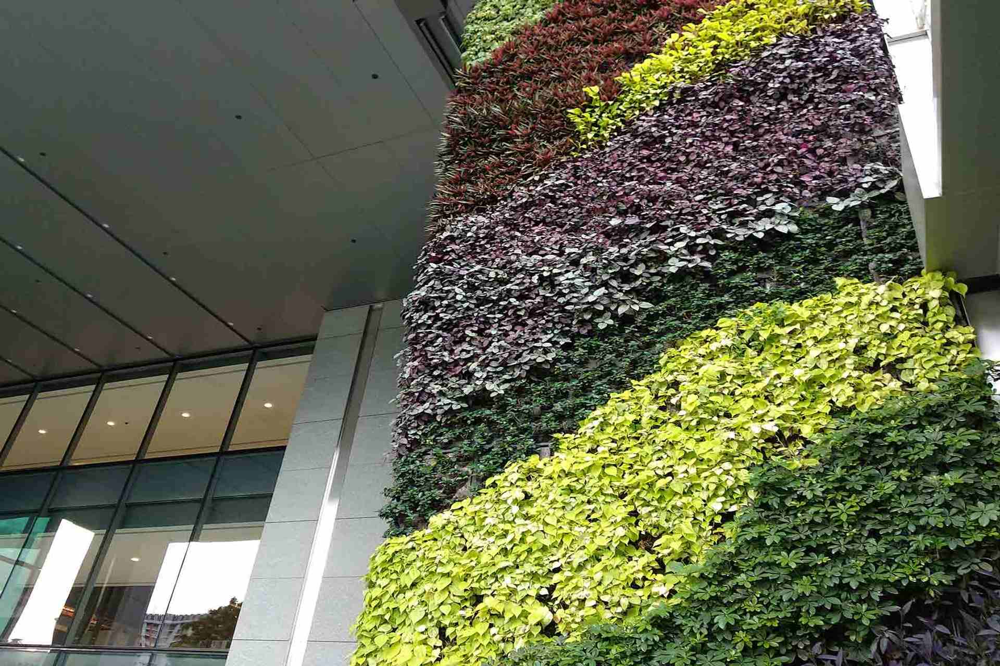
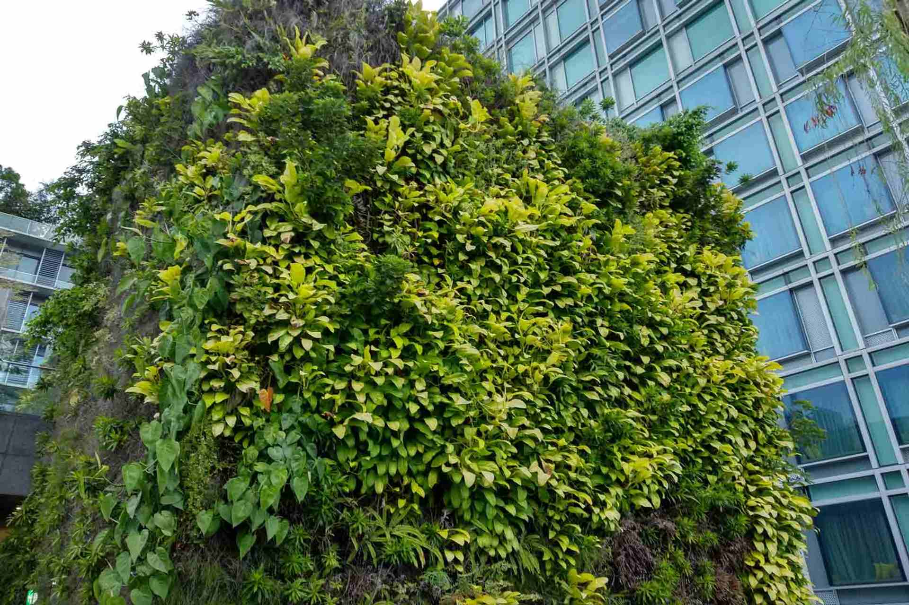
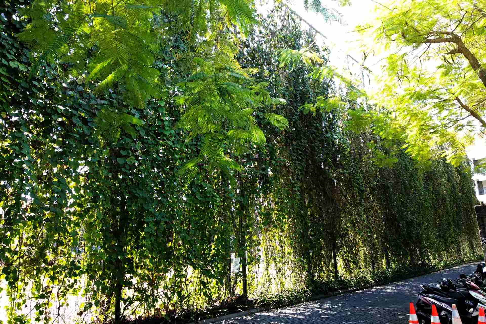

Green walls are not only visually pleasant, but naturally absorb CO2 and other pollutants thus cleaning the air.

Green walls, also called living walls, include a vertically applied growth medium such as soil, substitute substrate, or hydroculture felt; as well as an integrated hydration and fertigation, the injection of fertilizers, delivery system.

They are also referred to as living walls or vertical gardens, and widely associated with the delivery of many beneficial ecosystem services.

Green walls are found most often in urban environments where the plants reduce overall temperatures of the building.

> "The primary cause of heat build-up in cities is insulation, the absorption of solar radiation by roads and buildings in the city and the storage of this heat in the building material and its subsequent re-radiation. Plant surfaces however, as a result of transpiration, do not rise more than 4–5 °C above the ambient and are sometimes cooler."" _Ong, Boon Lay - "Green plot ratio: an ecological measure for architecture and urban planning". Landscape and Urban Planning"_

The popularising of green walls is often credited to Patrick Blanc, a French botanist specialised in tropical forest undergrowth.

He worked with architect Adrien Fainsilber and engineer Peter Rice to implement the first successful large indoor green wall or Mur Vegetal in 1986 at the Cité des Sciences et de l'Industrie in Paris.

He has since been involved with the design and implementation of a number of notable installations as the one at Musée du quai Branly, collaborating with architect Jean Nouvel.

Let's not forget that trees, and green in general, created the oxygen in our atmosphere.

Green facades typically support climbing plants that climb up the vertical face of the host wall, while green walls can accommodate a variety of plant species.

While this solution is picking up quickly in many metropolitan areas for the specific work they do for us, in Bali too we have some, like this one in Sanur.

## Know More Links

[Green wall - wikipedia ](https://en.wikipedia.org/wiki/Green_wall)

[Green plot ratio: an ecological measure for architecture and urban planning](https://www.sciencedirect.com/science/article/abs/pii/S0169204602001913)

[Create Your Own Living Wall](https://www.veranda.com/outdoor-garden/a32381715/how-to-create-a-living-wall/)

[How to create a living wall](https://www.gardenersworld.com/how-to/diy/how-to-create-a-living-wall/)

[Plants for a living wall](https://www.gardenersworld.com/plants/plants-for-a-living-wall/)

[The ultimate guide to living green walls](https://www.ambius.com/green-walls/ultimate-guide-to-living-green-walls/)

[Green wall 101: how to successfully install and take care of a living plant wall](https://www.vogue.com.au/vogue-living/design/greenwall-101-how-to-successfully-install-and-take-care-of-a-living-plant-wall/image-gallery/a801f5d3b04024afd1508cc8fa26481d)
