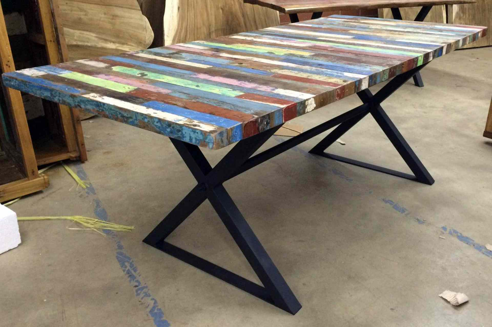
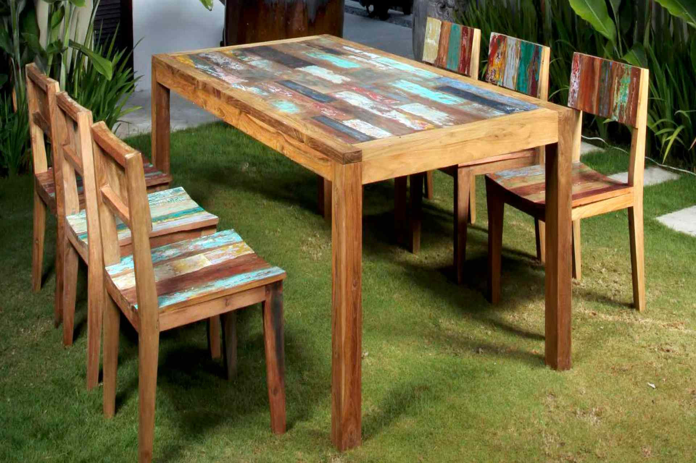

Rest easy, feel good, you are sitting on a reclaimed timber chair!

In the last few years in Indonesia and specially in Bali, we have seen a big boom in furniture made from reclaimed wood. They sell it locally and also ship it all over the world.

> "Prior to visiting Bali, I had never seen boat-wood furniture. I fell in love with the style and I knew it would look awesome in my home. Unfortunately I couldn't find any shops in the States that had any of this beautiful furniture designs. Luckily a local Bali supplier made my custom built dining room table and buffet."_Thomas Gandal_

A quick search on google can reveal you how many companies are offering a wide variety of furniture and designs all made using wood has been reclaimed or salvaged.

They take unused old structures such as boats, bridges, jetties and factories and turn them into surely solid timber products, sometime beautiful other time funky and kitsch, including flooring, decking, panelling, and countertops.

This ‘full circle’ production, reduce waste and utilize woods to the max. After all, hardwoods take thousands of years to grow and they deserve a second life.

Some companies, like [Recycle teak](http://www.recycleteak.com/about-us/) are conscious enough to get certified by FSC, to show customers their effort and care about our environment.

Some companies even go a step further and donate 10% of proceeds go to no-profits. For example [boat wood furniture Bali](https://divadiboatwoodfurniture.com/) supprt Ypac Jimbaran, a local organization helping the physically handicapped children of bali.

If you life far away and want to make something using reclaimed wood here is a [tutorial that guide you to build a reclaimed wood armchair](http://www.instructables.com/id/Reclaimed-Wood-Patio-Armchair/).

## Know More Links

[Recycle teak](http://www.recycleteak.com/)

[Bali recycled boat](http://balirecycledboat.com/)

[Kaltimber](http://www.kaltimber.com/)

[Bali crafts](http://bali-crafts.com/product-tag/boat-furniture/)

[Indonesia teak furniture](https://www.indonesiateakfurniture.com/recycled-boat-wood-furniture-bali.html)

[Zenddu](https://www.zenddu.com/product-category/indonesia-materials-furniture-manufacturers-exporters-wholesalers-java-bali/indonesia-wooden-furniture-manufacturers-exporters-wholesalers-java-bali/indonesia-reclaimed-wood-furniture-manufacturers-exporters-wholesalers-java-bali/)

[Recycled furniture Indonesia](http://www.recycledfurnitureindonesia.com/)

[Indonesia reclaimed teak](http://www.indonesiareclaimedteak.com/)
