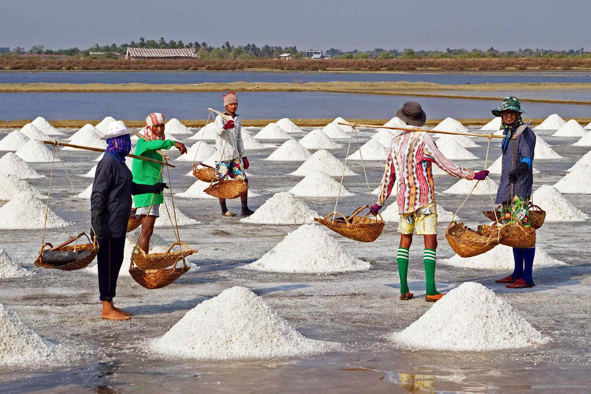
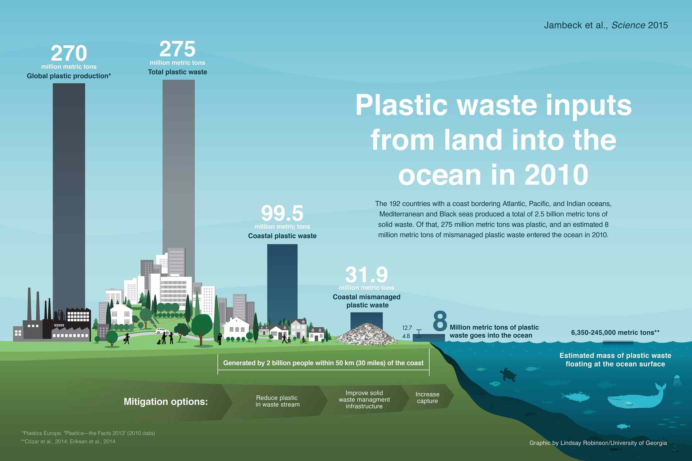

## TLDR

- Of 39 salt brands tested, 36 had microplastics in them, according to a new analysis by researchers in South Korea and Greenpeace East Asia.

- Studies show that there is far more plastic in the ocean than we can currently account for.

- So we need to prevent plastic from entering the oceans in the first place.

Salt produced in Indonesia, using the ancient technique of evaporating seawater, has been found to contains some of the highest microplastics sampled.

Microplastics were found in sea salt several years ago.

But how extensively plastic bits are spread throughout the most commonly used seasoning remained unclear.

Now, new research shows microplastics in 90% of the table salt brands sampled worldwide.

## Salt brands tested.

Of 39 salt brands tested, 36 had microplastics in them, according to a new analysis by researchers in South Korea and Greenpeace East Asia.

Using prior salt studies, this new effort is the first of its scale to look at the geographical spread of microplastics in table salt and their correlation to where plastic pollution is found in the environment.

> “The findings suggest that human ingestion of microplastics via marine products is strongly related to emissions in a given region,”_Seung-Kyu Kim, marine science professor at Incheon National University in South Korea._

## Assessing the impact of microplastics.

> “That fact that they found higher counts in Asia is interesting. While not surprising, you still have to have the data,”_Sherri Mason, professor at the State University of New York in Fredonia, who partnered with researchers at the University of Minnesota on a separate salt study._

 

> “The earlier studies found traces of microplastics in salt products sold in those countries, but we haven’t known how much.”_Sherri Mason_

## We know the solutions.

> "In short, if we want to understand the risks to marine animals, and humans through seafood, we need to first get a handle on how much plastic there is, what form it takes, and where it is in the ocean, so that we can evaluate how much plastic a particular animal or species is exposed to. If there is no exposure, there is no risk. This study shows that there is far more plastic in the ocean than we can currently account for. Now we have to find it."_Kara Lavender Law, research professor of oceanography at Sea Education Association (SEA) in Woods Hole, MA, home of the SEA Semester undergraduate study abroad program._

 

> "we must cut back on plastic waste generation and increase the amount we capture and manage properly. That sounds simple. We know how to design waste management systems, but waste management is not just a design problem, it is also has social and cultural dimensions. So we need to work together at a combination of local and global initiatives… and we need global participation from various stakeholders, and based upon the diverse global interest in this work – I am optimistic this will happen. By changing the way we think about waste, valuing the management of it, collecting, capturing and containing it, we can open up new jobs and opportunities for economic innovation, and in addition, improve the living conditions and health for millions of people around the world and protect our oceans." _Jenna R. Jambeck, assistant professor of environmental engineering from the University of Georgia, USA._

 

> "So we need to prevent plastic from entering the oceans in the first place. ...Lack of formal waste management systems causes high plastic waste inputs into the oceans. Helping every nation develop a sound solid waste management infrastructure is a top priority. It not only keeps plastic out of the oceans, but also has large economic and public health benefits. Increasing the poor reuse and recycling rates of plastic is equally important. Plastic reuse and recycling has significant economic and environmental benefits, if the right incentives are in place in order to motivate the collection of plastic waste and its reprocessing into valuable secondary resources. Finally, we need to take a good hard look at how we use plastic and what we use it for. In some cases, product redesign may be the best way forward, in others material substitution." _Roland Geyer, Associate Professor at the Bren School of Environmental Science and Management at the University of California, Santa Barbara._

 

## Know More Links

[Microplastics found in 90 percent of table salt](https://www.nationalgeographic.com/environment/2018/10/microplastics-found-90-percent-table-salt-sea-salt/)

['Alarming' level of microplastics found in a major U.S. river](https://www.nationalgeographic.com/environment/2018/10/alarming-level-microplastics-found-tennessee-river/)

[We Know Plastic Is Harming Marine Life. What About Us?](https://www.nationalgeographic.com/magazine/2018/06/plastic-planet-health-pollution-waste-microplastics/)

[Top 10 Zero Waste Instagram Accounts!](https://humans4sustainablefuture.wordpress.com/2016/05/24/top-10-zero-waste-instagram-accounts/)

[Global Pattern of Microplastics (MPs) in Commercial Food-Grade Salts: Sea Salt as an Indicator of Seawater MP Pollution](https://pubs.acs.org/doi/10.1021/acs.est.8b04180)

[Plastic waste inputs from land into the ocean](https://jambeck.engr.uga.edu/landplasticinput)

[Bioplastics - An alternative for sustainable living](https://advancebioplast.com/)
