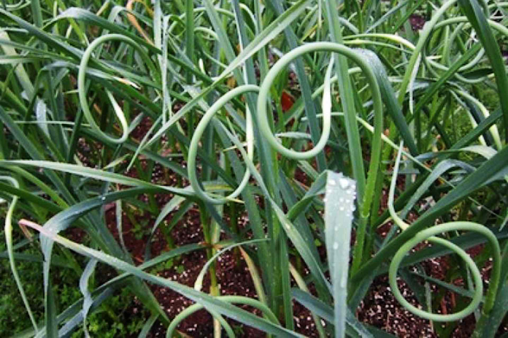
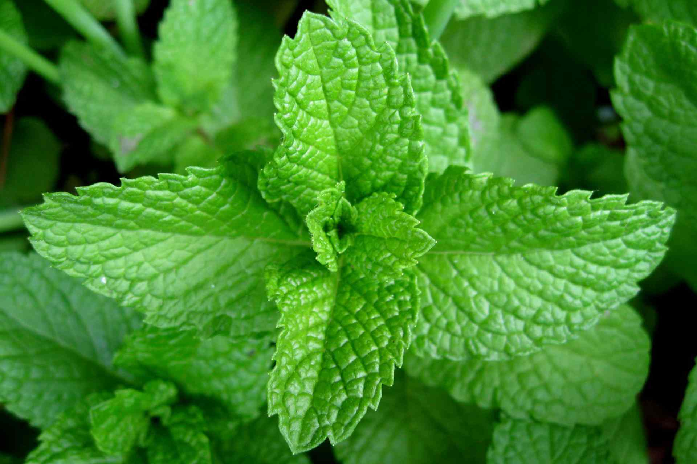
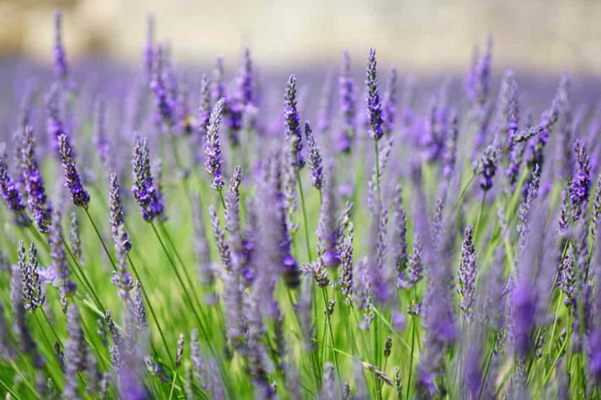
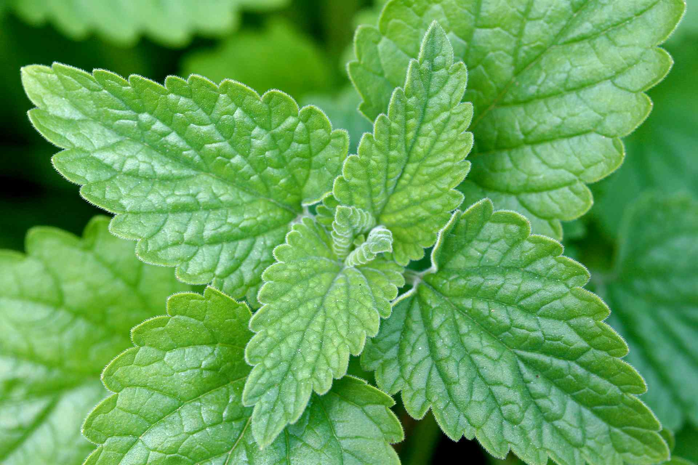
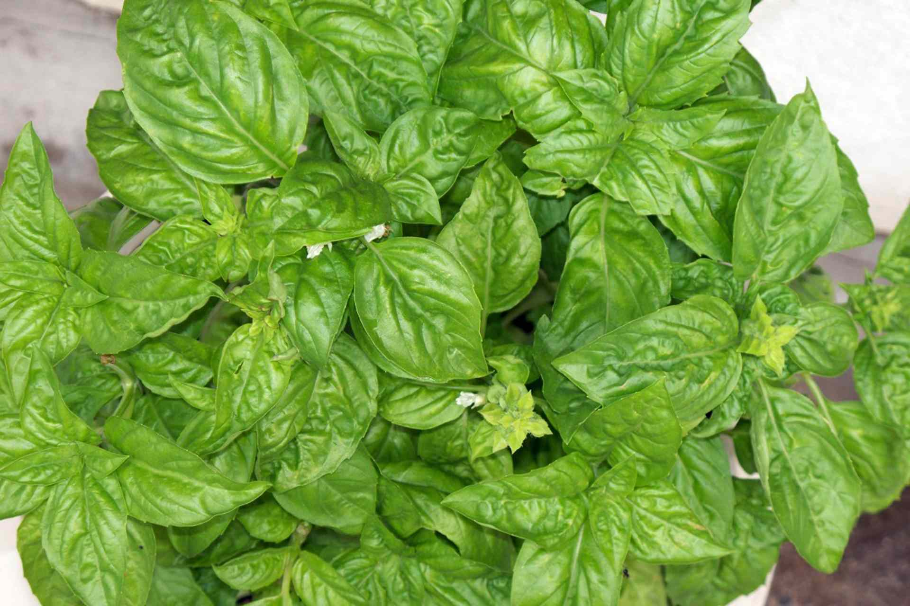
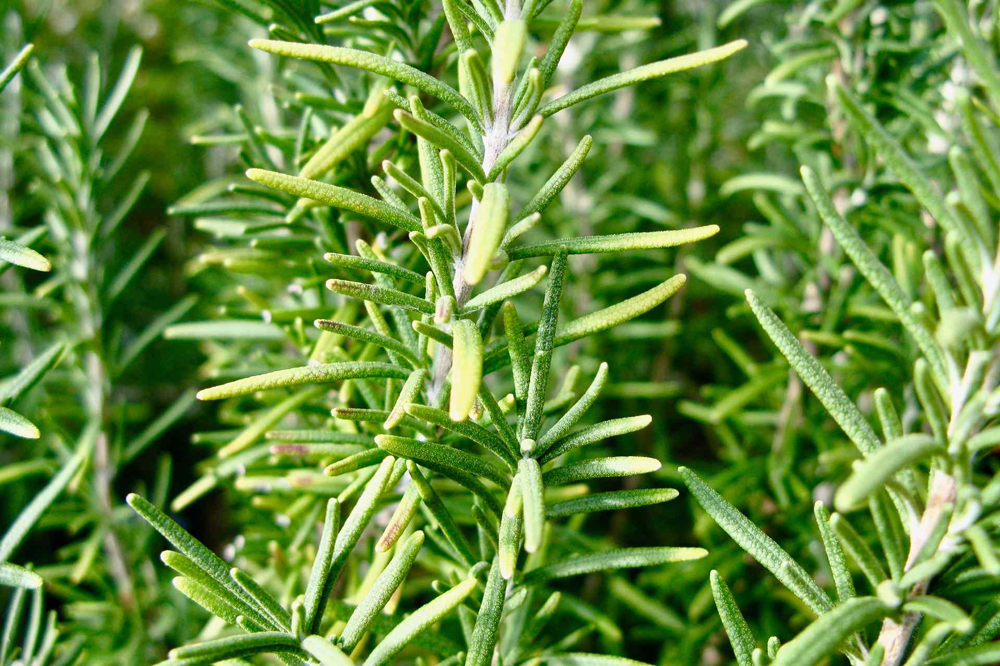

## TLDR

- Mosquitoes are attracted by the carbon dioxide we exhale.

- Many plant repels mosquitos and some can alleviate the bite hitch.

- Get rid of any stagnant or standing water in your yard and get one of the plants illustrated here to ahve a more peaceful life.

Mosquitoes can be a terrible nuisance. Before you grab a can of chemical bug spray, you can take a stand against mosquitoes with a few well-chosen plants.

Mosquitoes are stimulated by a number of factors when seeking out a blood meal.

Initially, they’re [attracted by the carbon dioxide we exhale.](http://theconversation.com/health-check-why-mosquitoes-seem-to-bite-some-people-more-36425)

Body heat is probably important too, but once the mosquito gets closer, she will respond to the smell of a potential blood source’s skin.

# Outdoors mosquito repellent plants

## Garlic - (Allium Sativum)

[Garlic](https://en.wikipedia.org/wiki/Garlic) is another natural way to stay away from mosquitoes. You can use it by chopping it in small pieces and spread it around your living areas.

A patio spray can also be made. You can also mix it with natural aromatic oils to make a mosquito repelling body spray. Or simply grow a garlic plant in your garden.

In addition to growing the plants or herbs mentioned above, you can also practice good mosquito control in your backyard so that the bugs don’t get out of hand.

The best thing you can do is - prevent water from collecting as the mosquitoes can lay a number of eggs here. Prevention is always better than cure. Get [garlic extract](https://amzn.to/3xNpGng) here, you can also [get odorless ones](https://amzn.to/3m8hwE9).

## Peppermint - (Mentha × piperita)

Most bugs despise the smell and taste of [peppermint](https://en.wikipedia.org/wiki/Peppermint), so planting it around your home is a great way to keep them from dropping by uninvited.

Plus, if you do happen to get bitten, peppermint leaves rubbed directly onto the skin make a great bite relief treatment.

An added bonus is the wonderful minty smell that makes a delicious addition to food and beverages. Get [peppermint seeds here](https://amzn.to/3iKA6zM) and [here](https://amzn.to/2VR2WFZ).

# Indoor houseplants

## Citronella - (Cymbopogon nardus)

This is by far the most well-known mosquito repellent because the compounds in its leaves are a common ingredient in commercial repellent products. It has a pleasant lemon smell and is very powerful at driving away mosquitoes.

[Citronella](https://en.wikipedia.org/wiki/Citronella), a tropical plant, it will thrive in warm weather and full sunshine.

It may benefit from regular fertilising and even a little added artificial light during the winter months if you have very short days.

If looking to buy citronella, be careful when choosing the plants.

There are a few varieties of scented geraniums that go by the name mosquito plant or even citronella plant, and they are not what you’re looking for.

True citronella looks a lot like thick grass, and does not have wide rippled leaves. Citronella [seeds are available here](https://amzn.to/3jS9Fb0) and [here](https://amzn.to/3xGVCK1).

## Lavender - (Lavandula)

[Lavender](https://en.wikipedia.org/wiki/Lavandula) is an excellent mosquito repellent. Much more common as an outdoor plant, you can keep a few small pots of it inside to help with the bugs.

It can be finicky, liking as much sun as you can find as well as a spot with good airflow. A nearby window with a frequent breeze is what you need. Get [non GMO Citronella seeds here](https://amzn.to/3iGDk7v) and [here](https://amzn.to/3yMDqQJ).

## Catnip - (Nepeta Cataria)

[Catnip](https://en.wikipedia.org/wiki/Catnip) is also an effective mosquito repellent. Nepetalactone is one of the main active ingredients in Catnip, which was found to be 10 times stronger than even DEET, according to a recent study.

Catnip is also a good non-toxic substitute to traditional chemical sprays. Catnip [spray available here](https://amzn.to/37Ia2iw) and here you can [buy Catnip seeds](https://amzn.to/3sen0hz) and make your own plants.

## Basil - (Ocimum basilicum)

[Basil](https://en.wikipedia.org/wiki/Basil) is already a great herb to have fresh in the kitchen, and now you can consider a pest repellent too. As usual, plan on keeping your potted basil in a very sunny window as it needs a lot of light, and be diligent about watering it.

In folk medicine practices, such as those of _Ayurveda_ or traditional Chinese medicine, basil is thought to have therapeutic properties. Get [Ayurveda Idiot's Guide](https://amzn.to/3iLETBb) here, its a ctually a good book!

Basil doesn’t handle dry conditions very well, but you also don’t want to drown the roots. Damp, well-draining soil is the key.

They prefer a warm environment, so they may not be the best indoor houseplant if you have a cold house during the winters.

Otherwise, they should thrive just fine. Feel free to harvest a few leaves now and again for cooking too. Oragic [Basil seeds here](https://amzn.to/3iJ6T8l).

## Rosemary - (Salvia Rosmarinus)

Another seasoning herb that has mosquito-repelling qualities is [rosemary](https://en.wikipedia.org/wiki/Rosemary).

Maybe not the best choice for a novice gardener, but it would be worth giving a try.

You need a place with as much sunlight as possible, even a grow light occasionally, and you should know it can be finicky about watering.

Use a well-draining potting soil mix, watering when the surface is dry to the touch. It can be sensitive to either too much or too little water.

Rosemary is also prone to powdery mildew so you have to have a lot of air movement around the plant to prevent that from settling in. Seeds [available here](https://amzn.to/2VSauZa).

Like with lavender, try to find a breezy location, or even set up a small fan around your plants to keep the air moving.

# Placement

Keep your plants in a spot offer the right amount of light or temperatures your indoor plants require. Choose strategic areas.

Keep your plants near busy entrances. Bedrooms and common living areas are the next placement spots, to keep them out of the room.

Remember, these plants only repel mosquitoes, they aren’t going to kill the bugs.

# Stop Attracting Them

You’ll have fewer mosquitoes to deal with around the house if you stop attracting them in the first place.

Unlike with other houseflies, mosquitoes aren’t attracted to food or garbage that might be in your house. So keeping things clean won’t have much impact here.

They’re drawn to the dark colours, body heat and a range of fragrances, including perfumes, lotions and even strong body odour.

Now, these aren’t things that are likely to bring them directly into your house, but if you are outdoors wearing dark clothes and smelling of cologne, you’re going to draw mosquitoes inside with you every time you come back in the house.

Mosquitoes are usually at their busiest at dusk and into the night, though not all species are exactly the same.

This is definitely the time to be careful you’re not drawing them into the house by opening the doors too often, or attracting them as we mentioned above.

# Other advices

It’s definitely worth putting a little extra effort in keeping your home and yard mosquito free. The biggest way to protect the house is to have tight window screens on every window and exposed vent in your house.

Get rid of any stagnant or standing water in your yard as much as possible. That’s where mosquitoes lay their eggs, which can lead to huge population explosions around the house when they mature.

Open water barrels, decorative ponds and unused kiddy pools are all a potential breeding ground for mosquitoes.

Drain pools or other horizontal_spacings when not needed, and consider adding lids or screening to places you can’t drain.

A little solar-powered bubbler would keep water moving in a pond enough to prevent insect development without sacrificing the water feature. Mosquitoes won’t lay eggs in moving water.

These can be a more natural option that treating a pond with chemical pesticides.

Depending on where you live, mosquitoes are very much a seasonal pest and their numbers are at their highest during the summer, and sometimes the late spring if the weather is warm enough.

They also need the water of spring rains for over-wintered eggs to hatch. These are the times to make sure you have thriving plants in the house to keep out the mosquitoes.

So with a few of these aromatic plants, and some simple changes around the house, you can have a more mosquito-free summer without having to resort to chemical sprays.

## Know More Links

[Garlic](https://en.wikipedia.org/wiki/Garlic)

[Peppermint](https://en.wikipedia.org/wiki/Peppermint)

[Citronella](https://en.wikipedia.org/wiki/Citronella)

[Lavender](https://en.wikipedia.org/wiki/Lavandula)

[Catnip](https://en.wikipedia.org/wiki/Catnip)

[Basil](https://en.wikipedia.org/wiki/Basil)

[Rosemary](https://en.wikipedia.org/wiki/Rosemary)

[Attracted by the carbon dioxide we exhale](http://theconversation.com/health-check-why-mosquitoes-seem-to-bite-some-people-more-36425)

[Grow mosquito repellent plants](https://krishijagran.com/health-lifestyle/easy-to-grow-mosquito-repellent-plants-at-home/)

[Plants that repel mosquitoes](https://www.proflowers.com/blog/plants-that-repel-mosquitoes)

[Peppermint oil for rats - howigetridof.com](https://howigetridof.com/peppermint-oil-for-rats/)

[Ayurvedic Herbs supplements](https://amzn.to/3iR0WXn)

[Living Ayurveda: Nourishing Body and Mind through Seasonal Recipes, Rituals, and Yoga](https://amzn.to/2VT2zuN)
