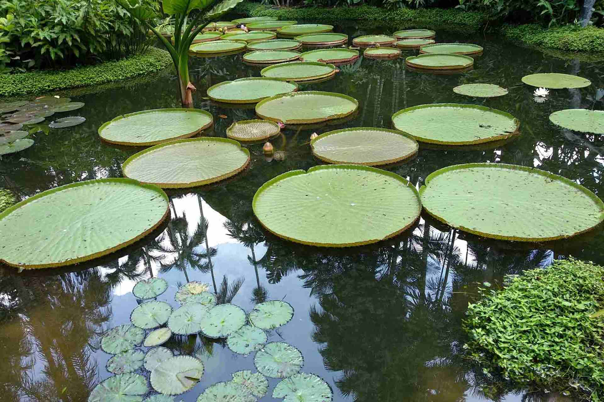
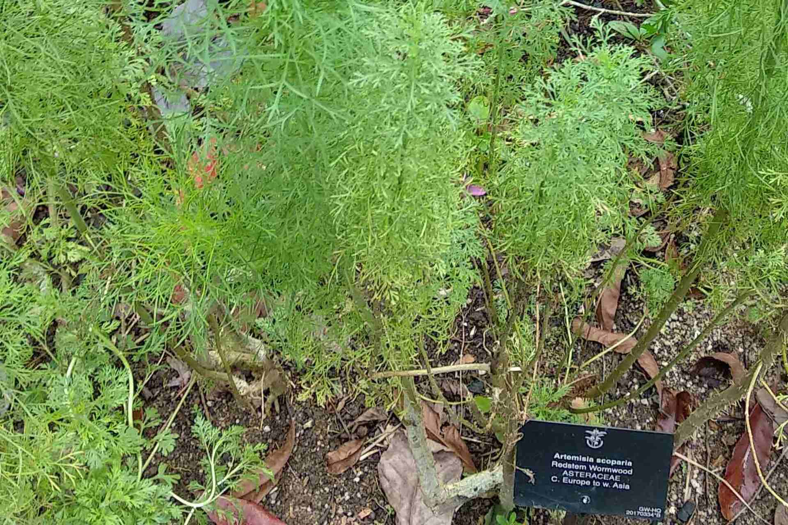
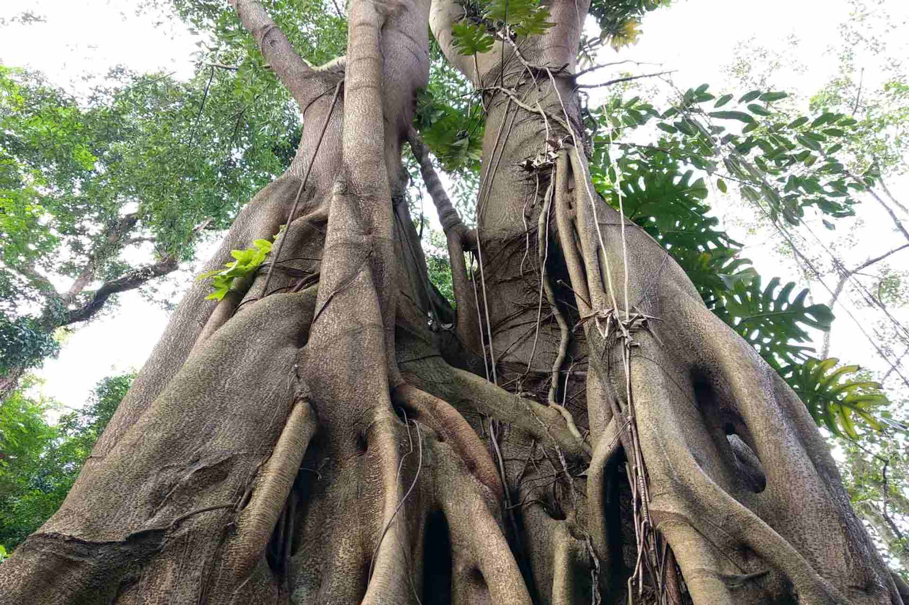
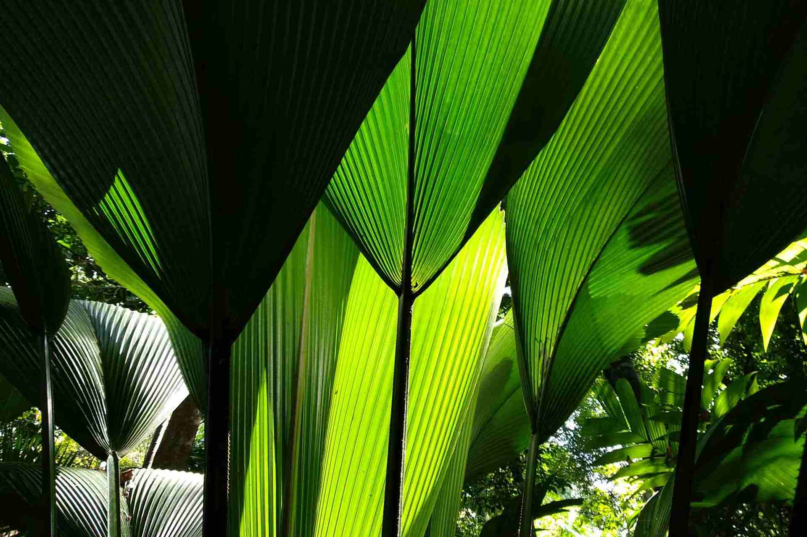
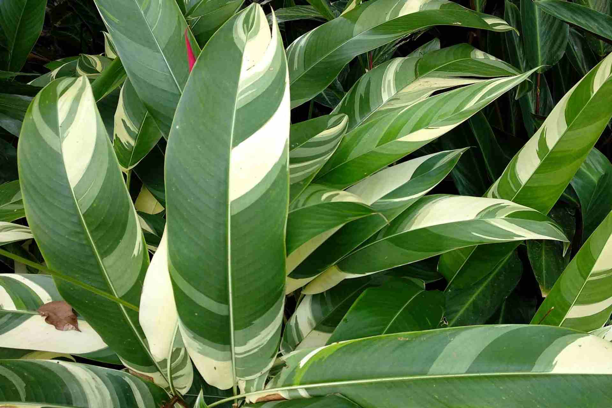
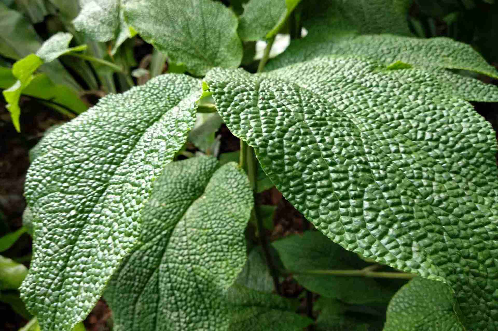
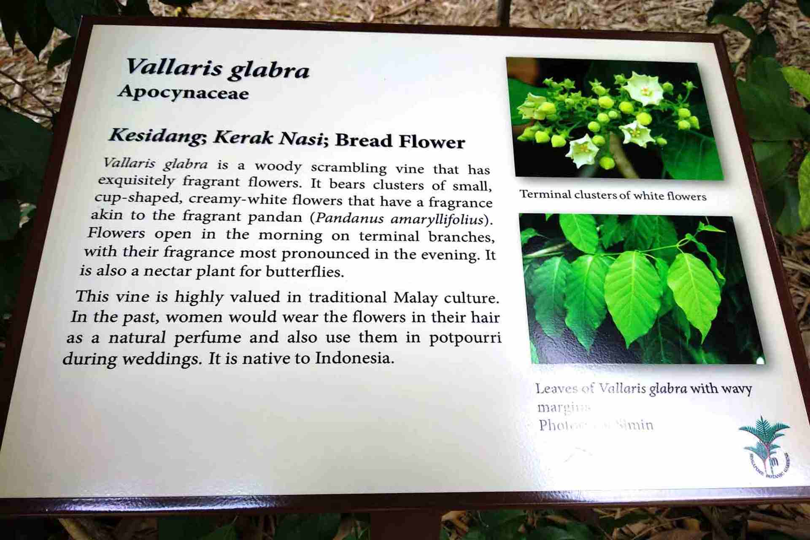
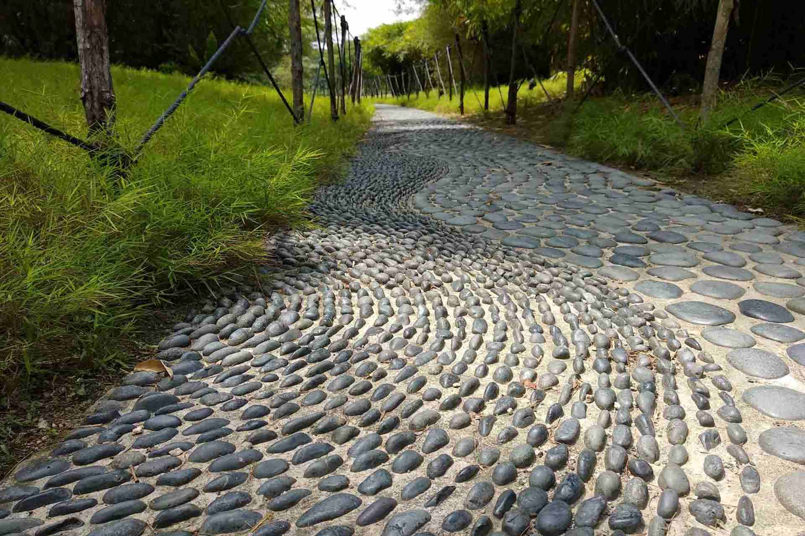

With 4 millions visitors per year, 150 years of connecting plant and people, free entrance and his own subway stop, the Singapore Botanic Gardens are an outstanding example of educational facility.

Awarded the [UNESCO world heritage site](https://whc.unesco.org/en/list/1483) title, it's so big that you hardly can see it all in one day.

The Singapore Botanic Gardens, protected through the Planning Act of Singapore, which regulates conservation and development, is situated at the heart of the city of Singapore.

> Take nothing but photographs, leave nothing but footprints

It demonstrates the evolution of a British tropical colonial botanic garden from a ‘Pleasure Garden’ in the English Landscape Style, to a colonial Economic Garden with facilities for horticultural and botanical research, to a modern and world-class botanic garden, scientific institution and place of conservation, recreation and education.

Most of the 183 acres of Singapore Botanic Gardens is in a National Park, and the other designations include: Conservation Area, Tree Conservation Area and Nature Area (applied to the rainforest area).

There are 44 heritage trees within the property, and a number of protected buildings/structures such as houses 1 to 5 of the former Raffles College, Raffles Hall, E.J.H. Corner House, Burkill Hall, Holttum Hall, Ridley Hall, House 6, Garage, Bandstand and Swan Lake Gazebo.

## Rain Forest

Some 314 species of plants jostle for space in this precious six-hectare fragment of primary tropical forest, forming a multi-layered ecosystem of herbs and ferns, climbers, shrubs, and trees.

Some trees reach 50 m. in height, and were here even before the founding of modern Singapore in 1819.

Among the rich species of plants found in the Rain Forest are trees of economic importance, such as rattans, fruit trees and the towering Jelutong.

With more than 50% of its species representing plants that are rare in Singapore, the Rain Forest certainly qualifies as a part of Singapore’s natural heritage.

### Healing Garden

The Healing Garden showcases over 400 varieties of plants used medicinally. It' i's laid out thematically relating to component parts of the body such as head, respiratory and reproductive systems.

Spread over 2.5 hectares, it's designed as a tranquil retreat with medicinal plants traditionally used in Southeast Asia as the main focus. Here you can discover the power of plants to heal and enhance our quality of life.

Plant's information featured in the Healing Garden, which closes on Tuesdays, is intended for educational purposes only.

All informations and recommendations are a good starting point to self-diagnose, self-prescribe, self-treat and cure diseases or illness.

### Ginger Garden

On displays here several hundred species of gingers and related families. Walk behind a waterfall, romantic night lighting and a pool adorned with giant Amazon water lilies, the Ginger Garden is very popular among visitors.

The one-hectare Ginger Garden, organised by their regions of origin, contains more than 250 species of members from the family [Zingiberaceae](https://en.wikipedia.org/wiki/Zingiberaceae) and its relatives.

Visitors are treated to a wide array of gingers in all shapes and forms, many with surprisingly beautiful leaves and very attractive flowers.

### Learning Forest

The Learning Forest is located in the new Tyersall-Gallop Core of the Singapore Botanic Gardens. It is designed to integrate with the existing 6-hectare Rain Forest to form an enlarged forest habitat.

The Learning Forest features a network of boardwalks and elevated walkways that allow visitors to explore habitats ranging from a freshwater forest wetland to a lowland rainforest.

Visitors can learn about freshwater forest wetland ecosystems at the Keppel Discovery Wetlands and walk amongst a collection of some of the tallest tree species in Southeast Asia at the SPH Walk of Giants.

Other highlights of the Learning Forest include themed collections showcasing trees with interesting forms and bark, a bambusetum, and an arboretum of wild fruit trees.

**Wild Fruit Trees Arboretum**

The collection of wild fruit trees features wild relatives of familiar and domesticated species, such as species from the [Soursop (Annonaceae)](https://en.wikipedia.org/wiki/Soursop), [Jackfruit (Moraceae)](https://en.wikipedia.org/wiki/Jackfruit), [Lychee (Sapindaceae)](https://en.wikipedia.org/wiki/Lychee) and [Mango (Anarcardiaceae)](https://en.wikipedia.org/wiki/Mango) families.

**Bambusetum**

Over 30 species of tropical bamboos, showcasing the wide diversity of growth forms that occur naturally in the wild.

**Bark of Trees**

Exposition of the diversity of textures and colours exhibited by trees in their bark.

**Products of the Forest**

This collection features forest plants that are cultivated for human uses such as timber, building materials and food.

**Durian Theory**

This part of the Learning Forest features tree species with specialised growth forms that inspired EJH Corner to formulate his 'Durian Theory'.

Corner postulated that many of today's plants are descended from tree species with large fruit similar to durians.

### Foliage Garden

The Foliage Garden will be a new and unique themed attraction at the Singapore Botanic Gardens.

Conveniently located next to the car park at Cluny Park Gate and opposite The Garage building, the Foliage Garden extends a warm welcome to visitors with an extensive collection of terrestrial and aquatic foliage.

It showcases a wide array of ornamental plants with colourful foliage of varying shapes and textures and demonstrates that the beauty and diversity of plants does not lie in their flowers alone.

Visitors can expect to spot interesting carnivorous plants such as Nepenthes or pitcher plants.

These plants have evolved to adapt to nutrient-poor environments where most obtain their nutrients from trapping and digesting insects.

One of the most notable specimens on display, the 'giant' form of Raffles’ Pitcher Plant, Nepenthes rafflesiana, can be easily spotted by its distinct red cups and large funnel shaped upper pitches.

A stroll on the boardwalk in the garden also offers a brilliant view of aquatic plants like the Lotus, Nelumbo nucifera.

**Leaf variegation**

The varying colours of the leaves in the foliage garden is one thing that will be hard to miss. This is known as variegation and it is attributed to many factors such as genetics or pigmentation.

For instance, plants bearing genetic leaf variegation, chimeras, lack chlorophyll in some tissues, causing their leaves to appear yellow or white in some areas.

Pigmentation can also be a cause for variegation where other pigments present mask the green pigment of chlorophyll.

This is the case with some Begonia species, where the presence of pigmented hairs cause the green leaves to appear red.

Variegated leaves are widely used to brighten up gardens and add dimension and structure.

**Shapes and textures of leaves**

The foliage garden also presents an eye-opening range of various leaf shapes and textures. Different plants adapt differently to the habitats that they grow in.

Leaves come in many forms such as heart (cordate) or palm (palmate) shaped.

Leathery or thin leaves are adaptive modifications to hot and humid tropical weather. Hairy leaves, whilst often pleasant to the touch, act as a form of self defence mechanism to deter herbivores.

### Library of Botany and Horticulture

Founded in 1875, the Singapore Botanic Gardens is one of the oldest specialized libraries in Southeast Asia.

The Library holds over 30,000 accessioned items, a rare and irreplaceable resource that supports the work of the Gardens staff, students, and researchers across the globe in a diverse range of science and horticulture disciplines.

The collection contains books, periodicals, field books, botanical artwork, historical maps of the Gardens and various other print and digital media.

The Library is equipped with Wireless@SG wifi service. [More information about the library](https://www.nparks.gov.sg/sbg/research/library-of-botany-and-horticulture).

The Library’s collections are held in two areas: the Public Reference Library (unrestricted access & open to public) and the Staff Library (restricted access).

70% the [Library Catalogue is searchable here](https://www.nparks.gov.sg/sbg/research/library-of-botany-and-horticulture/search-our-library)

### Eco-Garden and Eco-Lake

The perfect place for bird-watching and the learning of economically important plants.

### Sun Garden

Succulents and other plants of arid regions. This includes cacti and euphorbias and other drought-tolerant species such as agaves, yuccas and grass trees.

Succulents have fleshy leaves or stems that store water.

In stem succulents, the stems may be green and take over from the leaves as the main organs of photosynthesis.

A drainage system installed here help to simulate the dry conditions required to grow this collection.

### Jacob Ballas Children's Garden

The first garden in Asia dedicated to children, it aims to educate and instill love for nature.

The garden is a complete nature-learning environment, where children can delve deeper into the ecology of plants and our environment through discovery and experiential learning.

The Garden offers children a space for exploration, adventure and play, with a farm, an orchard, and a forest with its own stream and ponds.

Young adventure seekers can explore the suspension bridge and nature play areas.

Budding naturalists can walk along the stream and climb into the tree-houses.

Urban gardeners can observe how plants grow and pick up some gardening tips! Here kids can be an ‘Adventurer’, ‘Gardener’ or ‘Naturalist’ for a day.

### Evolution Gardens

A journey through time, from the beginnings of our planet to the first living organisms and gradually changing plant life on land. This 1.5-hectare garden offers displays designed to enrich and educate. Magnificent Tree Ferns & Cycads are the ‘Jurassic Park’ centrepiece here.

### Trellis Garden

The Trellis Garden showcases the Singapore Botanic Gardens’ climber collection. Climbers are plants that require support in order to grow upwards to harvest sunlight. Twining vines twine around the host, while others climb using tendrils, thorns or hooks.

Look out for the unique leaves and strange flower of the Pipe Vine, Aristolochia leuconeura from South America, and the beautiful flowers and foliage of Bauhinia semibifida, which is native to Singapore.

Some are scrambling bushes with fragrant flowers such as Nyctanthes arbor-tristis are trained to climb the trellis.

Many climbers attract wildlife such as butterflies and birds and in the forest they are often the super-highways, used to acces different parts of the canopy.

A few are important to the ethnic communities in this region, such as [Derris elliptica](https://en.wikipedia.org/wiki/Derris_elliptica), which is traditionally used as an insecticide.

### National Orchid Garden

The products of the Gardens' orchid breeding programme, which began in 1928, deserve a place where they can be displayed in their full splendour.

The very design of these orchids is, one could say, 'hand-crafted' by the Gardens' horticultural staff, dedicated to bringing out the finest in any hybrid cross.

With over 1000 species and 2000 hybrids on display, the splendour of these gorgeous blooms is absolutely a sight to behold at the National Orchid Garden.

Open from 8.30am to 7.00pm daily, it's the only section with an Admission Fee: 5 SGD for adults, 1 SGD for students and senior citizens (60 years+), Free for children below 12 years.

### Reflexology path

Near the bamboo area you will find the reflexology path, a joint community service project by the [Rotary Club of Changi](http://www.rotarychangi.com/), the [Rotary Club of Singapore](http://rotarysingaporefoundation.org/) East, Rotary Club of Kaohsiung East and the Rotary Club of Sanchung East.

**_Visitor informations:_**

Open: 5am to midnight, daily Admission: Free Location: [Botanic Gardens MRT (Bukit Timah Gate)](https://goo.gl/maps/J6HD6wpGYeJ2)

## Know More Links

[Singapore Botanical Gardens website](https://www.sbg.org.sg)

[Download SBG map here](https://www.nparks.gov.sg/-/media/sbg/documents/map-nov-2017-lwres.jpg)

[Searchable Library of Botany and Horticulture catalog](https://www.nparks.gov.sg/sbg/research/library-of-botany-and-horticulture/search-our-library).

[Professional Study Visit / Exchange Programme](https://www.nparks.gov.sg/sbg/contact/professional-study-visit-exchange-programme)
