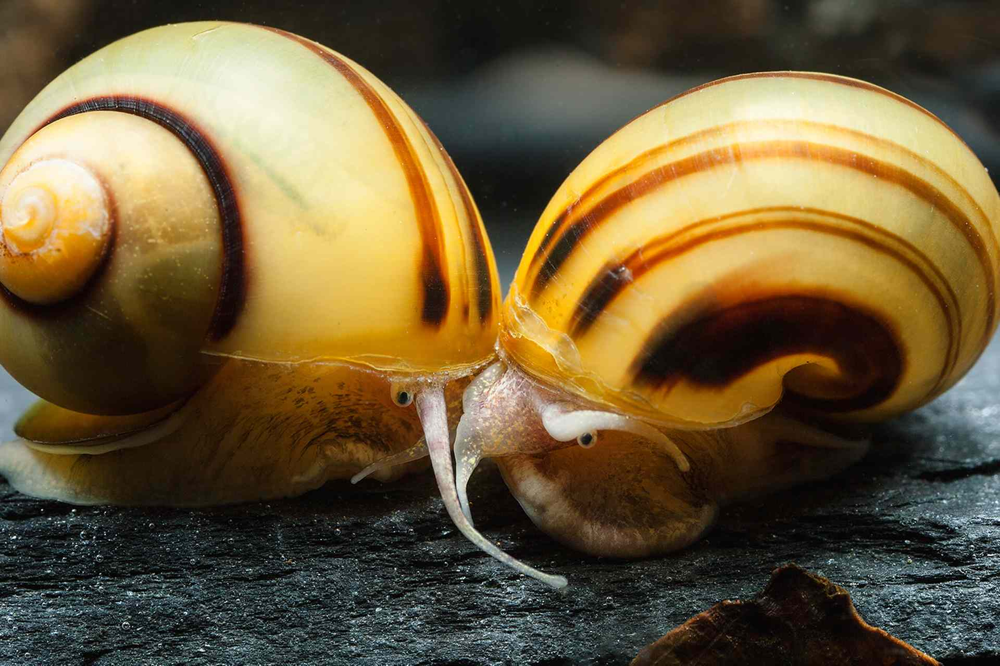
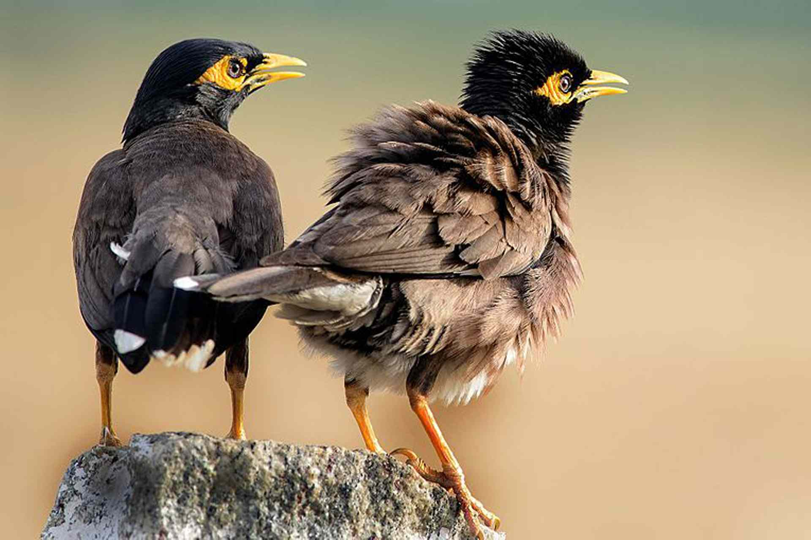
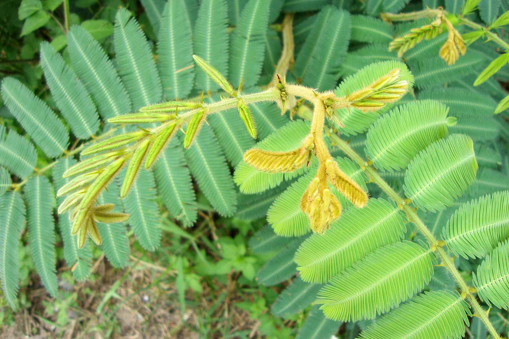

At recent ASEAN meeting in Canada, Indonesia, represented by Dr. Gono Semiadi of the [Indonesian Institute of Sciences (LIPI)](https://en.wikipedia.org/wiki/Indonesian_Institute_of_Sciences), stressed that the key to prevent spread of alien species is a strong border control.

Weak control mechanism, lack of knowledge on various invasive species, their life cycles and their pathways for introduction, and unclear related law and regulation are among the problems that require common attention.

Efforts to address these issues at national and regional level need to be supported.

While thanking the CBD Secretariat for all its guidance in abating the proliferation, Dr. Gono Semiadi wish to address the issue of well-established invasive alien species spread in certain regional areas.

The [Golden Apple Snail (Ampullariidae)](https://en.wikipedia.org/wiki/Ampullariidae) is an example of a well-established invasive species in Southeast Asia. It is considered as the 40th worst alien species in Europe and in the Top 100 of the World’s Worst Invasive Alien Species.

Dr. Gono Semiadi stated that other well-established species, particularly in Viet Nam, include mimosa trees, water hyacinth, and caterpillars.

Lao was seeking international assistance on the [locust](https://en.wikipedia.org/wiki/Locust) infestation in her country.

Majority of Parties to the Convention expressed the need for capacity building, technology transfer, and coordination and exchange of information among institutions on this biodiversity issue.

In the ASEAN, the damage caused by invasive alien species, as well as the programs designed to eradicate them, translates to significant economic and monetary losses.

The total annual loss equivalent to the economic and environmental impacts of harmful non indigenous species in the region was estimated at USD 33.5 billion.

This was broken down into costs to the agricultural sector (USD 23.4–33.9 billion), human health (USD 1.4–2.5 billion), and the environment (USD 0.9–3.3 billion).

> “Invasive Alien Species are threats to the balance of natural ecosystems. Their presence poses risk as unwanted predators of endemic species. Many of the introduced species have become pests. Disturbing ecosystems, and affecting livelihoods of many resource-based income earners depending on ecosystem services such as on agriculture. Case in point is the golden apple snail which is an introduced species in Lao PDR and the Philippines. These IAS are now menacing rice production in these areas,”_said Dr. Theresa Mundita S. Lim, SBSTTA Chair and ASEAN Centre for Biodiversity (ACB) Executive Director._

Invasive alien species have common characteristics: they can thrive under adverse conditions, reproduce and grow rapidly, have high dispersal ability and adaptability to new conditions, and survive on various food types and in a wide range of environmental conditions.

As these invasive species prevail in their new environment, indigenous species are unable to compete for space and food or are prey for the IAS, and eventually become extinct.

Vital ecosystem functions, such as pollination, soil regeneration, and nutrient and water cycling functions, among others, eventually deteriorate.

For example, a [common Myna](https://en.wikipedia.org/wiki/Myna), a bird of the starling family, can drive away native birds by occupying their nesting areas.

[Mimosa pigra](https://en.wikipedia.org/wiki/Mimosa_pigra), a thorny shrub with buoyant seeds that grow abundantly in mudflats, can drive away migratory birds feeding and nesting in these areas.

The ASEAN Centre for Biodiversity supports the ASEAN Member States in undertaking measures to cope with and come up with control measures on IAS through capacity building on taxonomy, information sharing through the ASEAN Clearing House Mechanism, and awareness raising.

Cambodia, Indonesia and the Philippines crafted their National Invasive Species Strategy and Action Plan (NISSAP).

Thailand has established a list of IAS and developed control measures. In Viet Nam, a strong legal regulation system on import and export of biological materials is in place.

All AMS are managing and controlling priority IAS, either manually or through the use of appropriate chemicals.

The [Integrated Pest Management (IPM) ](https://en.wikipedia.org/wiki/Integrated_pest_management) approach is also being applied particularly for IAS affecting the agriculture sector.

In-depth research, survey, and analysis of priority IAS in the ASEAN region, were identified as measures to further understand IAS and draft measures for its control and eradication.

## Know More Links

[ASEAN biodiversity](http://aseanbiodiversity.org/2018/07/10/indonesia-stresses-need-to-combat-invasive-alien-species/)

[Golden Apple Snail (Ampullariidae) - wikipedia](https://en.wikipedia.org/wiki/Ampullariidae)

[Myna bird - wikipedia](https://en.wikipedia.org/wiki/Myna)

[Mimosa pigra - wikipedia](https://en.wikipedia.org/wiki/Mimosa_pigra)
