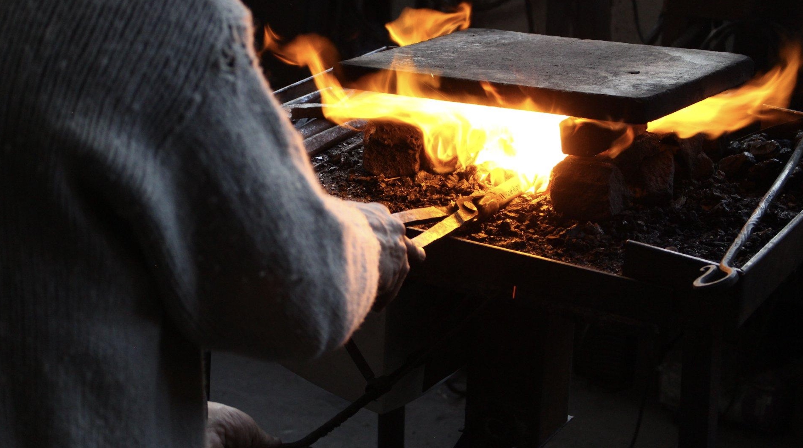
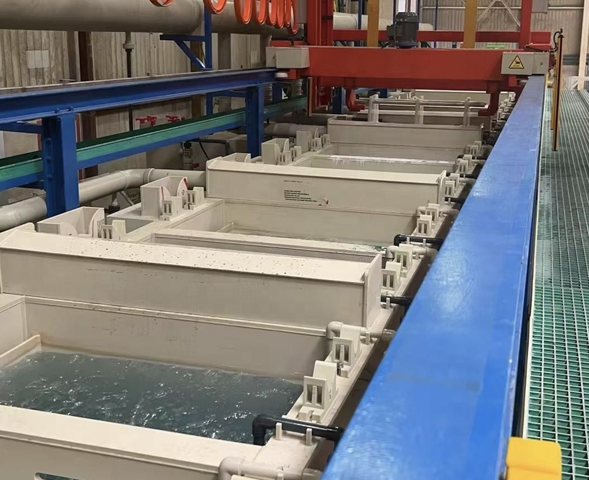
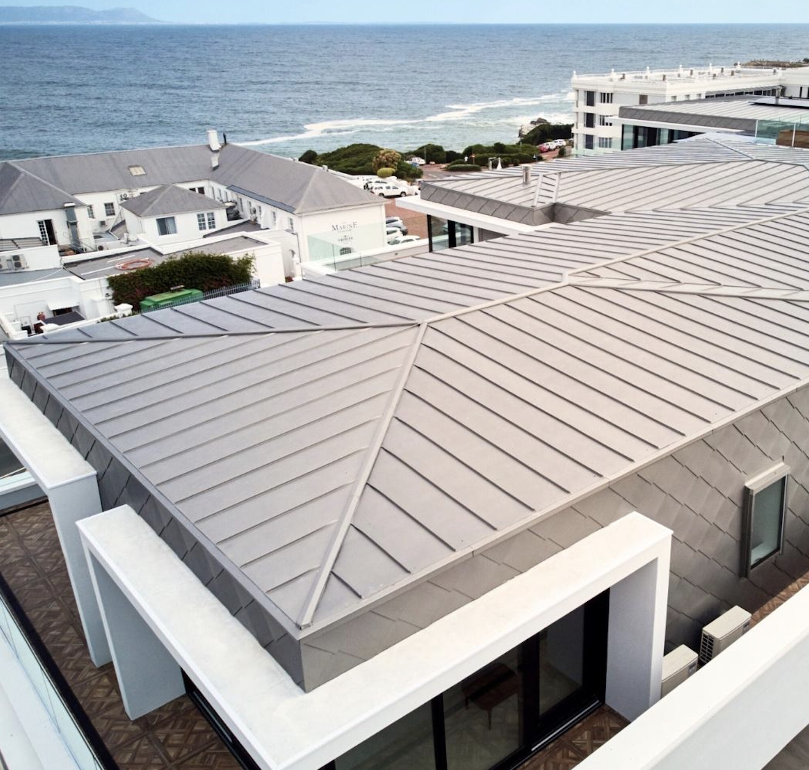
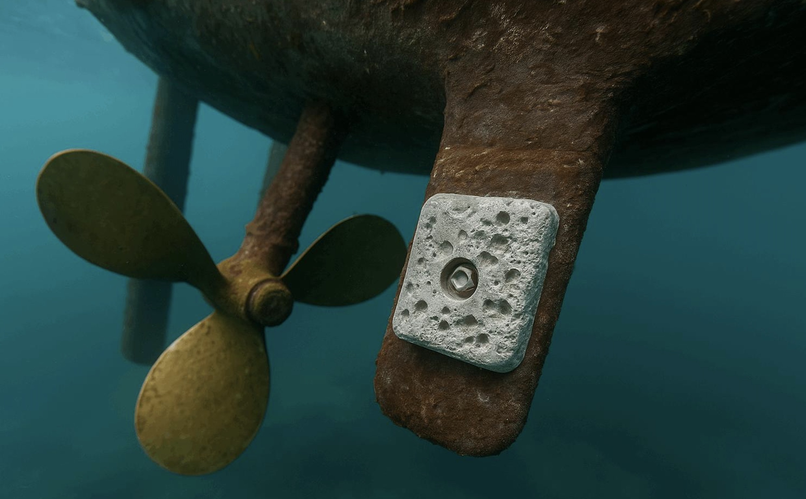

<!-- TOC depthfrom:2 depthto:2 -->
TL;DR

Tropical climates destroy steel faster than almost anywhere else on Earth.

Heat, humidity, salt air, fungus, acidic rain, and constant condensation attack metal day and night. In coastal jungle regions, untreated steel can begin rusting within hours.

If modern coatings and industrial paints are unavailable, you can still protect tools, hardware, roofs, blades, hinges, nails, farming equipment, and structures using:

- heat-curing oils
- charcoal carbonization
- pine resin and wax coatings
- limewash barriers
- sacrificial metals
- primitive galvanizing
- oil-blackening
- drainage design
- airflow engineering

The biggest secret is this:

In the tropics, preventing trapped moisture matters more than making a “perfect” coating.

A mediocre coating that dries quickly beats a strong coating that traps water.

<!-- /TOC -->

## Why Tropical Climates Destroy Metal

Temperate climates give metal time to dry.

Tropical climates do not.

In humid jungle or coastal regions:

- Night condensation forms daily.
- Salt accelerates electrochemical corrosion.
- Mold and organic acids attack surfaces.
- Rainwater remains trapped for long periods.
- Wood structures stay damp continuously.
- Air itself becomes conductive.

Near the sea, corrosion can become 5–10× faster.

This means:

- thin sheet steel fails rapidly
- bolts seize permanently
- nails disappear inside wood
- hinges freeze
- roofing perforates
- tools pit deeply
- springs weaken
- knives become rough and brittle

The solution is not one coating.

The solution is layers of defense.

## The Jungle Hierarchy of Rust Protection

For remote off-grid conditions, prioritize protection methods in this order:

1. Design against water
2. Keep airflow everywhere
3. Use thick steel
4. Blacken or carbonize surfaces
5. Apply drying oils
6. Add wax or resin sealers
7. Use sacrificial zinc when possible
8. Avoid water traps entirely

This order matters more than expensive materials.

## Rule #1 — Design So Water Cannot Stay

Most rust comes from trapped moisture.

Not rain.

Trapped moisture.

Avoid:

- closed steel tubes
- horizontal surfaces
- tight overlaps
- hidden pockets
- buried joints
- water-trapping bolt heads

Prefer:

- drainage holes
- sloped surfaces
- open airflow
- exposed fasteners
- raised foundations
- removable panels

In tropical climates:

If water can escape, steel survives.

If water gets trapped, steel dies.

## Traditional Tropical Protection Methods

1. Heat-Cured Oil Blackening

This is the most practical off-grid protection system.

Materials

- linseed oil
- tung oil
- neem oil
- castor oil (less ideal)
- wood fire
- steel brush
- cloth

Process

1. Heat steel until warm but not glowing.
2. Wipe thin oil layer.
3. Reheat slowly.
4. Oil polymerizes into hard dark coating.
5. Repeat 3–6 times.

The surface becomes:

- darker
- hydrophobic
- partially carbonized
- more rust resistant

This works extremely well for:

- machetes
- knives
- farming tools
- hinges
- brackets
- nails
- chains
- stove parts

Not ideal for submerged metal.

## 2. Pine Resin + Wax Barrier

Very old maritime technique.

Recipe

- 2 parts pine resin
- 1 part beeswax
- small amount charcoal powder
- optional linseed oil

Heat gently until liquid.

Apply warm.

Excellent for:

- bolts
- threads
- tool storage
- hinges
- marine hardware
- roof fasteners

This mixture stays flexible.

That matters in tropical climates because rigid coatings crack.

## 3. Charcoal Carbon Black Coating

Fine charcoal helps block UV and moisture.

Mix:

- charcoal dust
- oil
- resin
- wax

Creates primitive black anti-rust paste.

This resembles ancient Japanese and Scandinavian protective finishes.

## 4. Limewash for Structures

Lime protects indirectly.

White lime coatings reduce:

- heat
- condensation
- fungal growth
- trapped moisture

Limewash surrounding structures dramatically improves metal lifespan.

Especially useful for:

- roofing supports
- barns
- workshops
- tropical sheds

## Oil Choices in Tropical Regions

Best Options

Tung Oil

Excellent water resistance.

Hard finish.

Very durable.

Best overall if available.

### Linseed Oil

Traditional.

Easy to produce.

Needs maintenance.

Can mold if left thick.

Must be heat-cured thinly.

### Neem Oil

Interesting tropical option.

Less durable mechanically.

But naturally antifungal and insect resistant.

Very useful in humid jungle conditions.

### Coconut Oil

Not ideal.

Can become sticky.

Can support mold growth.

Only useful mixed with resin or wax.

## Protecting Roofs Near the Sea

Salt air destroys roofs rapidly.

Use:

- steep roof angles
- airflow beneath roofing
- sacrificial washers
- thick coatings
- regular rinsing with rainwater

Avoid:

- thin cheap sheet metal
- enclosed cavities
- permanent wet insulation
- touching dissimilar metals

Copper touching steel accelerates corrosion badly.

Aluminum touching wet steel also causes problems.

## Maintenance Is Mandatory

In the tropics, every coating eventually fails.

Accept this.

The goal is maintainability.

A repairable system is superior to a permanent one.

### Monthly Maintenance

- wipe tools with oil
- inspect rust spots
- clean salt deposits
- dry storage spaces
- improve airflow

Tiny repairs prevent catastrophic corrosion.

## The Most Important Tropical Rule

Steel should never stay cold and wet overnight.

If possible:

- store tools indoors
- hang them vertically
- keep airflow moving
- avoid ground contact
- warm tools near fires occasionally

Even primitive drying dramatically increases lifespan.

## Final Thoughts

Industrial civilization solved rust using chemistry.

Traditional cultures solved rust using:

- airflow
- heat
- oils
- carbon
- maintenance
- geometry

In remote tropical regions, those older methods become useful again.

Especially where supply chains fail.

Rust is not defeated once.

Rust is managed continuously.

And in the jungle, maintenance is survival.

## Off-Grid Galvanizing for Coastal and Tropical Survival

<!-- TOC depthfrom:2 depthto:2 -->

TL;DR

Primitive off-grid galvanizing is possible.

Galvanizing protects steel using a sacrificial layer of zinc.

The zinc corrodes first.

That means the steel underneath survives dramatically longer.

This is one of the few anti-rust systems that still works even after scratches and damage.

For tropical coastal regions, galvanizing is often the best long-term solution.

Primitive systems can use:

- zinc scrap
- battery zinc
- roofing zinc
- dry-cell zinc cans
- charcoal heat
- vinegar
- weak hydrochloric acid
- wood ash chemistry
- saltwater electrolysis

However:

- hot-dip galvanizing is dangerous
- fumes can be toxic
- acids require caution
- purity matters
- ventilation is essential

This article focuses on practical low-tech methods.

<!-- /TOC -->

## Why Galvanizing Works So Well

Zinc protects steel in two ways.

### 1. Barrier Protection

The zinc blocks oxygen and water.

### 2. Sacrificial Protection

Even if scratched:

- zinc corrodes first
- steel corrodes later

This is extremely important in:

- tropical climates
- marine air
- jungle humidity
- salty environments

Paint alone cannot do this.

## The Three Levels of Off-Grid Galvanizing

### Level 1 — Zinc-Rich Protective Paste

Easiest.

Most realistic.

No electricity required.

Materials

- powdered zinc
- linseed or tung oil
- resin or wax
- charcoal powder optional

### How To Make Zinc Powder

Possible sources:

- old zinc roofing
- sacrificial anodes
- marine zinc blocks
- dry-cell battery shells
- galvanized scrap

File or grind carefully.

Avoid breathing dust.

### Use

Mix into thick metallic paint.

Apply onto cleaned steel.

This acts similarly to modern cold galvanizing compounds.

Very effective.

### Level 2 — Electro-Galvanizing

This is true zinc plating.

Requires:

- zinc source
- electrolyte
- electricity

But electricity can come from:

- solar panels
- hand generators
- batteries
- small wind systems

### Primitive Electrolyte Recipes

Mild Vinegar Electrolyte

Materials

- white vinegar
- salt
- zinc pieces

Place zinc in vinegar overnight.

This creates zinc acetate solution.

Good beginner electrolyte.

Safer than strong acids.

Slow but usable.

### Hydrochloric Acid Electrolyte

Stronger.

More dangerous.

Sources

- muriatic acid
- brick cleaner
- pool acid

React zinc slowly into diluted acid.

This forms zinc chloride.

Very effective galvanizing solution.

But:

- fumes are dangerous
- acid burns skin
- never inhale vapors
- always ventilate

Never use indoors.

### Basic Electro-Galvanizing Setup

Needed

- plastic bucket
- zinc anode
- steel object
- electrolyte
- DC power source

Wiring

- zinc = positive
- steel = negative

Tiny bubbles should appear.

Zinc slowly plates onto steel.

Process may take:

- minutes for thin coating
- hours for stronger coating

Afterward:

1. rinse
2. dry completely
3. optionally heat cure oil over zinc

This combination works surprisingly well.

### Level 3 — Primitive Hot-Dip Galvanizing

Most powerful.

Most dangerous.

Industrial galvanizing uses molten zinc.

This requires roughly:

- 420–450°C molten zinc
- extremely clean steel
- flux chemicals
- temperature control

This is difficult but possible with charcoal furnaces.

## The Biggest Problem: Surface Preparation

Galvanizing fails if steel is dirty.

Steel must be:

- oil free
- rust free
- oxide free

Industrially they use:

1. degreasing
2. acid pickling
3. fluxing
4. zinc dipping

## Primitive Rust Removal Methods

Vinegar Soak

Slow.

Safe.

Good for small parts.

## Citric Acid

Excellent option.

Can come from:

- citrus waste
- powdered citric acid

Less dangerous than hydrochloric acid.

## Weak Hydrochloric Acid

Fast and effective.

But dangerous.

Always neutralize afterward using:

- baking soda
- limewater
- wood ash water

Never leave acid residue.

## Primitive Fluxes

Flux helps zinc bond.

Traditional/simple options:

- ammonium chloride
- zinc chloride
- rosin
- borax blends

The simplest field approach:

zinc chloride solution made from zinc + hydrochloric acid.

This is very similar to old soldering flux.

## Important Safety Warning — Zinc Fumes

Overheated zinc creates toxic fumes.

This causes:

- metal fume fever
- nausea
- headaches
- lung irritation

Never breathe zinc smoke.

Always work:

- outdoors
- with wind
- away from living spaces

Do not overheat galvanized metal in enclosed areas.

## Best Tropical Strategy

For realistic off-grid coastal survival:

Best Combination

1. electro-galvanize
2. heat-cure thin oil layer
3. wax threaded parts
4. maximize airflow
5. avoid trapped moisture

This outperforms paint alone.

## Stainless Steel vs Galvanized Steel

People assume stainless is always superior.

Not necessarily.

Cheap stainless can fail badly near saltwater.

Good galvanized steel often survives longer than poor stainless.

Especially if maintained.

## Sacrificial Zinc Blocks

Extremely useful near the sea.

Boats use sacrificial zinc anodes.

These intentionally corrode first.

Primitive systems can attach zinc blocks to:

- docks
- water tanks
- steel frames
- marine hardware

The zinc slowly sacrifices itself.

Very powerful concept.

## The Real Secret

Ancient and modern anti-rust systems share one truth:

Corrosion is electrochemistry.

### You are either:

- blocking oxygen
- blocking water
- blocking conductivity
- or sacrificing another metal first

Galvanizing works because zinc volunteers to die before steel.

That single principle has protected ships, bridges, roofs, towers, and tools for over a century.

And with simple chemistry, it can still be done far from industrial civilization.

## Know More Links:

[Corrosion Protection for Steel (American Galvanizers Association)](https://galvanizeit.org/hot-dip-galvanizing/why-specify-galvanizing/corrosion-protection)

[Barrier and Sacrificial Protection (Galvanizers Association UK](https://galvanizing.org.uk/sacrificial-protection/)

[Guide to protection of steel against corrosion](https://www.infosteel.be/en/publications/274-guide-to-protection-of-steel-against-corrosion)

[Tips on blackening steel with oil](https://www.reddit.com/r/Blacksmith/comments/gd2k21/tips_on_blackening_steel_with_oil/)

[The metallurgy of zinc-coated steel](https://www.sciencedirect.com/science/article/abs/pii/S0079642598000061)
