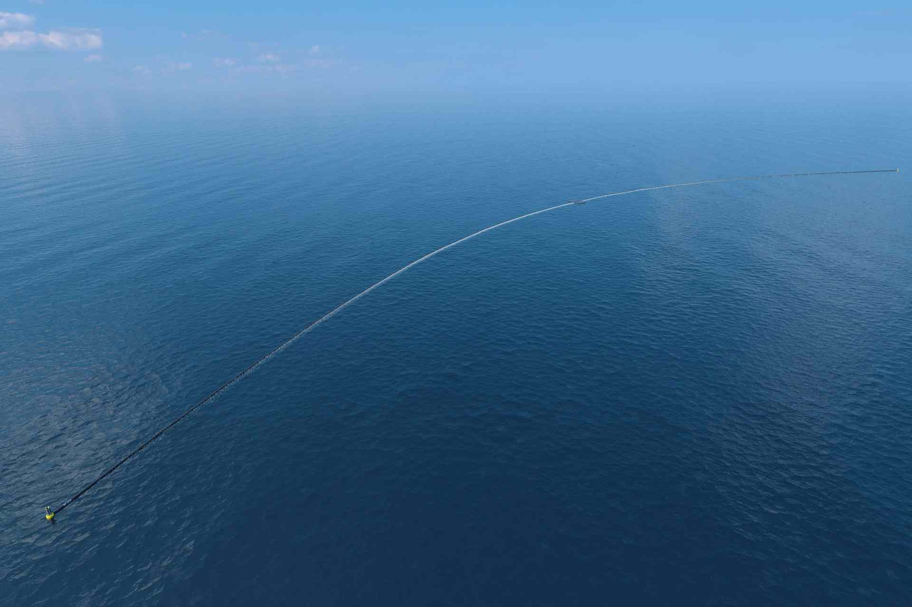

Trash accumulates in 5 ocean garbage patches, the largest one being the Great Pacific Garbage Patch, located between Hawaii and California. If left to circulate, the plastic will impact our ecosystems, health and economies.

**Ocean garbage patches are vast and dispersed**

Ocean currents concentrate plastic in five areas in the world: the subtropical gyres, also known as the world’s "ocean garbage patches". Once in these patches, the plastic will not go away by itself.

The challenge of cleaning up the gyres is the plastic pollution spreads across millions of square kilometers and travels in all directions.

Covering this area using vessels and nets would take thousands of years and cost billions of dollars to complete. How can we use these ocean currents to our advantage?

> "Over 5 trillion pieces of plastic currently litter the ocean." _The Ocean Cleanup_

Solving this problem requires a combination of closing the source, and cleaning up what has already accumulated in the ocean.

The Ocean Cleanup develops advanced [technologies](https://www.theoceancleanup.com/technology/) to rid the world's oceans of plastic. A full-scale deployment of our systems is estimated to clean up 50 % of the Great Pacific Garbage Patch in 5 years.

> "For society to progress, we should not only move forward but also clean up after ourselves." _Boyan Slat, The Ocean Cleanup Ceo & Founder_

The Ocean Cleanup floating systems are designed to capture plastics ranging from small pieces just millimeters in size, up to large debris, including massive discarded fishing nets (ghost nets), which can can be tens of meters wide.

Models show that a full-scale cleanup system roll-out (a fleet of approximately 60 systems) could clean 50% of the Great Pacific Garbage Patch in just five years.

After fleets of systems are deployed into every ocean gyre, combined with source reduction, The Ocean Cleanup projects will be able to remove 90% of ocean plastic by 2040.

**Join the team**

[Contribute your skills and build a clean future with The Ocean Cleanup](https://www.theoceancleanup.com/careers.html)

**Support the cleanup**

[Help fund the scale-up of The Ocean Cleanup fleet](https://www.theoceancleanup.com/fund/)

## Know More Links

[The Ocean Cleanup - website](https://www.theoceancleanup.com)

[See more photos](https://www.theoceancleanup.com/media-gallery/)

[The Ocean Cleanup - aerial expedition](https://www.theoceancleanup.com/milestones/aerial-expedition/)

[The Ocean Cleanup - YouTube channel](https://www.youtube.com/user/TheOceanCleanup)
